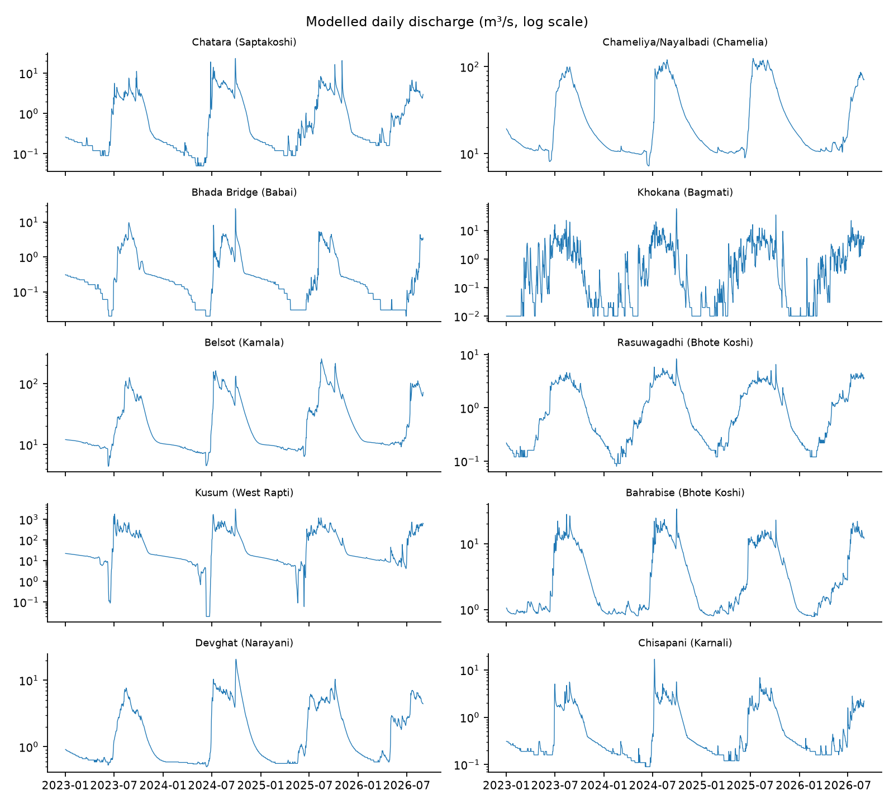
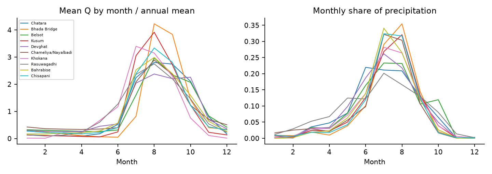
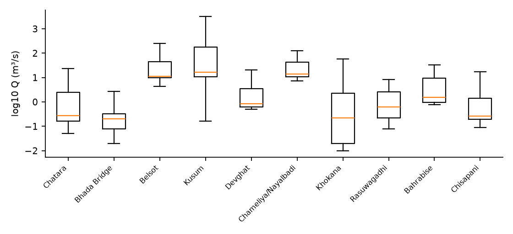
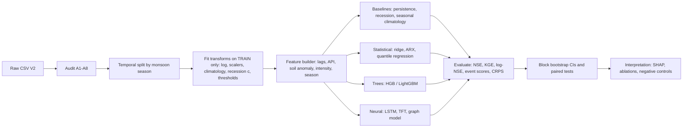
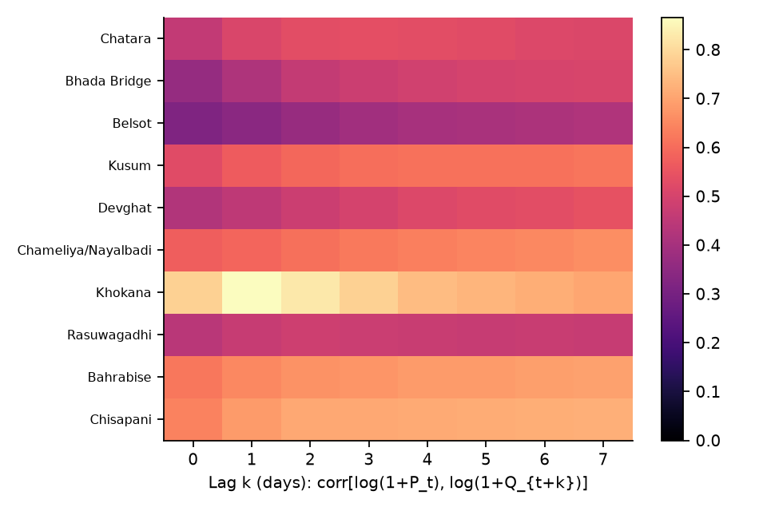
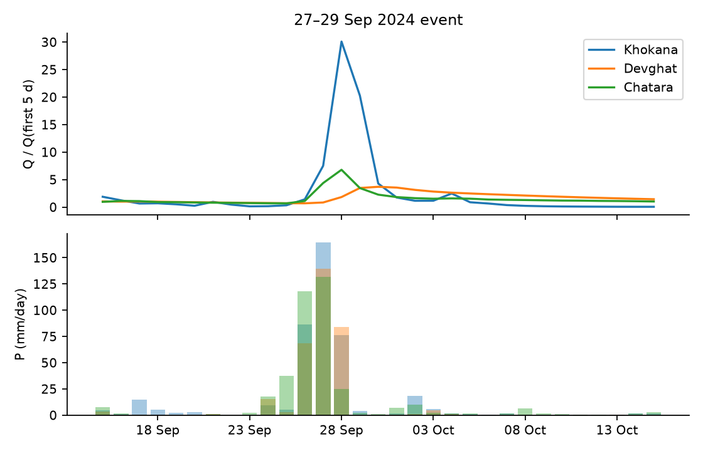

# Learning River Response Across Nepal's Himalayan Basins from Reanalysis Weather and Modelled Discharge: A Multi-Basin Benchmark and Methodology Plan

**Working paper / research plan · dataset: *Nepal Flood & Weather Dataset 2023–2026 (V2)* · 10 locations · 13,390 daily records**

> **Status of this document.** This is a research plan written as a full-length paper skeleton. Sections 1–4 and 6–7 describe what will be done and why. Every number in Section 8 and in the data-audit tables of Section 3 was computed from the CSV in this repository by the scripts in `paper/` (`prelim.py`, `baseline.py`, `make_tables.py`). Everything else is *planned*, and the planned result tables are intentionally left as templates so nothing is reported that has not been run.

---

## Abstract

Floods in Nepal are produced by a mixture of mechanisms: monsoon rainfall on wet catchments, extreme single-system storms such as the 27–29 September 2024 event, snow and glacier melt, and outburst or blockage floods that rainfall alone does not explain. Open datasets that let researchers study these mechanisms across basins are scarce. We plan a study built on the *Nepal Flood & Weather Dataset 2023–2026*, a balanced daily panel of ten river locations (13,390 station-days, 19 variables) that pairs Open-Meteo "Best Match" weather and 0–100 cm soil moisture with GloFAS-modelled river discharge served by the Open-Meteo Flood API.

The study has four parts. First, a *data audit* characterises what the panel can and cannot support. Preliminary results already show that the discharge values are grid-cell model output whose magnitudes for the large rivers (for example a mean of 0.8 m³/s for the Karnali at Chisapani) are orders of magnitude below what a gauge on that river would record, that 16.7 % of Khokana days are exactly zero, and that the July 2025 Rasuwagadhi flash flood leaves no visible signal in the data. Second, we define a *leakage-safe forecasting benchmark* with per-site and pooled models at 1-, 3- and 7-day horizons, evaluated with NSE, KGE, log-space skill and event-based scores. Third, we study *process questions* the panel can honestly answer: rainfall-to-discharge lag structure, antecedent soil-moisture control, extreme-value behaviour of precipitation and discharge, and cross-basin synchrony. Fourth, we examine *what the data cannot answer* and use the three documented glacier- and flash-flood events as negative controls.

A first benchmark run (train to 31 Aug 2025, test 1 Sep 2025–31 Aug 2026) shows that a pooled gradient-boosted model beats the persistence baseline at the median site (NSE 0.963 vs 0.953 at one day; 0.885 vs 0.867 at three days) and by a large margin at the flashiest sites (Khokana 0.632 vs 0.141 at one day), but that its advantage disappears or reverses at seven days at several sites. We argue that the right contribution of this dataset is not a leaderboard score but a carefully audited, reproducible multi-basin benchmark with explicit reporting of failure modes.

**Keywords:** Nepal; flood forecasting; GloFAS; Open-Meteo; soil moisture; river discharge; machine learning; extreme value theory; transboundary hydrology.

---

## 1. Introduction

### 1.1 Motivation

Nepal is a small country that drains a very large mountain range. Its rivers rise in or beyond the High Himalaya, fall several thousand metres in a few hundred kilometres, and leave the country into the Indo-Gangetic plain, where they join the Ganges system. The Koshi, Gandak (known as the Narayani inside Nepal), Karnali and Mahakali systems, together with the smaller Bagmati, Kamala and Rapti, carry the bulk of monsoon runoff. Between June and September, the South Asian monsoon delivers most of the year's precipitation to these catchments. In the ten-location panel analysed here, between 62 % and 89 % of precipitation falls in June–September, depending on the location (Table 3).

The consequences are well known: floods, landslides and debris flows each year, with periodic extreme years. The late-September 2024 event, in which the Department of Hydrology and Meteorology (DHM) reported new 24-hour precipitation records at 25 stations and flooding that exceeded historical levels on the Bagmati, Narayani and Sunkoshi, is the most prominent recent example. Floods in Nepal also matter downstream. Nepal-originating rivers drain into Bihar and Uttar Pradesh, and flood management on the Koshi and Gandak has long been a matter of Nepal–India cooperation.

Two features make Nepal a hard and interesting case for data-driven hydrology. First, *in-situ observational coverage is thin* relative to terrain complexity. Gauge records are valuable but not always public, and gridded products must fill the gap. Second, *flood generation is multi-hazard*. A river can rise because it rained, because snow and ice melted, because a glacial lake drained, because a landslide dam failed, or because several of these coincided. A daily weather panel can describe the first of these well and the others poorly.

### 1.2 The dataset and why it is worth a paper

The *Nepal Flood & Weather Dataset 2023–2026* (V2) is a daily panel of ten river locations assembled by joining Open-Meteo Historical Weather API output (Best Match model selection) with GloFAS-based river discharge from the Open-Meteo Flood API, and attaching location, river, basin, elevation and DHM station metadata. V2 corrects the 2023 weather-variable mapping and station metadata errors found in V1. The panel is balanced: 10 locations × 1,339 days (1 January 2023 to 31 August 2026) = 13,390 rows, with no missing values in any of the 19 columns.

We consider three properties of the dataset to be scientifically useful and under-exploited:

1. **Cross-basin coverage with a common schema.** The same 19 variables are available for locations spanning high-elevation Himalayan reaches (Rasuwagadhi, Bahrabise), mid-hill and valley sites (Khokana, Devghat, Chameliya/Nayalbadi) and Terai or near-Terai sites (Chatara, Belsot, Kusum, Bhada Bridge, Chisapani). This permits systematic comparison of how rainfall is converted into discharge under different regimes.
2. **No predefined flood label.** The curator deliberately did not supply a flood-risk score. This is a methodological strength: the researcher must define events from the physical variables and justify the definition, which allows us to compare definitions and quantify how sensitive conclusions are to them.
3. **Contact with documented real events.** The record window contains the September 2024 extreme rainfall, the August 2024 Thame glacial lake outburst, and the July 2025 Bhote Koshi flash flood, among others. These provide a natural experiment: a rainfall-driven event that the data should capture, and non-rainfall events that the data should *not* be expected to capture.

### 1.3 What the dataset is not

The dataset documentation is candid about its limits, and the paper must be as well. Weather variables are model- or reanalysis-based and not station measurements. Discharge is *modelled* (GloFAS via Open-Meteo), not DHM gauge data. The panel does not replace official monitoring or warning. High-density zeros in precipitation, rain and precipitation hours are retained deliberately and represent genuine dry days; they are not missing data and must not be imputed.

An implication that deserves emphasis early is *circularity*. GloFAS discharge is produced by a hydrological model forced with meteorological data. When a machine-learning model predicts GloFAS discharge from Open-Meteo weather, it is partly learning to approximate the forcing-to-runoff mapping of another model, not the behaviour of the physical river. High skill on this target is therefore evidence about *predictability within a modelled system* and should not be reported as evidence of operational forecast skill. We return to this in Sections 3.4 and 9.

### 1.4 Research questions

We organise the study around six research questions, each of which the dataset can address, with the caveats above.

- **RQ1 (Data characterisation).** What are the statistical properties of the panel (seasonality, intermittency, heavy tails, quantisation, cross-site dependence), and which of them constrain modelling choices?
- **RQ2 (Rainfall–runoff lag structure).** How does the lag between precipitation and modelled discharge vary with elevation, basin and season, and can the lag distribution be estimated robustly from four years of daily data?
- **RQ3 (Antecedent conditions).** Does 0–100 cm soil moisture, and a cumulative antecedent-precipitation index, add predictive skill beyond current rainfall and persistence, particularly for high-flow days?
- **RQ4 (Forecast skill and its limits).** How well do statistical and machine-learning models forecast discharge at 1, 3 and 7 days, per site and pooled, and where do they fail relative to persistence?
- **RQ5 (Extremes).** How heavy are the tails of daily precipitation and discharge, and is the September 2024 event consistent with the tail fitted to the remaining data?
- **RQ6 (Negative controls and multi-hazard blind spots).** Which documented floods are invisible in the panel, and what does this imply for the appropriate scope of claims?

### 1.5 Contributions

We plan the following contributions.

1. A **reproducible data audit** with explicit, machine-checkable tests (Section 3), including findings that affect downstream interpretation: discharge scale mismatch, quantisation, intermittent zero flow, and an elevation metadata inconsistency.
2. A **leakage-safe benchmark protocol** for short, multi-site hydrological panels (Sections 5 and 6), including blocked temporal validation by monsoon season and event-based metrics.
3. A **process analysis** of lag structure, soil moisture and extremes (Section 7), with uncertainty quantified by block bootstrap.
4. A **negative-control analysis** of non-rainfall hazards that gives a calibrated statement of what daily weather plus modelled discharge cannot detect (Section 8.5).
5. Open code for every table and figure.

### 1.6 Paper organisation

Section 2 reviews related work. Section 3 describes and audits the data. Section 4 sets out the mathematical formulation and feature construction. Section 5 presents models and algorithms. Section 6 specifies the experimental protocol and metrics. Section 7 lists the analyses that can be done with the dataset. Section 8 reports preliminary results computed so far. Section 9 discusses validity, ethics and limitations, and Section 10 gives the work plan and a word budget.

---

## 2. Related Work

### 2.1 Large-scale discharge modelling and GloFAS

The Global Flood Awareness System (GloFAS) couples meteorological forcing with a land-surface and routing model to produce discharge on a global grid (Alfieri et al., 2013). The GloFAS-ERA5 reanalysis provides a consistent historical discharge record, and its evaluation against global gauges shows good skill for large rivers and weaker skill for small and flashy catchments (Harrigan et al., 2023). This matters here: a global model at roughly 0.05° resolution routes water along a coarse river network, and a requested coordinate is snapped to a model cell. If that cell is a small tributary rather than the main stem, the returned discharge reflects the tributary. Our audit (Section 3.3) suggests this happened for several locations.

Open-Meteo repackages ERA5, ERA5-Land and other numerical weather products behind a unified API (Zippenfenig, 2023). "Best Match" selects among them for a coordinate and date range. Because the product is a blend, small discontinuities in the weather series are possible when the underlying model changes, which is a reason to test for structural breaks (Section 3.5).

### 2.2 Machine learning for streamflow prediction

Recurrent networks have become a standard tool for rainfall–runoff modelling since Kratzert et al. (2018) showed that LSTMs trained on many catchments could outperform calibrated conceptual models, and that a single regional model can generalise to catchments not used in training (Kratzert et al., 2019). Nearing et al. (2024) extended this to extreme-flood prediction in ungauged watersheds and showed that a global LSTM can match or exceed GloFAS forecasts at multi-day lead times. These results come from multi-decade records with hundreds to thousands of basins, so their data regime is very different from ours: ten sites and under four years. The lesson we take is methodological (train across sites, use static attributes, evaluate on out-of-sample periods), not that deep models will automatically work in this smaller regime.

Gradient-boosted trees (Chen and Guestrin, 2016; Ke et al., 2017) are strong, cheap baselines for tabular hydrological features and train quickly on short panels. Temporal Fusion Transformers (Lim et al., 2021) offer interpretable attention over static, known-future and observed inputs and are a candidate when many covariates and multiple horizons are needed. Graph neural networks for traffic and hydrology (Kipf and Welling, 2017; Li et al., 2018) represent upstream–downstream structure explicitly, though with ten non-nested locations the graph is sparse, a point we examine in Section 5.5.

### 2.3 Skill metrics and the problem with NSE

Nash–Sutcliffe efficiency (Nash and Sutcliffe, 1970) is the default metric in hydrology but is dominated by high flows and is sensitive to a few events, and Schaefli and Gupta (2007) argue that its benchmark (the observed mean) is a weak one for strongly seasonal series. Kling–Gupta efficiency (Gupta et al., 2009) decomposes error into correlation, variability and bias, and Knoben et al. (2019) showed that KGE values are not directly comparable to NSE values and that a KGE of about −0.41 corresponds to the mean-flow benchmark. For seasonal series, a *persistence* or *seasonal-climatology* benchmark is more informative, and we report skill relative to both. For probabilistic forecasts, the CRPS and pinball loss are proper scoring rules (Gneiting and Raftery, 2007; Gneiting, 2011).

### 2.4 Extremes, flood frequency and rainfall thresholds

Peaks-over-threshold modelling with the generalised Pareto distribution is the standard approach to tail inference (Coles, 2001), resting on the Pickands–Balkema–de Haan theorem. With only about four years of data, return levels cannot be estimated reliably, and we use extreme-value modelling descriptively and to check *consistency* of the 2024 event with the remaining data. Rainfall-threshold approaches have a long history for landslides in the Nepal Himalaya (Dahal and Hasegawa, 2008), and the same intensity–duration logic can be applied to discharge exceedance.

### 2.5 Himalayan hydroclimate and multi-hazard floods

Monsoon rainfall in the Himalaya is organised by orography, with strong gradients and a well-documented rainfall maximum along the first major topographic rise (Bookhagen and Burbank, 2010). Gridded products can mis-estimate precipitation in this terrain, both at the rain-shadow and windward extremes, so we treat the weather series as an *estimate* with its own uncertainty. Glacial lakes have grown rapidly worldwide (Shugar et al., 2020), and outburst floods have caused severe damage in the Nepal Himalaya. These floods are initiated by processes (ice or rock avalanche, moraine failure, supraglacial lake drainage) that do not appear in daily weather. This is why a hazard-aware paper must treat them as a boundary on what the dataset can show.

### 2.6 Positioning

Existing public work on this dataset, such as a notebook developed on V1 reporting a headline score, follows a standard recipe: construct a flood label from a discharge threshold and classify. We differ in four ways: we use V2 (the corrected release), we do not predefine a label but examine several, we treat the target as modelled rather than observed, and we test failure explicitly.

---

## 3. Data Description and Audit

### 3.1 Provenance and construction

The panel is constructed by joining two API products by date and location, then attaching station metadata.

- **Weather and soil moisture:** Open-Meteo Historical Weather API, "Best Match" model selection (a seamless blend of available model datasets, not a single fixed reanalysis). Variables are daily aggregates of hourly model output.
- **River discharge:** Open-Meteo Flood API, which serves GloFAS data. Discharge is a modelled quantity.
- **Metadata:** river, basin, elevation, latitude/longitude and DHM station identifiers from information published by Nepal's DHM.

Attribution follows CC BY 4.0 requirements of the Open-Meteo API. The V2 release corrects the 2023 weather-variable mapping and station metadata found after validation; **all analyses use V2 only**, and results from V1 notebooks are not comparable.

### 3.2 Locations

Table 1 lists the ten locations ordered by the elevation field. Two rivers carry the name *Bhote Koshi*: the Rasuwagadhi site is on the Bhote Koshi that becomes the Trishuli and then the Narayani, whereas Bahrabise is on the Bhote Koshi that joins the Sun Koshi in the Koshi basin. Analysts who group by `river` instead of `basin` will merge two distinct drainage systems, so we group by `location` and by `basin` and never by `river` alone.

**Table 1. Monitoring locations and discharge summary (m³/s), computed from the CSV.**

| Location | River | Basin | DHM id | Lat (°N) | Lon (°E) | Elev (m) | Mean Q | Median Q | Max Q |
|---|---|---|---|---|---|---|---|---|---|
| Chatara | Saptakoshi | Koshi | 695.0 | 26.855 | 87.152 | 153 | 1.5 | 0.28 | 23.3 |
| Bhada Bridge | Babai | Babai | 291.0 | 28.189 | 81.366 | 157 | 0.7 | 0.2 | 24.2 |
| Belsot | Kamala | Kamala | 595.5 | 26.913 | 86.248 | 188 | 33.0 | 11.42 | 255.4 |
| Kusum | West Rapti | Rapti | 375.0 | 28.008 | 82.094 | 230 | 125.8 | 16.86 | 3175.9 |
| Devghat | Narayani | Narayani/Gandak | 450.0 | 27.71 | 84.43 | 603 | 2.3 | 0.86 | 20.8 |
| Chameliya/Nayalbadi | Chamelia | Mahakali | 120.0 | 29.674 | 80.563 | 685 | 31.4 | 14.14 | 124.6 |
| Khokana | Bagmati | Bagmati | 550.05 | 27.632 | 85.293 | 1315 | 1.7 | 0.22 | 57.6 |
| Rasuwagadhi | Bhote Koshi | Narayani | 446.22 | 28.271 | 85.378 | 1749 | 1.4 | 0.63 | 8.3 |
| Bahrabise | Bhote Koshi | Koshi | 610.0 | 27.787 | 85.899 | 1870 | 5.1 | 1.56 | 33.8 |
| Chisapani | Karnali | Karnali | 280.0 | 28.653 | 81.287 | 2215 | 0.8 | 0.26 | 17.0 |


*Figure 1. The ten locations. The panel spans roughly 80.6–87.2 °E and 26.9–29.7 °N, covering the Mahakali/Karnali system in the west through the Koshi system in the east.*

### 3.3 Variable dictionary

**Table 2. Variables, with their roles in this study.**

| Variable | Unit | Type | Role in study |
|---|---|---|---|
| `date` | day | index | time index; daily, no gaps |
| `location`, `river`, `basin` | — | categorical | panel identifier; basin used for grouping |
| `dhm_station` | id | numeric id | metadata only (not a numeric predictor) |
| `latitude`, `longitude`, `elevation_m` | °, °, m | static | static covariates (with caveat, §3.4) |
| `precipitation_mm` | mm/day | dynamic | main forcing; heavy-tailed, zero-inflated |
| `rain_mm` | mm/day | dynamic | liquid part of precipitation |
| `precipitation_hours` | h/day | dynamic | duration; intensity = P / hours |
| `soil_moisture_0_100cm_m3m3` | m³/m³ | dynamic | antecedent wetness |
| `temperature_mean_c` | °C | dynamic | melt/phase proxy |
| `dew_point_mean_c`, `relative_humidity_mean_pct` | °C, % | dynamic | moisture state |
| `wind_speed_max_kmh`, `wind_gusts_max_kmh`, `wind_direction_dominant_deg` | km/h, km/h, ° | dynamic | storm-regime descriptors; direction is circular |
| `river_discharge_m3s` | m³/s | target | modelled discharge |

The difference `precipitation_mm − rain_mm` is a proxy for solid precipitation (snow). It is non-zero on 223 days at Rasuwagadhi and on only 4 days at Chameliya/Nayalbadi, and exactly zero everywhere else, which is consistent with Rasuwagadhi's high elevation and cool climate (mean temperature 17.5 °C).

### 3.4 Audit findings

The audit consists of eight tests. They are cheap to run and should be reported in the paper's appendix as a reproducible checklist. The results below are the values observed in the file.

**Table 3. Seasonality and tail diagnostics per location (June–September = monsoon).**

| location | Monsoon (JJAS) share of P | Monsoon share of Q | CV of Q | Q99 / median | P99 (mm/d) | Zero-Q days |
|---|---|---|---|---|---|---|
| Chatara | 77% | 72% | 1.5 | 30.5 | 51.4 | 0.0% |
| Bhada Bridge | 89% | 76% | 2.12 | 26.4 | 40.5 | 0.0% |
| Belsot | 73% | 63% | 1.18 | 15.6 | 46.7 | 0.0% |
| Kusum | 85% | 85% | 1.86 | 56.9 | 29.4 | 0.0% |
| Devghat | 79% | 62% | 1.1 | 12.0 | 48.2 | 0.0% |
| Chameliya/Nayalbadi | 83% | 66% | 0.98 | 8.1 | 42.8 | 0.0% |
| Khokana | 81% | 84% | 2.02 | 56.2 | 54.1 | 16.7% |
| Rasuwagadhi | 62% | 74% | 1.02 | 7.7 | 37.6 | 0.0% |
| Bahrabise | 86% | 73% | 1.14 | 13.3 | 48.6 | 0.0% |
| Chisapani | 89% | 76% | 1.39 | 17.8 | 41.5 | 0.0% |


**Table 4. Data-quality diagnostics per location.** "Zero P days" are genuine dry days, retained by design. "Repeated Q" is the fraction of days where discharge is identical to the previous day.

| location | Zero P days | P≠rain days | Repeated Q (ΔQ=0) | Q<0.01 | Mean temp °C |
|---|---|---|---|---|---|
| Chatara | 44% | 0 | 44% | 0.0% | 23.9 |
| Bhada Bridge | 59% | 0 | 64% | 0.0% | 24.1 |
| Belsot | 52% | 0 | 13% | 0.0% | 24.6 |
| Kusum | 56% | 0 | 3% | 0.0% | 24.1 |
| Devghat | 57% | 0 | 39% | 0.0% | 23.4 |
| Chameliya/Nayalbadi | 50% | 4 | 8% | 0.0% | 21.3 |
| Khokana | 34% | 0 | 30% | 16.7% | 18.6 |
| Rasuwagadhi | 30% | 223 | 32% | 0.0% | 17.5 |
| Bahrabise | 47% | 0 | 19% | 0.0% | 20.3 |
| Chisapani | 53% | 0 | 51% | 0.0% | 23.1 |


**A1 — Completeness and key integrity.** 10 locations × 1,339 days with no duplicate (location, date) pairs and no missing values. *Pass.*

**A2 — Zero-inflation of precipitation.** Between 30 % and 59 % of days have exactly zero precipitation, rain and precipitation hours. Rows with `precipitation_mm = 0` and `precipitation_hours > 0`, or the reverse, do not occur. The three zero patterns are therefore internally consistent. We follow the curator's advice and **do not impute or remove zeros**; instead we use hurdle-style modelling (Section 4.4).

**A3 — Rain versus precipitation.** `rain_mm` equals `precipitation_mm` everywhere except where snow is plausible (Section 3.3). Using both as predictors would add almost no information at 8 of 10 sites, so we use precipitation and a derived snow fraction.

**A4 — Discharge magnitude (critical).** Mean modelled discharge at the three large-river locations Chisapani (Karnali), Devghat (Narayani) and Chatara (Saptakoshi) is 0.8, 2.3 and 1.5 m³/s, respectively, and the maxima are 17.0, 20.8 and 23.3 m³/s. Published long-term mean flows for these rivers at or near the named gauge stations are, to our knowledge, of order 10³ m³/s. We have not checked against DHM gauge series (this is planned, Section 10), so we state the inference cautiously: **the returned values most plausibly correspond to a small tributary cell, or to a sub-grid snap, rather than the main stem.** The practical consequence is that absolute magnitudes cannot be interpreted as river-gauge flows, and conclusions should be drawn about *relative* behaviour (normalised or log-scale) and not about volumes, return periods in m³/s, or inundation. By contrast, Kusum (mean 125.8 m³/s, maximum 3,175.9 m³/s) looks like a main-stem flow, which makes cross-site absolute comparisons inconsistent.

**A5 — Quantisation and repeated values.** At Bhada Bridge, 64 % of days have discharge identical to the previous day, and 51 % at Chisapani (Table 4). The median at Bhada Bridge is 0.2 m³/s. This is consistent with discharge rounded to two decimals at very low flow, so the series has *plateaus*. Models with strong persistence features therefore enjoy an unrealistically easy task on these days, and **log-space metrics are dominated by baseflow plateaus**. We report NSE on raw flow *and* a high-flow-weighted metric to prevent this from flattering the results.

**A6 — Intermittent zero flow.** Khokana (Bagmati) has 223 days with discharge exactly 0.00 (16.7 % of its record), concentrated in the dry season: all 31 days of December 2025, 27 of January 2026, 28 of January 2023, and 18–25 days of February in each of 2023, 2024 and 2025. No other site has any zero flow. Modelled intermittency of this kind is an artefact of a coarse model reaching its floor in a regulated or heavily abstracted reach, or of a small cell, and it has a modelling consequence: a log-transform requires an offset ($\log(1+Q)$), and the zero-flow state is better handled with a classifier.

**A7 — Elevation field plausibility.** The `elevation_m` field gives Chisapani as 2,215 m, but its mean temperature is 23.1 °C, similar to the 150–230 m sites (23.9–24.6 °C) and far above the 17.5 °C of the 1,749 m Rasuwagadhi site. A 2,215 m Nepal site with a 23 °C annual mean is not plausible; the field may represent grid or DEM elevation, may be a typing error, or may refer to a different point. We therefore **do not use `elevation_m` as a physical covariate without correction** and run all models with and without it. Devghat (603 m) also looks high relative to its temperature but is less clear-cut.

**A8 — Dates beyond the present.** The panel ends on 31 August 2026 and contains the 2026 monsoon through that date. We do not interpret 2026 flood events from the file beyond what the data shows, because the documentation describes a 2026 Rasuwagadhi–Trishuli event whose signature we could not find in the series (Section 8.5).

### 3.5 Circularity and the status of the target

Let $F$ denote Open-Meteo/GloFAS's hydrological model, forced with meteorological inputs $X^{\mathrm{GloFAS}}_{t}$. The target is $Q_t = F(X^{\mathrm{GloFAS}}_{1:t}) + \epsilon_t$, and the predictors are Open-Meteo weather $X^{\mathrm{OM}}_t$, which is *related* to, but not guaranteed identical to, $X^{\mathrm{GloFAS}}_t$. A learned model $\hat f$ that predicts $Q_{t+h}$ from $X^{\mathrm{OM}}_{1:t}$ is therefore approximating $F$ composed with a forcing-mismatch term. Three consequences follow:

1. High skill is expected whenever the forcings are close, and tells us little about the real river.
2. Skill should be *compared to a benchmark that exploits the same structure* (persistence plus recession), not to zero.
3. The right scientific question is not "can we forecast the river?" but "how is the modelled river's response organised, and where does the data-driven approximation break?"

We write the paper in this framing throughout.

### 3.6 Structural breaks and non-stationarity

Because "Best Match" is a blend, the underlying weather model may change over time. We will test each weather series for mean shifts using the CUSUM statistic and the Pettitt test, after removing the seasonal cycle by regressing on harmonics. For a series $z_t$, $t=1,\dots,n$, the Pettitt statistic is

$$U_{t} = \sum_{i=1}^{t}\sum_{j=t+1}^{n}\operatorname{sgn}(z_i - z_j), \qquad K = \max_{1\le t<n}|U_t|,$$

with approximate $p$-value $p \approx 2\exp\!\big(-6K^2 / (n^3 + n^2)\big)$. A significant break in precipitation or soil moisture near a model-version date would be a red flag for temporal validation, since a model trained before the break would be tested after it.

### 3.7 Preliminary exploratory results



*Figure 2. Modelled daily discharge at each location (log axis). Monsoon peaks dominate. Khokana shows a floor at zero, and several low-flow sites (Bhada Bridge, Chisapani, Chatara) show plateaus. The September 2024 peak is visible at most sites.*



*Figure 3. Left: mean discharge by month normalised by the annual mean. Right: monthly share of total precipitation. All locations peak in June–September, but the discharge peak lags the rainfall peak at several sites, consistent with storage and snow/ice contributions at the high-elevation sites.*



*Figure 4. Distribution of log10 discharge at each location, ordered as in Table 1. The ten locations differ by about three orders of magnitude, which is why we normalise per location before pooling.*

Discharge is extremely persistent. Lag-1 autocorrelation of $\log(1+Q)$ ranges from 0.914 (Khokana) to 0.999 (Chameliya/Nayalbadi) and lag-7 from 0.711 (Khokana) to 0.972 (Chameliya/Nayalbadi). This is why persistence is a very hard baseline at most sites and why Khokana, the flashiest site, is the most informative test.

---

## 4. Mathematical Formulation

### 4.1 Notation

Index locations by $s\in\{1,\dots,S\}$ with $S=10$ and days by $t\in\{1,\dots,T\}$ with $T=1339$. Let $P_{s,t}$ denote precipitation (mm), $\theta_{s,t}$ soil moisture, $\tau_{s,t}$ mean temperature, $Q_{s,t}$ discharge, and $\mathbf{x}_{s,t}\in\mathbb{R}^{d}$ the vector of all dynamic covariates. Static attributes are $\mathbf{a}_s$. The forecasting task at horizon $h$ is to learn

$$\hat Q_{s,t+h} = f_h\big(\mathbf{x}_{s,\,t-L+1:t},\; Q_{s,\,t-L+1:t},\; \mathbf{a}_s\big),$$

where $L$ is the look-back length. Crucially, no covariate dated after $t$ enters the model unless it is a *known-future* variable, and we do not use any such variable in the main benchmark, because forecast weather is not in the file. This is the most common source of leakage in flood-prediction notebooks, so it is spelled out as a rule: **a feature is admissible at forecast origin $t$ only if it is computable from data dated $\le t$.**

### 4.2 Variance-stabilising transformation

Discharge spans three orders of magnitude, so models are trained on

$$y_{s,t} = \log\!\big(1 + Q_{s,t}\big),$$

which is defined at zero flow. Skill is reported both in $y$-space (balanced) and after back-transformation to $Q$-space (high-flow dominated), because the two answer different questions. Back-transformation of a conditional mean of $y$ is biased; for a Gaussian residual with variance $\sigma^2$, the unbiased estimate is $\hat Q = \exp(\hat y + \tfrac{1}{2}\sigma^2) - 1$, and we use a smearing estimator (Duan, 1983) when residuals are not Gaussian:

$$\hat Q_{s,t+h} = \Big(\tfrac{1}{n}\sum_{i=1}^{n} e^{\hat\varepsilon_i}\Big)\, e^{\hat y_{s,t+h}} - 1 .$$

### 4.3 Antecedent precipitation and soil moisture

The classical antecedent precipitation index (Kohler and Linsley, 1951) is an exponentially weighted sum:

$$\mathrm{API}_{s,t}(k) = \sum_{j=0}^{J} k^{\,j}\,P_{s,t-j} \quad\Longleftrightarrow\quad \mathrm{API}_{s,t}(k) = k\,\mathrm{API}_{s,t-1}(k) + P_{s,t},\qquad 0<k<1,$$

with recession constant $k$ estimated per location. The soil-moisture covariate $\theta$ is supplied directly, and we form its anomaly relative to the day-of-year climatology so that the seasonal cycle does not dominate:

$$\theta^{*}_{s,t} = \frac{\theta_{s,t}-\bar\theta_{s,\mathrm{doy}(t)}}{\sigma_{\theta,s,\mathrm{doy}(t)}} .$$

With under four years of data, the climatological mean for each day of year is estimated from at most three or four values, so we use a smooth harmonic fit ($K=3$ harmonics) rather than per-day averages:

$$\bar\theta_{s}(t) = a_0 + \sum_{k=1}^{K}\Big[a_k\cos\!\tfrac{2\pi k\,\mathrm{doy}(t)}{365.25} + b_k \sin\!\tfrac{2\pi k\,\mathrm{doy}(t)}{365.25}\Big].$$

*Leakage note:* the climatology must be fitted on the training period only.

### 4.4 Zero-inflated precipitation

Let $I_{s,t}=\mathbb{1}[P_{s,t}>0]$. Daily precipitation is commonly modelled with a hurdle structure,

$$p(P)\;=\;(1-\pi)\,\delta_0(P)\;+\;\pi\,g(P;\boldsymbol\psi)\,\mathbb{1}[P>0],$$

with wet-day probability $\pi$ and positive-amount density $g$, often a gamma or a mixture of gammas to capture the heavy tail. This is used in three places: (i) as a generative model to simulate scenario rainfall in the sensitivity analysis (Section 7.6); (ii) to define wet-spell and dry-spell features; and (iii) to explain why a Gaussian loss on $P$ is inappropriate. We do not alter the data: the zeros are retained.

Two extra rainfall descriptors come from the duration variable. Mean wet-hour intensity is

$$\mathrm{INT}_{s,t} = \frac{P_{s,t}}{\max(H_{s,t},\,1)},$$

with $H$ the precipitation hours, and the wet-spell length $W_{s,t}$ is the number of consecutive days up to $t$ with $P>0$.

### 4.5 Seasonal-recession baseline

During dry spells, discharge recedes approximately as a linear reservoir:

$$Q_{t+1} = c\,Q_t,\qquad c = e^{-1/\kappa},$$

where $\kappa$ is a storage time constant. Taking logs, the recession constant for each site is estimated by regressing $\log Q_{t+1}$ on $\log Q_t$ over days with $P_{t}=P_{t+1}=0$ and $Q_{t+1}\le Q_t$ (a master recession curve). A *recession-persistence* baseline forecasts

$$\hat Q_{t+h} = c^{h}Q_t \quad\text{if no rain is forecast, else } Q_t,$$

which is a harder benchmark than raw persistence on recession limbs and a sanity check on model complexity.

### 4.6 Extreme value formulation

For threshold $u$ chosen as a high quantile of a series $Z$ (precipitation or discharge), exceedances $Y=Z-u\mid Z>u$ are modelled by the generalised Pareto distribution

$$G(y;\sigma,\xi)=1-\Big(1+\xi\,\tfrac{y}{\sigma}\Big)^{-1/\xi},\qquad y>0,\; 1+\xi y/\sigma>0,$$

with scale $\sigma>0$ and shape $\xi$. The $m$-observation return level is

$$z_m = u + \frac{\sigma}{\xi}\Big[(m\,\zeta_u)^{\xi}-1\Big],\qquad \zeta_u = \Pr(Z>u),$$

where $\zeta_u$ is estimated by the empirical exceedance rate. Because the panel spans under four years, $m$ is restricted to small multiples of the record length, and we report **return-level-like quantities as descriptive statistics with bootstrap intervals** and not as design values. Threshold stability is checked by plotting $\hat\sigma^{*}=\hat\sigma-\hat\xi u$ and $\hat\xi$ against $u$, and exceedances are declustered with a run length of $r$ days so that one storm counts once.

### 4.7 Event definitions

We deliberately compare three definitions of a "high-flow event" at location $s$, using only training-period information to set thresholds:

1. **Quantile threshold.** $E^{(q)}_{s,t}=\mathbb{1}[Q_{s,t}>Q_{s}^{(q)}]$, $q\in\{0.90,0.95,0.99\}$, with the quantile taken from the training period.
2. **Relative-rise threshold.** $E^{(r)}_{s,t}=\mathbb{1}\big[Q_{s,t}/\tilde Q_{s,t-1:t-7}>r\big]$, where $\tilde Q$ is the 7-day median (this is relevant for locations where absolute magnitudes are unreliable, per audit A4).
3. **Rate-of-rise threshold.** $E^{(\Delta)}_{s,t}=\mathbb{1}[\,y_{s,t}-y_{s,t-1}>\delta_s\,]$ with $\delta_s$ a training-period quantile of daily log-increments.

We report results under all three, to expose sensitivity to the labelling choice. A single headline accuracy under one arbitrary threshold is not a scientific result.

### 4.8 A worked example: Khokana, 24 September – 2 October 2024

To make the formulation concrete, Table 4a shows the quantities defined above for the most responsive location during the late-September 2024 storm. All values come from the CSV; the antecedent index uses a recession constant $k=0.8$ chosen for illustration (the study estimates $k$ per site).

**Table 4a. Khokana during the 2024 storm.** $y=\log(1+Q)$, $\Delta y$ is the one-day log increment, "persistence error" is $Q_{t+1}-Q_t$ in m³/s, and API is Eq. 4.3 with $k=0.8$.

| Date | P (mm) | θ (m³/m³) | Q (m³/s) | y | Δy | Persistence error (next day) | API(0.8) |
|---|---|---|---|---|---|---|---|
| 24 Sep | 9.4 | 0.375 | 0.33 | 0.285 | — | +0.31 | 25.2 |
| 25 Sep | 5.3 | 0.377 | 0.64 | 0.495 | +0.210 | +2.07 | 25.4 |
| 26 Sep | 86.5 | 0.389 | 2.71 | 1.311 | +0.816 | +11.67 | 106.9 |
| 27 Sep | 164.9 | 0.419 | 14.38 | 2.733 | +1.422 | +43.23 | 250.4 |
| 28 Sep | 76.4 | 0.429 | 57.61 | 4.071 | +1.338 | −18.80 | 276.7 |
| 29 Sep | 4.0 | 0.424 | 38.81 | 3.684 | −0.387 | −30.61 | 225.4 |
| 30 Sep | 0.5 | 0.418 | 8.20 | 2.219 | −1.465 | −4.85 | 180.8 |
| 1 Oct | 1.9 | 0.413 | 3.35 | 1.470 | −0.749 | −1.14 | 146.5 |
| 2 Oct | 18.3 | 0.411 | 2.21 | 1.166 | −0.304 | — | 135.5 |

Four features of this table drive the modelling choices.

1. **The response is fast and asymmetric.** Discharge rises 21-fold in two days (2.71 to 57.61 m³/s between 26 and 28 September) and falls to 8.20 m³/s within two days of the peak. The recession ratio on 29→30 September is $8.20/38.81=0.21$, far steeper than the linear-reservoir constants of the slower sites. For such a site a one-day persistence forecast has errors of +43 m³/s on the rising limb and −31 m³/s on the falling limb. The sum of squared one-day persistence errors over 26–30 September is about 3,300 (m³/s)², against a flow that is below 1 m³/s on a typical dry day, which is why NSE at this site is dominated by a handful of days.
2. **The increment target is informative.** The log-increment $\Delta y$ is positive on 25–28 September when rain is falling and negative afterwards, and it is large (|Δy| > 1.3) on three of the nine days. A model that predicts $\Delta y_{t+1}$ from $P_t$, $P_{t-1}$ and the API has a direct, nearly monotone signal on the rising limb. This is the mechanism behind the boosted model's one-day gain at Khokana (NSE 0.141 → 0.632 on the test period, Section 8.4).
3. **Soil moisture moves slowly and late.** Soil moisture rises from 0.375 to 0.429 (+0.054) over the event while discharge changes by a factor of about 170 (0.33 to 57.61 m³/s). The 0–100 cm layer integrates rainfall and is a *state* rather than a trigger; its value on 26 September (0.389) is already elevated relative to the dry-season level, and the ablation in Section 6.5 asks whether it adds skill beyond the rainfall history. This is an empirical question, not an assumption.
4. **The API saturates and decays.** With $k=0.8$ the index is 250–277 on 27–28 September and decays by about 20 % per day. If the best $k$ differs markedly by site, that is itself a measure of storage.

### 4.9 Master recession constants (preliminary)

The recession model of Section 4.5 requires pairs of consecutive days with no rainfall and a falling hydrograph. Applying the filter $P_t=P_{t+1}=0,\ Q_{t+1}\le Q_t,\ Q_t>0.5$ m³/s on the training period gives wildly different sample sizes: 21 pairs at Rasuwagadhi (median ratio $c=0.957$, i.e. a storage constant $\kappa=-1/\ln c\approx 23$ days), 23 at Chisapani ($c=0.951$, $\kappa\approx 20$ days), and only 3 at Khokana ($c=0.41$, unreliable). At Devghat the filter returns 489 pairs but the median ratio is exactly 1.0, because the series is quantised or plateaued at the 2-decimal resolution (audit A5), which makes the linear-reservoir constant degenerate. We draw two conclusions. First, a per-site recession constant is only identifiable at some sites; the others need a pooled or regularised estimate. Second, this is a concrete example of how the audit findings propagate: a quantised target makes a standard hydrological diagnostic uninformative, and the study must say so instead of reporting a spurious $\kappa$.

---

## 5. Methodology: Models and Algorithms

### 5.1 Overall pipeline



*Figure 5. Study pipeline. Every learned quantity in box D is estimated on the training period only; this is the single most important rule in the protocol.*

### 5.2 Baselines

Baselines carry the argument, because a model that does not beat persistence has learned nothing useful.

- **B0 Persistence.** $\hat Q_{t+h}=Q_t$. At every location the lag-1 autocorrelation exceeds 0.91, so this is demanding.
- **B1 Recession-persistence.** Section 4.5.
- **B2 Seasonal climatology.** $\hat Q_{t+h}=\bar Q_{s}(\mathrm{doy}(t+h))$, a smoothed day-of-year mean fitted on training data. This is the "no information about today" benchmark, relevant at long horizons.
- **B3 Persistence plus rainfall response.** A linear model $\Delta y_{t+h} = \beta_0 + \sum_{j=0}^{J}\beta_j\log(1+P_{t-j})+\gamma\,\theta^*_t + \varepsilon$, which is a lagged-rainfall transfer function (an ARX model) fitted per site by ridge regression.

### 5.3 Statistical models

**Distributed-lag (transfer function) model.** The rainfall–runoff relationship at a site is represented as a convolution,

$$y_{t+h}-y_t = \alpha + \sum_{j=0}^{J} w_j\,\phi(P_{t-j}) + \gamma\,\theta^*_t+\delta\,\Delta\tau_t + \varepsilon_t,$$

with $\phi(P)=\log(1+P)$ and an optional smoothness penalty on the weights, $\lambda\sum_j (w_{j+1}-2w_j+w_{j-1})^2$, to avoid noisy lag estimates from the short record. The estimated weights $\{w_j\}$ are the empirical *unit-hydrograph-like* response, and their centre of mass $\bar j=\sum_j j\,w_j/\sum_j w_j$ is a summary of catchment response time used in RQ2.

**Quantile regression.** To produce prediction intervals without Gaussian assumptions, we fit conditional quantiles $\hat q_\alpha(y_{t+h}\mid \cdot)$ for $\alpha\in\{0.05,0.5,0.95\}$ by minimising the pinball loss

$$\rho_\alpha(u)=u\,(\alpha-\mathbb{1}[u<0]),\qquad \mathcal{L}=\sum_{t}\rho_\alpha\big(y_{t+h}-\hat q_\alpha\big).$$

### 5.4 Gradient-boosted trees

Gradient boosting (Friedman, 2001) builds an additive model $F_M(\mathbf z)=\sum_{m=1}^{M}\eta\,\gamma_m\,T_m(\mathbf z)$ where each tree $T_m$ is fitted to the negative gradient of the loss at the current fit. We use histogram-based boosting (Ke et al., 2017) for speed. The target is the *increment* $\Delta y_{t+h}=y_{t+h}-y_t$, so the model begins from persistence and learns the correction; this reproduces the best-practice trick of modelling residuals against a strong baseline and turns out to matter (Section 8.4). Location enters as a categorical feature, enabling a *pooled* model with site-specific offsets, which is the data-efficient choice for ten sites.

Hyperparameters are tuned by blocked cross-validation (Section 6.2) over: learning rate $\in[0.02,0.1]$, leaves $\in\{7,15,31\}$, minimum samples per leaf $\in\{10,20,50\}$, and $L_2$ regularisation. We limit the search budget deliberately: with ~13k rows from effectively four monsoons, an extensive search overfits the validation split.

### 5.5 Neural sequence models

**LSTM.** A single-layer LSTM (Hochreiter and Schmidhuber, 1997) with hidden size $H$ maps a sequence of dynamic features $\mathbf{x}_{t-L+1:t}$ and static attributes (embedded) to $y_{t+h}$:

$$\begin{aligned}
\mathbf i_t&=\sigma(W_i\mathbf x_t+U_i\mathbf h_{t-1}+\mathbf b_i), &
\mathbf f_t&=\sigma(W_f\mathbf x_t+U_f\mathbf h_{t-1}+\mathbf b_f),\\
\mathbf o_t&=\sigma(W_o\mathbf x_t+U_o\mathbf h_{t-1}+\mathbf b_o), &
\tilde{\mathbf c}_t&=\tanh(W_c\mathbf x_t+U_c\mathbf h_{t-1}+\mathbf b_c),\\
\mathbf c_t&=\mathbf f_t\odot\mathbf c_{t-1}+\mathbf i_t\odot\tilde{\mathbf c}_t, &
\mathbf h_t&=\mathbf o_t\odot\tanh(\mathbf c_t).
\end{aligned}$$

Following Kratzert et al. (2019), the model is **trained jointly on all locations** with per-location input normalisation, so that it shares a single set of recurrent weights and can learn a common rainfall–response structure. The data regime is very small for a deep model (~13k sequences, strongly correlated), so we use heavy dropout, early stopping on a *monsoon-held-out* validation block, and an ensemble of $M=10$ seeds.

**Temporal Fusion Transformer.** A TFT (Lim et al., 2021) provides variable-selection gates and attention that can be inspected. It is a candidate rather than a promise, because its parameter count is large relative to the data. If it overfits, that is itself a publishable finding about the data regime.

**Graph-structured model.** With nodes $s\in\{1,\dots,10\}$ and an adjacency $A$ encoding upstream/downstream or same-basin relations, a graph convolution (Kipf and Welling, 2017) updates the node representation as $H^{(l+1)}=\sigma(\tilde D^{-1/2}\tilde A\tilde D^{-1/2}H^{(l)}W^{(l)})$. In this panel the locations are mostly *not nested*: only the pairs Rasuwagadhi→Devghat (Trishuli into Narayani) and Bahrabise→Chatara (Sun Koshi into Saptakoshi) have a plausible upstream–downstream relationship, and the other six nodes belong to separate basins. We therefore treat the graph model as an *ablation* testing whether explicit connectivity helps, with a learned adjacency as a data-driven alternative (the reverse engineering of a graph from cross-correlation is *not* evidence of physical connectivity).

### 5.6 Algorithms

Four algorithms are central. We present them as precisely as possible because leakage and event-definition errors are where this type of study most often fails.

**Algorithm 1 — Leakage-safe feature construction**

```
Input : panel D with columns (s, t, P, θ, τ, Q, ...); training end date t_train; horizon h
Output: feature matrix X, target y, for all origins t
1  split D into D_train (t ≤ t_train) and D_rest
2  for each location s:
3      fit  climatology harmonics for θ, Q on D_train[s]               # Eq. 4.3
4      fit  recession constant c_s on D_train[s] dry-spell pairs       # Eq. 4.5
5      fit  event thresholds Q_s^(q), δ_s on D_train[s]                # §4.7
6      fit  per-location scaler (mean, sd of y = log(1+Q)) on D_train[s]
7  for each location s and each origin t:
8      lag block   : y_{t-k}, k = 0..L-1                                # only past
9      rain block  : log(1+P_{t-j}), P_sum(3,7,14,30), API_t(k), W_t, INT_t
10     state block : θ*_t, Δθ_t(7), τ_t, RH_t, snow fraction_t
11     season block: sin(2π doy/365.25), cos(2π doy/365.25)
12     static block: location id, (optionally) elevation
13     target      : y_{t+h} − y_t
14 drop origins whose target is beyond the end of the panel
15 return X, y        # every transform in steps 3-6 used parameters from D_train only
```

**Algorithm 2 — Monsoon-blocked temporal cross-validation**

```
Input : panel D, seasons M = {2023, 2024, 2025, 2026}, gap g days
Output: out-of-fold predictions and per-fold scores
1  for each season m in M with a complete or partial monsoon (Jun 1–Sep 30):
2      V ← all days in [Jun 1 − g, Sep 30 + g] of season m               # held-out block
3      Tr ← all days outside V                                          # (a) non-contiguous OK for tabular
4      Tr ← Tr minus any origin whose look-back or horizon window overlaps V   # purge
5      fit pipeline of Algorithm 1 on Tr; predict V
6      store predictions with fold id m
7  aggregate scores per site, pooled and per fold; bootstrap over blocks
```

*Note.* Folds that train on the future and test on the past are legitimate for *tabular* models whose features use only the past, provided the purge in line 4 removes any overlap. For sequence models we additionally run a strictly forward-chaining scheme (train on seasons before $m$ and test on $m$) because recurrent state is also temporal. Both schemes are reported.

**Algorithm 3 — Event detection and declustering**

```
Input : series z_t, threshold u, minimum gap r (days)
Output: list of independent events {(t_start, t_peak, t_end, z_peak)}
1  exceed ← { t : z_t > u }
2  group consecutive exceedance days; merge groups separated by < r days
3  for each merged group G:
4      t_peak ← argmax_{t∈G} z_t
5      t_start ← last t < min(G) with z_t ≤ u      (or min(G))
6      t_end   ← first t > max(G) with z_t ≤ u     (or max(G))
7      record (t_start, t_peak, t_end, z_peak)
8  return events
```

**Algorithm 4 — Block-bootstrap confidence intervals for a skill difference**

```
Input : paired errors e^A_t, e^B_t for models A and B at one site; block length b; replicates R
Output: 95% CI for Δ = Metric(A) − Metric(B)
1  split the time axis into overlapping blocks of length b (stationary bootstrap, geometric lengths with mean b)
2  repeat R times:
3      draw blocks with replacement and concatenate to length T
4      compute Metric(A), Metric(B) on the resampled index set; store Δ_r
5  return the 2.5% and 97.5% quantiles of {Δ_r}
```

Block length $b$ is chosen from the integral time scale of the squared-error series (typically 7–14 days here). A paired block bootstrap (Politis and Romano, 1994) is used because daily errors are strongly autocorrelated, so independent resampling would give intervals that are too narrow.

### 5.7 Hyperparameters, computation and reproducibility budget

**Table 5a. Planned model configurations.** Search ranges are deliberately narrow; effective sample size is small (Section 6.4).

| Model | Inputs | Key settings | Search budget | Output |
|---|---|---|---|---|
| Ridge ARX (B3) | lags of $\log(1+P)$ up to $J=14$; $\theta^*$; $\Delta\tau$ | ridge $\lambda\in\{10^{-3},\dots,10^{2}\}$; second-difference smoothness penalty | 5-fold blocked CV | lag weights $\{w_j\}$ |
| Pooled HGB | 22 features (§8.4) plus variants | lr 0.02–0.1; leaves 7/15/31; min leaf 10/20/50; $L_2$ | ≤ 30 random configs | point forecast, SHAP |
| Quantile HGB | same | pinball loss, $\alpha\in\{0.05,0.5,0.95\}$ | shared with HGB | intervals |
| Joint LSTM | 30-day window, 12 dynamic inputs, static embedding | hidden 32/64; dropout 0.2–0.4; AdamW; early stopping | ≤ 12 configs × 10 seeds | ensemble mean and spread |
| TFT | same plus static covariates | 1–2 attention heads; hidden 16–32 | ≤ 6 configs × 5 seeds | attention, variable weights |
| Graph ablation | node features as LSTM plus adjacency (§5.5) | 1–2 layers | 3 configs | difference vs LSTM |

All of this is cheap: the data set has about 13,000 rows, the boosting arm trains in seconds on a CPU, and the neural arms fit in minutes on a CPU or a single small GPU. The binding constraint is therefore not computation but *degrees of freedom*: the more configurations are tried, the greater the risk that the best validation score reflects luck in a few monsoon peaks. We handle this in three ways: an explicit cap on the number of configurations; reporting the **distribution** of scores over configurations and seeds, not only the best; and a final untouched evaluation on the held-out season, run once.

**Seeds and determinism.** Every stochastic component (bootstrap, tree subsampling, neural initialisation, data shuffling) takes an explicit seed recorded alongside the result. For the neural models, results are reported as the median over seeds with the inter-seed range, since single-seed neural results are known to vary by amounts comparable to the differences between models.

---

## 6. Experimental Design

### 6.1 Prediction tasks

| Task | Target | Horizon | Rationale |
|---|---|---|---|
| T1 Regression | $\log(1+Q_{t+h})$ | 1, 3, 7 d | main forecasting benchmark |
| T2 Classification | $E^{(q)}_{t+h}$ for $q=0.90,0.95$ | 1, 3 d | event occurrence, three definitions in §4.7 |
| T3 Quantile | $q_{0.05,0.5,0.95}$ of $y_{t+h}$ | 1, 3 d | calibrated intervals |
| T4 Zero-flow | $\mathbb{1}[Q_{t+h}=0]$ | 1 d | Khokana only; handles audit A6 |
| T5 Anomaly | high reconstruction error flag | — | unsupervised, detects unusual response |

### 6.2 Splits

The record is short, so the split design is critical. We use three schemes and report all three.

1. **Primary split (chronological).** Train 1 Jan 2023 – 31 Aug 2025, test 1 Sep 2025 – 31 Aug 2026. Training contains two full monsoons plus most of the 2025 monsoon, including the extreme September 2024 event; the test contains the tail of the 2025 monsoon and the monsoon months of 2026 to 31 August. This is the split used in the preliminary results.
2. **Leave-one-monsoon-out (Algorithm 2).** Each season is held out in turn with a purge gap. This measures sensitivity to which year is in the test set, which with four years is large.
3. **Leave-one-location-out (LOLO).** Train on nine locations, test on the tenth over the full period. This approximates *prediction at ungauged sites* (Kratzert et al., 2019; Nearing et al., 2024) and is the most scientifically interesting test the panel permits, because it asks whether the rainfall–discharge mapping generalises across basins.

Validation data for early stopping or hyperparameter search is always carved out of the *training* period by season, never from the test period.

### 6.3 Metrics

For observations $o_i$ and predictions $p_i$ over a test set with mean $\bar o$:

$$\mathrm{NSE}=1-\frac{\sum_i (o_i-p_i)^2}{\sum_i (o_i-\bar o)^2},\qquad
\mathrm{KGE}=1-\sqrt{(r-1)^2+(\alpha-1)^2+(\beta-1)^2},$$

where $r$ is the Pearson correlation, $\alpha=\sigma_p/\sigma_o$ and $\beta=\mu_p/\mu_o$. NSE is computed on raw $Q$ (high-flow weighted) and on $y=\log(1+Q)$ (all-flow weighted). Skill relative to a benchmark $B$ is

$$\mathrm{SS}=1-\frac{\mathrm{MSE}_{\text{model}}}{\mathrm{MSE}_{B}},$$

reported against persistence and against seasonal climatology. Peak timing error is the difference in days between observed and predicted peak within each declustered event (Algorithm 3), and peak magnitude error is $(\hat z_{\text{peak}}-z_{\text{peak}})/z_{\text{peak}}$.

For event classification with hits $a$, misses $c$ and false alarms $b$:

$$\mathrm{POD}=\frac{a}{a+c},\quad \mathrm{FAR}=\frac{b}{a+b},\quad \mathrm{CSI}=\frac{a}{a+b+c},\quad \mathrm{F}_1=\frac{2a}{2a+b+c},$$

and, because events are rare, **precision–recall AUC** is preferred over ROC AUC. Probabilistic forecasts are scored with CRPS,

$$\mathrm{CRPS}(F,o)=\int_{-\infty}^{\infty}\big(F(x)-\mathbb{1}[x\ge o]\big)^2dx,$$

approximated from quantiles by averaging pinball losses over a grid of levels, and with the interval coverage and the sharpness of the 90 % prediction interval.

### 6.4 Statistical testing

Pairwise model comparisons use the Diebold–Mariano test (Diebold and Mariano, 1995) with a HAC variance estimator on the loss differential $d_t=L(e^A_t)-L(e^B_t)$, and the paired block bootstrap of Algorithm 4. With ten sites and several horizons, we control the false discovery rate with the Benjamini–Hochberg procedure. Because the ten series are cross-correlated (the cross-site correlation of $\log(1+Q)$ is between 0.49 and 0.94; Section 8.2), site-level results are *not independent*, and we say so when interpreting "wins at 8 of 10 sites".

### 6.5 Ablations and interpretation

Feature groups (lag, rain, soil, temperature/humidity, wind, season, static) are ablated one group at a time and one-group-only. Permutation importance and TreeSHAP (Lundberg and Lee, 2017) are computed on held-out data, with importance aggregated at the group level because individual features such as lags and rolling sums are highly collinear and individual importances are unstable. For the transfer-function model, interpretation is directly the lag-weight vector $\{w_j\}$.

### 6.6 Reproducibility

Random seeds, package versions and the exact split dates are logged; each table in the paper is generated by a script that reads the CSV and writes a Markdown or LaTeX table to `tables/`. The scripts used so far (`prelim.py`, `baseline.py`, `make_tables.py`) are in the repository, and no figure is hand-edited.

---

## 7. What Can Be Done With This Dataset

This section turns the research questions into concrete analyses. For each we state the question, the method, the output (figure or table) and an honest assessment of how far the data can support it. The assessment is part of the contribution: a reader should be able to tell which analyses are strong, which are exploratory, and which should not be attempted.

### 7.1 Rainfall–discharge lag structure (RQ2) — *strong*

**Method.** Estimate the distributed-lag weights $\{w_j\}_{j=0}^{J}$ (Section 5.3) per location on the prewhitened series, i.e. after removing seasonal harmonics and the autoregressive component of $\log(1+Q)$, so that the common monsoon cycle does not masquerade as a rainfall response. Summarise each site by the response centroid $\bar j$ and the cumulative response $\sum_j w_j$. Compare against elevation, basin and event size. Uncertainty comes from the stationary bootstrap (Algorithm 4).

**Why it is feasible.** The lag structure is identifiable from daily data at sites with response times of a few days, and the monsoon provides a large range of rain events. **Caveat.** Raw cross-correlations (Table 9) mix response with seasonality and must not be reported as lags. For example, correlations at several sites keep rising up to the maximum lag examined (7 days), which reflects the shared seasonal cycle and not a 7-day response time.

**Output.** Figure: lag-weight curves per site; Table: $\bar j$ with 95 % intervals; scatter of $\bar j$ against drainage characteristics if a corrected catchment-area attribute can be added (Section 10).

### 7.2 Antecedent soil moisture and wetness (RQ3) — *strong, with a causal caveat*

**Question.** For a given rainfall depth, is the discharge response larger when the soil is already wet?

**Method.** Estimate a runoff-ratio-like quantity per rainfall event, $\mathrm{RR}_e=\Delta Q_e/P_e$ with $\Delta Q_e$ the peak rise above pre-event flow and $P_e$ the event rainfall, identified through Algorithm 3. Then regress $\log \mathrm{RR}_e$ on pre-event soil moisture $\theta^{*}$, $\mathrm{API}$, season and site random effects:

$$\log \mathrm{RR}_{e,s}=\beta_0+\beta_1\,\theta^{*}_{e,s}+\beta_2\,\mathrm{API}_{e,s}+\beta_3\log P_{e,s}+u_s+\varepsilon_{e,s},\qquad u_s\sim\mathcal N(0,\sigma_u^2).$$

A positive $\beta_1$ supports the wet-catchment amplification hypothesis. The ablation of $\theta^*$ and API in the forecasting models (Section 6.5) provides a second, independent test.

**Caveat.** Modelled soil moisture and modelled discharge may derive from related land-surface physics, so a positive $\beta_1$ is partly a statement about model consistency. We will therefore compare with the case of a *random-permuted soil-moisture* control and with the response before and after the monsoon onset.

### 7.3 Forecasting benchmark (RQ4) — *strong, and the main quantitative result*

A pooled increment model, per-site models and a joint LSTM are compared against persistence, recession and climatology at 1-, 3- and 7-day horizons under the three splits of Section 6.2. The result is a skill table (planned layout below) and the associated significance tests. The preliminary version of the pooled-boosting arm of this table is in Section 8.4.

**Table 5 (template, to be filled by the full run).** Median across sites of NSE / log-NSE / KGE for each model and horizon, under the chronological split and under leave-one-monsoon-out.

| Model | h=1 NSE | h=1 log-NSE | h=3 NSE | h=3 log-NSE | h=7 NSE | h=7 log-NSE | KGE (h=3) |
|---|---|---|---|---|---|---|---|
| B0 Persistence | *run* | *run* | *run* | *run* | *run* | *run* | *run* |
| B1 Recession-persistence | *run* | *run* | *run* | *run* | *run* | *run* | *run* |
| B2 Seasonal climatology | *run* | *run* | *run* | *run* | *run* | *run* | *run* |
| B3 Distributed-lag ARX | *run* | *run* | *run* | *run* | *run* | *run* | *run* |
| Pooled HGB (increment) | see §8.4 | see §8.4 | see §8.4 | see §8.4 | see §8.4 | see §8.4 | *run* |
| Joint LSTM (10 seeds) | *run* | *run* | *run* | *run* | *run* | *run* | *run* |
| TFT | *run* | *run* | *run* | *run* | *run* | *run* | *run* |

### 7.4 Spatial generalisation: prediction at an unseen location (RQ4) — *the most interesting test*

Leave-one-location-out training (Section 6.2) asks: if we had no discharge history at a site, but only weather and the discharge of the other nine, how much skill remains? The answer is a function of how similar the site's regime is to the others and is expected to vary widely. Khokana, whose flashy and intermittent regime differs from the rest, is a likely failure case, and the *pattern* of failures across sites is as informative as the average.

**Table 6 (template).** LOLO NSE and log-NSE at $h=1$ per held-out site, compared with the same site's within-site model.

| Held-out site | Within-site log-NSE | LOLO log-NSE | Change | Regime similarity (see below) |
|---|---|---|---|---|
| (ten rows to be filled) | | | | |

Regime similarity is quantified by the distance between sites in a feature space of normalised flow-duration-curve percentiles, monsoon share and lag centroid $\bar j$, and we test whether LOLO skill decays with this distance (rank correlation with bootstrap interval).

### 7.5 Extremes (RQ5) — *descriptive*

For precipitation and for discharge (in normalised form) we fit peaks-over-threshold models (Section 4.6) and report:

- threshold-stability plots and the declustered event counts (Algorithm 3);
- the GPD shape $\hat\xi$ per site with profile-likelihood intervals;
- a *leave-event-out* check: refit omitting 24–30 September 2024, then ask where the held-out event falls in the fitted tail. If the event is far beyond the fitted tail, that is evidence that the 2024 storm was unusual relative to the rest of the record, which is consistent with the DHM reports of record precipitation.
- joint extremes: the proportion of sites simultaneously above their 95th percentile on a given day (a spatial extent index), and an extremal-dependence coefficient $\chi(u)=\Pr(Z_2>F_2^{-1}(u)\mid Z_1>F_1^{-1}(u))$ for site pairs.

**Feasibility.** With 1,339 days per site and only about 4–5 monsoon seasons, tail inference is weak. We therefore refuse to report 50- or 100-year return levels and we keep extreme-value results qualitative and comparative.

### 7.6 Scenario and sensitivity analysis — *exploratory*

Because the forecasting models are differentiable (neural) or cheap to evaluate (trees), they can be used for *counterfactual sensitivity* analysis: how much would modelled discharge change if the same storm fell on drier antecedent soil? Perturb $\theta^*$ by $\pm1\sigma$ and the 3-day rainfall by multiplicative factors $\lambda\in\{0.8,1.0,1.2\}$, and report the change in peak. This is a statement about the learned model and the modelled system, not about the real catchment, and is labelled as such. A hurdle-gamma rainfall generator (Section 4.4) can create synthetic rainfall for stress-testing.

### 7.7 Cross-basin synchrony and upstream–downstream relations — *exploratory*

Using a wavelet coherence or a simple lagged correlation of prewhitened series, test whether discharge at Rasuwagadhi leads discharge at Devghat (Trishuli into Narayani), and whether Bahrabise leads Chatara. Cross-correlation of the *precipitation* series (Table in §8.2) shows that adjacent eastern sites share rainfall (Chatara–Belsot 0.85; Bahrabise–Khokana 0.85) but that Rasuwagadhi is relatively decoupled from all others (0.46–0.61). Any "upstream leads downstream" result must be tested against the null of common rainfall forcing, for example with a Granger-type regression that conditions on the local precipitation series, since a common storm can induce an apparent lead–lag without any hydraulic connection.

### 7.8 Anomaly detection (T5) — *exploratory and useful as a diagnostic*

Train an LSTM autoencoder or an isolation forest on normal behaviour and score the reconstruction error of the rainfall–discharge relationship. A flood whose discharge response is *large relative to rainfall* (Kusum on 28 September 2024, or hypothetical glacier-driven rises) should produce a high residual, while a flood fully explained by rainfall should not. This gives a principled operational definition of a "non-rainfall-explained" event, and is evaluated against the documented-event list in Section 8.5, with the important proviso that the list has only a handful of entries.

### 7.9 Downstream (Nepal–India) context

The panel contains no Indian locations, so *transboundary effects cannot be measured*. What can be done is to characterise the **lead time available** between rainfall in Nepal and peak modelled discharge at the most downstream locations (Chatara on the Saptakoshi and Devghat on the Narayani, which become the Koshi and Gandak systems in India). In the September 2024 event, the peak at these locations followed the precipitation peak by 1 and 3 days (Table 13). We report this as a *characteristic timescale in the model*, not as an operational warning time, and flag that real routing, attenuation by structures, and observed flows could differ.

### 7.10 Summary of feasibility

**Table 7. Analyses by evidential strength.**

| Analysis | Strength | Main limitation |
|---|---|---|
| Lag structure (7.1) | Strong | seasonality confounding; needs prewhitening |
| Soil-moisture effect (7.2) | Strong | modelled-modelled dependence |
| Forecast benchmark (7.3) | Strong | circular target; short record |
| LOLO transfer (7.4) | Strong | ten sites; regimes differ |
| Extremes (7.5) | Descriptive | < 5 monsoons |
| Scenarios (7.6) | Exploratory | statement about the model |
| Synchrony/upstream (7.7) | Exploratory | common-forcing confound |
| Anomaly detection (7.8) | Exploratory | few labelled events |
| Transboundary (7.9) | Limited | no Indian locations |
| Glacier/flash flood detection | **Not supported** | processes absent from daily weather |

### 7.11 Extensions that would need additional data

The panel supports a considerable amount of science as it stands, but several of the most valuable extensions would need data it does not contain. We list them because a paper that says what is *missing* is more useful to the next researcher than one that stops at the file boundary.

1. **Gauge observations.** DHM discharge series for the ten named stations would allow the central validity question (audit A4) to be answered directly: how does the modelled series compare in magnitude, timing and extremes with measured flow, and does the machine-learning model trained on modelled flow transfer to measured flow? Even a short overlapping period would let us compute bias, correlation and KGE of GloFAS against gauges at each site, and fit a simple bias-correction (for example quantile mapping) whose effect on forecast skill could be tested.
2. **Catchment attributes.** Upstream area, mean catchment elevation, glacier and snow fraction, land cover and slope are the static features that make cross-catchment learning work in larger studies (Kratzert et al., 2019). With ten sites, a handful of well-chosen attributes (upstream area, glacier fraction, mean slope) are all that can be supported, and they would replace the questionable `elevation_m` field.
3. **Alternative precipitation products.** Comparing the Open-Meteo precipitation series with satellite estimates such as IMERG, and with station records for the rare locations that have them, would show how sensitive conclusions are to the forcing. This is especially relevant for the steep Himalayan locations, where reanalysis precipitation can be biased.
4. **Snow and glacier information.** Snow-cover fraction, snow-water equivalent or degree-day melt estimates would help separate rain-driven from melt-driven rises at Rasuwagadhi and Bahrabise. A temperature-index feature, such as positive degree-days $\mathrm{PDD}_t=\sum_{j=0}^{J}\max(\tau_{t-j}-\tau_0,0)$ with $\tau_0=0\,^\circ$C, can be built from the panel as it stands, but a physical snow model would be better.
5. **Hazard inventories.** A dated, geo-located list of glacial-lake outbursts, landslide dams and flash floods would allow the negative-control analysis to be extended from three events to a proper evaluation, with labelled positives for anomaly detection (Section 7.8).
6. **Downstream observations.** Indian-side gauges on the Koshi, Gandak, Bagmati, Kamala and Rapti would turn the transboundary discussion into a measurable lead-time analysis. Without them, Section 7.9 stays at the level of a stated timescale in the modelled data.
7. **Forecast inputs.** Operational weather forecasts at the forecast origin (not available in the file) would make the task a true forecast problem with *known-future* inputs. The present benchmark is a *nowcast-plus-persistence* problem in which rainfall on the target day is unknown.

None of these is required for the core study, and none should be implied to have been used.

---

## 8. Preliminary Results (computed from the CSV)

All numbers in this section are produced by scripts in `paper/`. They are first-pass results from a single configuration, intended to show feasibility and to expose the issues that the full study must handle, and not as final results.

### 8.1 Annual maxima

**Table 8. Annual maximum modelled discharge (m³/s).** 2026 includes data only to 31 August.

| location | 2023 | 2024 | 2025 | 2026 (to 31 Aug) |
|---|---|---|---|---|
| Chatara | 11.1 | 23.3 | 20.6 | 6.7 |
| Bhada Bridge | 9.6 | 24.2 | 5.3 | 4.4 |
| Belsot | 125.8 | 163.1 | 255.4 | 111.5 |
| Kusum | 1802.0 | 3175.9 | 1190.2 | 742.0 |
| Devghat | 7.6 | 20.8 | 10.4 | 7.1 |
| Chameliya/Nayalbadi | 99.5 | 120.3 | 124.6 | 86.5 |
| Khokana | 22.4 | 57.6 | 34.6 | 22.1 |
| Rasuwagadhi | 4.6 | 8.3 | 6.5 | 4.5 |
| Bahrabise | 28.0 | 33.8 | 22.9 | 22.0 |
| Chisapani | 5.6 | 17.0 | 6.9 | 2.8 |


The 2024 annual maximum is the largest in the panel at eight of the ten sites; the exceptions are Belsot, whose maximum (255.4 m³/s) occurs on 16 August 2025, and Chameliya/Nayalbadi, whose maximum (124.6 m³/s) occurs on 12 July 2025. The all-time maximum falls on 28 September 2024 at Bhada Bridge, Chatara, Khokana, Kusum and Rasuwagadhi, on 29 September at Bahrabise and on 30 September at Devghat. Chisapani's maximum falls earlier, on 8 July 2024, so the 2024 storm was not the largest event everywhere (and at Chameliya/Nayalbadi only 7.2 mm fell over 26–28 September, as that part of far-western Nepal was outside the storm's footprint).

### 8.2 Dependence between locations

The cross-site correlation of $\log(1+Q)$ ranges from 0.49 (Khokana–Bhada Bridge) to 0.94 (Bahrabise–Chameliya/Nayalbadi, Bahrabise–Devghat, Bahrabise–Rasuwagadhi), which is dominated by the shared seasonal cycle and means ten sites are far fewer than ten independent samples. The correlation of $\log(1+P)$ is lower and more spatially structured: Bhada Bridge–Kusum 0.88, Bhada Bridge–Chisapani 0.87 and Chatara–Belsot 0.85 are the strongest pairs, consistent with neighbouring western and eastern groups, and Rasuwagadhi is the most isolated (0.46–0.61 with every other site). This structure motivates the leave-one-location-out experiment and the use of block bootstraps that respect dependence.

### 8.3 Rainfall–discharge association

**Table 9. Correlation between $\log(1+P_t)$ and $\log(1+Q_{t+k})$ (raw, not prewhitened).**

| location | r(k=0) | r(k=1) | r(k=3) | r(k=7) | argmax k | max r |
|---|---|---|---|---|---|---|
| Chatara | 0.46 | 0.51 | 0.54 | 0.51 | 3 | 0.54 |
| Bhada Bridge | 0.37 | 0.42 | 0.48 | 0.51 | 7 | 0.51 |
| Belsot | 0.32 | 0.34 | 0.39 | 0.42 | 7 | 0.42 |
| Kusum | 0.53 | 0.57 | 0.6 | 0.62 | 7 | 0.62 |
| Devghat | 0.43 | 0.45 | 0.5 | 0.54 | 7 | 0.54 |
| Chameliya/Nayalbadi | 0.57 | 0.59 | 0.62 | 0.66 | 7 | 0.66 |
| Khokana | 0.78 | 0.87 | 0.78 | 0.71 | 1 | 0.87 |
| Rasuwagadhi | 0.44 | 0.47 | 0.48 | 0.47 | 2 | 0.48 |
| Bahrabise | 0.62 | 0.65 | 0.67 | 0.7 | 7 | 0.7 |
| Chisapani | 0.64 | 0.68 | 0.71 | 0.72 | 7 | 0.72 |




*Figure 6. Lagged correlation between log precipitation and log discharge, by location (rows ordered by elevation as in Table 1). Khokana responds within one day and then decays, while most others keep increasing to the largest lag examined, which reflects seasonality and not a long response time (Section 7.1).*

Khokana is the only site where the correlation *peaks and then falls* (maximum at $k=1$, $r=0.87$), which is consistent with a small, fast-responding, partly regulated reach. At the other nine sites the correlation continues to rise or plateaus by $k=3$–$7$.

### 8.4 First benchmark: persistence versus pooled gradient boosting

**Setup.** One pooled `HistGradientBoostingRegressor` per horizon, target $\Delta y_{t+h}=y_{t+h}-y_t$, location as a categorical feature, 22 features (Algorithm 1 with log-lags 0–3 and 7, log-rain lags 0–3, 3/7/14/30-day rainfall sums, soil moisture and its 7-day change, temperature, humidity, seasonal harmonics, the one-day log-increment, elevation and site). Train 1 Jan 2023 – 31 Aug 2025; test 1 Sep 2025 – 31 Aug 2026. No hyperparameter search was run (400 iterations, learning rate 0.05, 15 leaves), no look-ahead features were used, and the split is purely chronological. Back-transformation was `expm1` with no smearing correction, so the raw-flow NSE is slightly pessimistic.

**Table 10. One-day-ahead skill (NSE on raw Q and on log(1+Q)).**

| location | NSE persistence | NSE HGB | logNSE persistence | logNSE HGB |
|---|---|---|---|---|
| Chatara | 0.526 | 0.776 | 0.939 | 0.972 |
| Bhada Bridge | 0.952 | 0.966 | 0.98 | 0.978 |
| Belsot | 0.956 | 0.946 | 0.991 | 0.991 |
| Kusum | 0.936 | 0.933 | 0.978 | 0.981 |
| Devghat | 0.976 | 0.985 | 0.991 | 0.994 |
| Chameliya/Nayalbadi | 0.997 | 0.996 | 0.998 | 0.998 |
| Khokana | 0.141 | 0.632 | 0.798 | 0.904 |
| Rasuwagadhi | 0.949 | 0.985 | 0.984 | 0.993 |
| Bahrabise | 0.955 | 0.97 | 0.989 | 0.991 |
| Chisapani | 0.953 | 0.96 | 0.969 | 0.973 |
| **Median** | 0.953 | 0.963 | 0.982 | 0.986 |


**Table 11. Three-day-ahead skill.**

| location | NSE persistence | NSE HGB | logNSE persistence | logNSE HGB |
|---|---|---|---|---|
| Chatara | 0.268 | 0.57 | 0.863 | 0.905 |
| Bhada Bridge | 0.831 | 0.885 | 0.911 | 0.902 |
| Belsot | 0.861 | 0.884 | 0.968 | 0.975 |
| Kusum | 0.793 | 0.819 | 0.924 | 0.945 |
| Devghat | 0.906 | 0.929 | 0.959 | 0.972 |
| Chameliya/Nayalbadi | 0.985 | 0.991 | 0.99 | 0.995 |
| Khokana | -0.224 | 0.353 | 0.568 | 0.716 |
| Rasuwagadhi | 0.876 | 0.928 | 0.953 | 0.97 |
| Bahrabise | 0.914 | 0.937 | 0.973 | 0.983 |
| Chisapani | 0.872 | 0.869 | 0.913 | 0.92 |
| **Median** | 0.867 | 0.885 | 0.938 | 0.958 |


**Table 12. Seven-day-ahead skill.**

| location | NSE persistence | NSE HGB | logNSE persistence | logNSE HGB |
|---|---|---|---|---|
| Chatara | 0.159 | 0.452 | 0.798 | 0.829 |
| Bhada Bridge | 0.557 | 0.42 | 0.746 | 0.676 |
| Belsot | 0.735 | 0.775 | 0.925 | 0.935 |
| Kusum | 0.637 | 0.715 | 0.837 | 0.868 |
| Devghat | 0.778 | 0.708 | 0.881 | 0.878 |
| Chameliya/Nayalbadi | 0.942 | 0.971 | 0.963 | 0.98 |
| Khokana | -0.409 | 0.315 | 0.314 | 0.607 |
| Rasuwagadhi | 0.81 | 0.87 | 0.907 | 0.929 |
| Bahrabise | 0.844 | 0.891 | 0.938 | 0.954 |
| Chisapani | 0.769 | 0.656 | 0.857 | 0.808 |
| **Median** | 0.752 | 0.711 | 0.869 | 0.873 |


**Observations.**

1. *Persistence is a very hard baseline* at most locations: at one day its median NSE is 0.953 and at three days 0.867. A published headline accuracy that is not set against persistence cannot be interpreted.
2. *The model helps most where persistence is worst.* At Khokana the one-day NSE rises from 0.141 to 0.632 and the three-day NSE from −0.224 to 0.353; at Chatara from 0.526 to 0.776 and from 0.268 to 0.570. These are the flashiest or quantised series.
3. *The model gains little, or loses, where the series are smooth.* At Belsot and Kusum at $h=1$ it is no better than persistence in raw-flow NSE, and at $h=7$ it is worse than persistence at Bhada Bridge (0.420 vs 0.557), Chisapani (0.656 vs 0.769) and Devghat (0.708 vs 0.778). A seven-day increment model trained on about 2.7 years has little information beyond the current state and learns spurious corrections. The median NSE at $h=7$ is 0.711 for boosting against 0.752 for persistence.
4. *Log-space and raw-space metrics disagree* at several sites (for example Bhada Bridge at $h=3$: raw NSE 0.885 vs 0.831 for persistence, but log-NSE 0.902 vs 0.911), because raw NSE is dominated by a few monsoon peaks and log-NSE by the long baseflow plateaus (audit A5). Reporting only one would mislead.
5. *The test window* contains a single complete monsoon (2026, through August) plus September 2025; one season is too little for confident conclusions, which is why the final study uses leave-one-monsoon-out.

### 8.5 Documented events as positive and negative controls

**Table 13. The 27–29 September 2024 storm (positive control).** "Pre-event Q" is the median of 15–24 September; peaks are taken in 20 September–8 October; the lag is from the largest precipitation day (24–30 September) to the peak discharge day.

| Location | P 26–28 Sep (mm) | Pre-event Q (median 15–24 Sep) | Peak Q 20 Sep–8 Oct | Peak / pre-event | Peak / Q99 | Lag P-peak→Q-peak (d) |
|---|---|---|---|---|---|---|
| Chatara | 274.7 | 2.98 | 23.27 | 7.8 | 2.72 | 1 |
| Bhada Bridge | 241.3 | 1.4 | 24.18 | 17.3 | 4.58 | 1 |
| Belsot | 185.3 | 54.03 | 132.66 | 2.5 | 0.74 | 3 |
| Kusum | 157.2 | 215.02 | 3175.87 | 14.8 | 3.31 | 1 |
| Devghat | 292.4 | 5.15 | 20.78 | 4.0 | 2.01 | 3 |
| Chameliya/Nayalbadi | 7.2 | 70.46 | 69.31 | 1.0 | 0.61 | — |
| Khokana | 327.8 | 1.12 | 57.61 | 51.2 | 4.66 | 1 |
| Rasuwagadhi | 196.3 | 2.82 | 8.33 | 3.0 | 1.71 | 1 |
| Bahrabise | 265.8 | 10.09 | 33.75 | 3.3 | 1.63 | 2 |
| Chisapani | 119.5 | 2.41 | 5.65 | 2.3 | 1.22 | 1 |




*Figure 7. Precipitation (bottom) and discharge normalised by its pre-event level (top) at Khokana (Bagmati), Devghat (Narayani) and Chatara (Saptakoshi).*

The data **do** capture the rainfall-driven event: three-day precipitation of 120–328 mm at nine of the ten locations, and discharge peaks of 2.3 to 51 times the pre-event flow. Khokana (Bagmati) shows the sharpest response, 51-fold within a day; Devghat (Narayani) peaks three days after the rain. At Kusum, the 28 September peak of 3,175.9 m³/s occurs on a day with only 8.4 mm of local precipitation, following 117.6 mm the day before and 31.2 mm two days before, which shows that the point-wise precipitation at the coordinate is an incomplete description of upstream catchment forcing. The far-western Chameliya/Nayalbadi site (7.2 mm) is a useful negative within the same event.

**Negative controls (events the data should not capture).**

| Event | Nearest location in panel | What the series show | Interpretation |
|---|---|---|---|
| 16 Aug 2024 Thame GLOF (Solukhumbu) | Chatara (Saptakoshi) and Bahrabise; Thame is in the Dudh Koshi catchment, not itself in the panel | Chatara: discharge 5.7–6.6 m³/s over 12–20 Aug, maximum 6.59, below its 99th percentile of 8.55. Bahrabise: 17–23 m³/s | no GLOF signal; any outburst is invisible at daily, modelled resolution at these locations |
| 8 Jul 2025 Bhote Koshi flash flood | Rasuwagadhi | 3.07 m³/s on 8 July vs a prior-week median of 2.83 (+8.5 %); 1.3 mm precipitation; July maximum 4.92 m³/s | no flash-flood signal; the event is a supraglacial-lake release from Tibet, not forced by local rainfall |
| 2026 Rasuwagadhi–Trishuli flood | Rasuwagadhi | June–August 2026 discharge 1.5–4.5 m³/s, below the record's 99th percentile (4.86) | no signal found; the dates of the event are not given in the file, so this check is indicative |

These controls are as important as the positive one: they show that **modelled daily discharge cannot be used to detect or reconstruct glacier- and outburst-driven floods**, and that a model scoring well on the panel says nothing about its ability to warn of them. The paper will say this plainly.

### 8.6 Discussion of the preliminary findings

**What the numbers say.** The first benchmark has three robust messages. First, the target is highly persistent, so any claim of forecasting skill has to be stated *relative to persistence*, and at a median NSE of 0.953 at one day the room for improvement is modest at most sites. Second, the improvement is concentrated at a small number of sites whose series are flashy (Khokana) or noisy because of quantised low flows (Chatara), and there the gain is large in absolute terms. Third, at a seven-day horizon the single pooled model *loses* to persistence at several sites. This is not a surprising result in a short record: forecasting a week ahead from rainfall history requires knowing future rainfall, which the model does not have, so the best it can do is to learn the typical decay and typical monsoon forcing; and with about 2.7 years of training data it has few distinct monsoon trajectories to learn from.

**Why a "72 %" style headline is hard to interpret.** The dataset page refers to a public notebook that reported a headline percentage on version 1. Without the label definition, split, and baseline, such a number cannot be compared with anything. For instance, a classifier for "discharge above the site's 90th percentile" achieves a high accuracy by predicting the previous day's label, since high-flow days cluster in the monsoon. Accuracy is also dominated by the majority class and is therefore close to uninformative. The comparison that matters is with the persistence classifier, on precision–recall and on events rather than days (Algorithm 3), and at each of the three label definitions of Section 4.7. This is why the plan does not report accuracy as a headline.

**What the events say.** The September 2024 storm is an excellent positive control: the data show it at nine of the ten sites with a physically sensible order of response (Khokana first, Devghat three days later), and the far-western site, which was outside the storm's footprint, correctly shows no response. The three non-rainfall events provide equally clean *negative* controls: no signal at all. Together they mark out the territory in which this dataset is appropriate. They also suggest a useful reporting convention for flood-related machine-learning papers that use reanalysis data: always state which of the documented events in the study period the data and model can reproduce, and which they cannot.

**What would change the conclusions.** The most important uncertainty is the discharge scale (audit A4). If the returned values are tributary cells, then the *shape* of the response may still be physically informative at the cell level but not at the gauge. If a correction against gauge data is feasible, a bias-corrected series should be analysed as a sensitivity case. A second important uncertainty is the effective sample size: with a single full test monsoon, even a difference of 0.02 in NSE between two models can be due to a single peak, and leave-one-monsoon-out evaluation will be the main safeguard.

**Positioning of the contribution.** We do not claim an operational flood-warning model. We claim: (a) a documented audit that identifies, with evidence, what the dataset can and cannot support; (b) a reproducible benchmark protocol appropriate to short multi-site panels; (c) quantitative process findings (lag structure, antecedent wetness, extreme behaviour) with honest uncertainty; and (d) a calibrated statement of blind spots. The first and last of these are the contributions most likely to be useful to other users of the dataset.

---

## 9. Threats to Validity, Ethics and Limitations

**Construct validity.** The target is a modelled discharge, not a gauge record (Section 3.5). Discharge magnitudes at several locations are inconsistent with the named gauge on a large river (audit A4), so the target may represent a tributary or a snapped cell. Until the station-level mismatch is resolved against DHM gauge series, we interpret results as properties of the modelled data. A future version of the dataset should record the GloFAS grid cell used and its upstream area.

**Internal validity.** The principal risks are temporal leakage (mitigated by Algorithm 1 and the rule that transforms are fitted on training data only), selection of thresholds on test data (fixed from training), and seed- or split-dependent conclusions (mitigated by multiple splits, seeds and bootstrap intervals). Samples at ten sites are not independent; the effective sample size for monsoon-level conclusions is a handful of seasons.

**External validity.** Four years (about 4.7 monsoon seasons by the end of August 2026, with the 2026 monsoon incomplete) is a short record that includes at least one record-breaking storm. Conclusions about the typical or the extreme must be framed accordingly. Results for ten locations cannot be extrapolated to all Nepali rivers, particularly the snow- and glacier-dominated headwaters.

**Statistical conclusion validity.** Metric choice affects rankings (Section 8.4, point 4); we report both raw and log-space metrics plus event metrics. Multiple comparisons across sites, horizons and models are corrected by false-discovery-rate control. Hyperparameter search is bounded to avoid overfitting a small validation block.

**Data limitations.** Weather values are model/reanalysis-based; precipitation in steep terrain can be strongly biased, and soil moisture is a model variable. The elevation field has a plausibility problem at Chisapani (audit A7). Zeros in precipitation are genuine and retained. Quantisation of low flows (audit A5) must be handled.

**Ethical and societal considerations.** Flood information is safety-relevant. The paper must state explicitly that the models are research tools and not warning systems; that they cannot detect glacial-lake outburst, landslide-dam or avalanche-triggered floods; and that the dataset is not a substitute for DHM's official monitoring and forecasting. We will avoid any presentation that could be mistaken for an operational forecast, avoid publishing a ranked "most dangerous river" list derived from modelled magnitudes known to be unreliable, and credit Open-Meteo, GloFAS and DHM according to the licence terms. Death and displacement figures from the 2024 floods are cited only from official reports.

**Negative results are reportable.** If deep models fail to beat boosting or persistence in this data regime, or LOLO transfer fails, we will report this. The documentation of the dataset itself invites such honest use: it explicitly leaves target definition to the researcher.

---

## 10. Work Plan, Deliverables and Word Budget

### 10.1 Remaining work

| Step | Task | Output |
|---|---|---|
| 1 | Verify discharge scale against DHM gauge series or published mean flows; record GloFAS grid cell and upstream area; correct or document `elevation_m` | audit appendix; possibly a V3 metadata proposal |
| 2 | Implement Algorithms 1–4 as a package with unit tests for leakage (a test that perturbs future data and asserts predictions are unchanged) | `floodlab/` module |
| 3 | Baselines B0–B3, recession constants, climatology | Table 5 rows |
| 4 | Pooled boosting with blocked CV and bounded tuning; quantile models | Tables 5 and 10–12, calibration plot |
| 5 | LSTM (10 seeds), TFT, graph ablation | Table 5, training curves |
| 6 | LOLO and leave-one-monsoon-out | Table 6, fold figure |
| 7 | Lag-weight, soil-moisture and extreme-value analyses | Sections 7.1, 7.2, 7.5 figures |
| 8 | Negative-control and anomaly-detection evaluation | Section 8.5 extension |
| 9 | Writing, figure polish, reproducibility package | final manuscript |

### 10.2 Suggested venues

Hydrology and water-resources journals that accept data-driven studies, and data-focused venues if the audit and benchmark are packaged as a dataset-and-benchmark paper. A datasets paper would put more weight on Sections 3 and 6; a methods paper on Sections 4, 5 and 7.

### 10.3 Word budget for the final manuscript (~14,000 words)

| Section | Words |
|---|---|
| Abstract | 250 |
| 1 Introduction | 1,400 |
| 2 Related work | 1,300 |
| 3 Data and audit | 2,100 |
| 4 Mathematical formulation | 1,700 |
| 5 Models and algorithms | 1,900 |
| 6 Experimental design | 1,400 |
| 7 Analyses | 1,500 |
| 8 Results | 1,500 |
| 9 Validity and ethics | 700 |
| 10 Plan, references | 250 |
| **Total** | **14,000** |

---

## References

*Entries are given from memory and should be checked against the publishers' records (volume, pages and DOIs) before submission.*

- Alfieri, L., Burek, P., Dutra, E., Krzeminski, B., Muraro, D., Thielen, J., Pappenberger, F. (2013). GloFAS – global ensemble streamflow forecasting and flood early warning. *Hydrology and Earth System Sciences*, 17, 1161–1175.
- Bookhagen, B., Burbank, D. W. (2010). Toward a complete Himalayan hydrological budget: spatiotemporal distribution of snowmelt and rainfall and their impact on river discharge. *Journal of Geophysical Research: Earth Surface*, 115, F03019.
- Chen, T., Guestrin, C. (2016). XGBoost: a scalable tree boosting system. *Proc. KDD*, 785–794.
- Coles, S. (2001). *An Introduction to Statistical Modeling of Extreme Values*. Springer.
- Dahal, R. K., Hasegawa, S. (2008). Representative rainfall thresholds for landslides in the Nepal Himalaya. *Geomorphology*, 100, 429–443.
- Diebold, F. X., Mariano, R. S. (1995). Comparing predictive accuracy. *Journal of Business & Economic Statistics*, 13, 253–263.
- Duan, N. (1983). Smearing estimate: a nonparametric retransformation method. *Journal of the American Statistical Association*, 78, 605–610.
- Friedman, J. H. (2001). Greedy function approximation: a gradient boosting machine. *Annals of Statistics*, 29, 1189–1232.
- Gneiting, T. (2011). Making and evaluating point forecasts. *Journal of the American Statistical Association*, 106, 746–762.
- Gneiting, T., Raftery, A. E. (2007). Strictly proper scoring rules, prediction, and estimation. *Journal of the American Statistical Association*, 102, 359–378.
- Gupta, H. V., Kling, H., Yilmaz, K. K., Martinez, G. F. (2009). Decomposition of the mean squared error and NSE performance criteria: implications for improving hydrological modelling. *Journal of Hydrology*, 377, 80–91.
- Harrigan, S., Zsoter, E., Cloke, H., Salamon, P., Prudhomme, C. (2023). Daily ensemble river discharge reforecasts and real-time forecasts from the operational Global Flood Awareness System. *Hydrology and Earth System Sciences*, 27, 1–19.
- Hochreiter, S., Schmidhuber, J. (1997). Long short-term memory. *Neural Computation*, 9, 1735–1780.
- Ke, G., et al. (2017). LightGBM: a highly efficient gradient boosting decision tree. *Advances in Neural Information Processing Systems*, 30.
- Kipf, T. N., Welling, M. (2017). Semi-supervised classification with graph convolutional networks. *ICLR*.
- Knoben, W. J. M., Freer, J. E., Woods, R. A. (2019). Technical note: inherent benchmark or not? Comparing Nash–Sutcliffe and Kling–Gupta efficiency scores. *Hydrology and Earth System Sciences*, 23, 4323–4331.
- Kohler, M. A., Linsley, R. K. (1951). Predicting the runoff from storm rainfall. *US Weather Bureau Research Paper 34*.
- Kratzert, F., Klotz, D., Brenner, C., Schulz, K., Herrnegger, M. (2018). Rainfall–runoff modelling using long short-term memory (LSTM) networks. *Hydrology and Earth System Sciences*, 22, 6005–6022.
- Kratzert, F., et al. (2019). Toward improved predictions in ungauged basins: exploiting the power of machine learning. *Water Resources Research*, 55, 11344–11354.
- Li, Y., Yu, R., Shahabi, C., Liu, Y. (2018). Diffusion convolutional recurrent neural network: data-driven traffic forecasting. *ICLR*.
- Lim, B., Arık, S. Ö., Loeff, N., Pfister, T. (2021). Temporal fusion transformers for interpretable multi-horizon time series forecasting. *International Journal of Forecasting*, 37, 1748–1764.
- Lundberg, S. M., Lee, S.-I. (2017). A unified approach to interpreting model predictions. *Advances in Neural Information Processing Systems*, 30.
- Nash, J. E., Sutcliffe, J. V. (1970). River flow forecasting through conceptual models, part I. *Journal of Hydrology*, 10, 282–290.
- Nearing, G., et al. (2024). Global prediction of extreme floods in ungauged watersheds. *Nature*, 627, 559–563.
- Politis, D. N., Romano, J. P. (1994). The stationary bootstrap. *Journal of the American Statistical Association*, 89, 1303–1313.
- Schaefli, B., Gupta, H. V. (2007). Do Nash values have value? *Hydrological Processes*, 21, 2075–2080.
- Shugar, D. H., et al. (2020). Rapid worldwide growth of glacial lakes since 1990. *Nature Climate Change*, 10, 939–945.
- Zippenfenig, P. (2023). Open-Meteo.com Weather API. Zenodo. (CC BY 4.0.)
- Nepal Department of Hydrology and Meteorology (2024). Reports on the September 2024 extreme rainfall and flood events and the August 2024 Thame glacial lake outburst, as cited in the dataset documentation.
