# Learning River Response Across Nepal's Himalayan Basins from Reanalysis Weather and Modelled Discharge: Correcting a Grid-Cell Error and Benchmarking Short-Horizon Forecasts

**Working paper · dataset: *Nepal Flood & Weather Dataset 2023–2026 (V2)* with a corrected discharge series · 10 locations · 13,390 daily records**

> **Status of this document.** A research paper with its methodology and results from an implemented pipeline, **computed on the corrected discharge series** (Section 3.4). Every number in Sections 3 and 8 was computed from the panel in this repository by the code in `paper/` (see Section 10.1b to reproduce). Section 10.1 lists which planned items were implemented and which were not run (notably the reference Temporal Fusion Transformer, validation against gauge data and any record longer than 2023–2026). The earlier analysis of the uncorrected V2 discharge is kept in `PAPER_PLAN.md`.

---

## Abstract

Floods in Nepal are produced by a mixture of mechanisms: monsoon rainfall on wet catchments, extreme single-system storms such as the 27–29 September 2024 event, snow and glacier melt, and outburst or blockage floods that rainfall alone does not explain. Open datasets that let researchers study these mechanisms across basins are scarce. We study the *Nepal Flood & Weather Dataset 2023–2026 (V2)*, a balanced daily panel of ten river locations (13,390 station-days, 19 variables) that pairs Open-Meteo weather and 0–100 cm soil moisture with GloFAS-modelled river discharge.

**Data correction.** An audit showed discharge magnitudes that are orders of magnitude too small for the large rivers (mean 0.8 m³/s for the Karnali at Chisapani). We scanned the 5 × 5 block of GloFAS cells around every coordinate: at all ten locations the file's own cell is reproduced exactly, and at seven a neighbouring cell carries 17–1,565 times more flow (for example 1,325 m³/s for the Karnali at Chisapani, 1,609 for the Narayani at Devghat and 1,829 for the Saptakoshi at Chatara). The file had sampled tributary-scale cells beside the channel. We built a corrected panel and show that the error also created artefacts (quantised low flows, 223 days of spurious zero flow at Khokana) and changed scientific conclusions.

**Benchmark.** On the corrected panel we ran a leakage-tested protocol (automated leakage tests; chronological, leave-one-monsoon-out, forward-chaining and leave-one-location-out validation; Diebold–Mariano tests with false-discovery control; block-bootstrap intervals) with hard baselines. Persistence is very strong (median NSE 0.984, 0.949 and 0.893 at 1, 3 and 7 days). Boosting, an LSTM, a Transformer-style network and graph networks all lie within about 0.02 log-NSE of one another, beat persistence at 7–10 of 10 locations on the chronological split and do so significantly at 0–5; a simple per-site ridge distributed-lag model beats persistence significantly at 8 of 10 locations under leave-one-monsoon-out. Tuning raised the boosted model's three-day NSE from 0.904 to 0.965 but did not help the LSTM, so untuned comparisons are unreliable. Explicit river connectivity did not help robustly.

**Process findings.** After removing seasonality, the modelled response to rain peaks within one to two days of the rain at nine of ten locations (zero days at Bhada Bridge), with a centroid of 1.2–3.7 days. We find no detectable effect of antecedent soil moisture on event amplification (310 events, $p=0.81$) or on forecast skill. Residual cross-correlations between an upstream and a downstream location, after removing the local rainfall response, are about 0.52 for the Trishuli–Narayani and Sun Koshi–Saptakoshi pairs and 0.11–0.17 for control pairs from different basins; this coupling was invisible in the uncorrected series. The September 2024 storm stands out clearly in forecast residuals and in an unsupervised detector (99.9th percentile), while the August 2024 glacial-lake outburst and the July 2025 flash flood leave no trace.

**Limits.** The target remains modelled and partly circular with the weather inputs, the record covers about 4.7 monsoons, and neither the corrected cells nor the model skill have been validated against gauge data. We argue that the main contributions are the audited and corrected panel, a leakage-tested benchmark in which model complexity buys little over persistence, and an explicit account of what daily modelled data cannot show.

**Keywords:** Nepal; flood forecasting; GloFAS; Open-Meteo; data audit; soil moisture; river discharge; machine learning; extreme value theory; transboundary hydrology.

---

## 1. Introduction

### 1.1 Motivation

Nepal is a small country that drains a very large mountain range. Its rivers rise in or beyond the High Himalaya, fall several thousand metres in a few hundred kilometres, and leave the country into the Indo-Gangetic plain, where they join the Ganges system. The Koshi, Gandak (known as the Narayani inside Nepal), Karnali and Mahakali systems, together with the smaller Bagmati, Kamala and Rapti, carry the bulk of monsoon runoff. Between June and September, the South Asian monsoon delivers most of the year's precipitation to these catchments. In the ten-location panel analysed here, between 62 % and 89 % of precipitation falls in June–September, depending on the location (Table 4).

The consequences are well known: floods, landslides and debris flows each year, with periodic extreme years. The late-September 2024 event, in which the Department of Hydrology and Meteorology (DHM) reported new 24-hour precipitation records at 25 stations and flooding that exceeded historical levels on the Bagmati, Narayani and Sunkoshi, is the most prominent recent example. Floods in Nepal also matter downstream. Nepal-originating rivers drain into Bihar and Uttar Pradesh, and flood management on the Koshi and Gandak has long been a matter of Nepal–India cooperation.

Two features make Nepal a hard and interesting case for data-driven hydrology. First, *in-situ observational coverage is thin* relative to terrain complexity. Gauge records are valuable but not always public, and gridded products must fill the gap. Second, *flood generation is multi-hazard*. A river can rise because it rained, because snow and ice melted, because a glacial lake drained, because a landslide dam failed, or because several of these coincided. A daily weather panel can describe the first of these well and the others poorly.

### 1.2 The dataset and why it is worth a paper

The *Nepal Flood & Weather Dataset 2023–2026* (V2) is a daily panel of ten river locations assembled by joining Open-Meteo Historical Weather API output (Best Match model selection) with GloFAS-based river discharge from the Open-Meteo Flood API, and attaching location, river, basin, elevation and DHM station metadata. V2 corrects the 2023 weather-variable mapping and station metadata errors found in V1. The panel is balanced: 10 locations × 1,339 days (1 January 2023 to 31 August 2026) = 13,390 rows, with no missing values in any of the 19 columns.

We consider three properties of the dataset to be scientifically useful and under-exploited:

1. **Cross-basin coverage with a common schema.** The same 19 variables are available for locations spanning high-elevation Himalayan reaches (Rasuwagadhi, Bahrabise), mid-hill and valley sites (Khokana, Devghat, Chameliya/Nayalbadi) and Terai or near-Terai sites (Chatara, Belsot, Kusum, Bhada Bridge, Chisapani). This permits systematic comparison of how rainfall is converted into discharge under different regimes.
2. **No predefined flood label.** The curator deliberately did not supply a flood-risk score. This is a methodological strength: the researcher must define events from the physical variables and justify the definition, which allows us to compare definitions and quantify how sensitive conclusions are to them.
3. **Contact with documented real events.** The record window contains the September 2024 extreme rainfall, the August 2024 Thame glacial lake outburst, and the July 2025 Bhote Koshi flash flood, among others. These provide a natural experiment: a rainfall-driven event that the data should capture, and non-rainfall events that the data should *not* be expected to capture.

### 1.3 What the dataset is not

The dataset documentation is candid about its limits, and the paper must be as well. Weather variables are model- or reanalysis-based and not station measurements. Discharge is *modelled* (GloFAS via Open-Meteo), not DHM gauge data. The panel does not replace official monitoring or warning. High-density zeros in precipitation, rain and precipitation hours are retained deliberately and represent genuine dry days; they are not missing data and must not be imputed.

An implication that deserves emphasis early is *circularity*. GloFAS discharge is produced by a hydrological model forced with meteorological data. When a machine-learning model predicts GloFAS discharge from Open-Meteo weather, it is partly learning to approximate the forcing-to-runoff mapping of another model, not the behaviour of the physical river. High skill on this target is therefore evidence about *predictability within a modelled system* and should not be reported as evidence of operational forecast skill. We return to this in Sections 3.4 and 9.

### 1.4 Research questions

We organise the study around six research questions, each of which the dataset can address, with the caveats above.

- **RQ1 (Data characterisation).** What are the statistical properties of the panel (seasonality, intermittency, heavy tails, quantisation, cross-site dependence), and which of them constrain modelling choices?
- **RQ2 (Rainfall–runoff lag structure).** How does the lag between precipitation and modelled discharge vary with elevation, basin and season, and can the lag distribution be estimated robustly from four years of daily data?
- **RQ3 (Antecedent conditions).** Does 0–100 cm soil moisture, and a cumulative antecedent-precipitation index, add predictive skill beyond current rainfall and persistence, particularly for high-flow days?
- **RQ4 (Forecast skill and its limits).** How well do statistical and machine-learning models forecast discharge at 1, 3 and 7 days, per site and pooled, and where do they fail relative to persistence?
- **RQ5 (Extremes).** How heavy are the tails of daily precipitation and discharge, and is the September 2024 event consistent with the tail fitted to the remaining data?
- **RQ6 (Negative controls and multi-hazard blind spots).** Which documented floods are invisible in the panel, and what does this imply for the appropriate scope of claims?

### 1.5 Contributions

We plan the following contributions.

1. A **reproducible data audit** that finds, and a cell scan that confirms, a grid-cell error affecting the discharge of seven of the ten locations, with a **corrected panel** and a comparison showing which conclusions change (Sections 3.4 and 8.9).
2. A **leakage-safe benchmark protocol** for short, multi-site hydrological panels (Sections 5 and 6), including blocked temporal validation by monsoon season and event-based metrics.
3. A **process analysis** of lag structure, soil moisture and extremes (Section 7), with uncertainty quantified by block bootstrap.
4. A **negative-control analysis** of non-rainfall hazards that gives a calibrated statement of what daily weather plus modelled discharge cannot detect (Section 8.8).
5. Open code for every table and figure.

### 1.6 Paper organisation

Section 2 reviews related work. Section 3 describes and audits the data. Section 4 sets out the mathematical formulation and feature construction. Section 5 presents models and algorithms. Section 6 specifies the experimental protocol and metrics. Section 7 lists the analyses that can be done with the dataset. Section 8 reports exploratory and full-benchmark results. Section 9 discusses validity, ethics and limitations, and Section 10 gives the work plan and a word budget.

---

## 2. Related Work

### 2.1 Large-scale discharge modelling and GloFAS

The Global Flood Awareness System (GloFAS) couples meteorological forcing with a land-surface and routing model to produce discharge on a global grid (Alfieri et al., 2013). The GloFAS-ERA5 reanalysis provides a consistent historical discharge record, and its evaluation against global gauges shows good skill for large rivers and weaker skill for small and flashy catchments (Harrigan et al., 2023). This matters here: a global model at roughly 0.05° resolution routes water along a coarse river network, and a requested coordinate is snapped to a model cell. If that cell is a small tributary rather than the main stem, the returned discharge reflects the tributary. Our audit (Section 3.4) confirms that this happened at seven of the ten locations.

Open-Meteo repackages ERA5, ERA5-Land and other numerical weather products behind a unified API (Zippenfenig, 2023). "Best Match" selects among them for a coordinate and date range. Because the product is a blend, small discontinuities in the weather series are possible when the underlying model changes, which is a reason to test for structural breaks (Section 3.5).

### 2.2 Machine learning for streamflow prediction

Recurrent networks have become a standard tool for rainfall–runoff modelling since Kratzert et al. (2018) showed that LSTMs trained on many catchments could outperform calibrated conceptual models, and that a single regional model can generalise to catchments not used in training (Kratzert et al., 2019). Nearing et al. (2024) extended this to extreme-flood prediction in ungauged watersheds and showed that a global LSTM can match or exceed GloFAS forecasts at multi-day lead times. These results come from multi-decade records with hundreds to thousands of basins, so their data regime is very different from ours: ten sites and under four years. The lesson we take is methodological (train across sites, use static attributes, evaluate on out-of-sample periods), not that deep models will automatically work in this smaller regime.

Gradient-boosted trees (Chen and Guestrin, 2016; Ke et al., 2017) are strong, cheap baselines for tabular hydrological features and train quickly on short panels. Temporal Fusion Transformers (Lim et al., 2021) offer interpretable attention over static, known-future and observed inputs and are a candidate when many covariates and multiple horizons are needed. Graph neural networks for traffic and hydrology (Kipf and Welling, 2017; Li et al., 2018) represent upstream–downstream structure explicitly, though with ten non-nested locations the graph is sparse, a point we examine in Section 5.5.

### 2.3 Skill metrics and the problem with NSE

Nash–Sutcliffe efficiency (Nash and Sutcliffe, 1970) is the default metric in hydrology but is dominated by high flows and is sensitive to a few events, and Schaefli and Gupta (2007) argue that its benchmark (the observed mean) is a weak one for strongly seasonal series. Kling–Gupta efficiency (Gupta et al., 2009) decomposes error into correlation, variability and bias, and Knoben et al. (2019) showed that KGE values are not directly comparable to NSE values and that a KGE of about −0.41 corresponds to the mean-flow benchmark. For seasonal series, a *persistence* or *seasonal-climatology* benchmark is more informative, and we report skill relative to both. For probabilistic forecasts, the CRPS and pinball loss are proper scoring rules (Gneiting and Raftery, 2007; Gneiting, 2011).

### 2.4 Extremes, flood frequency and rainfall thresholds

Peaks-over-threshold modelling with the generalised Pareto distribution is the standard approach to tail inference (Coles, 2001), resting on the Pickands–Balkema–de Haan theorem. With only about four years of data, return levels cannot be estimated reliably, and we use extreme-value modelling descriptively and to check *consistency* of the 2024 event with the remaining data. Rainfall-threshold approaches have a long history for landslides in the Nepal Himalaya (Dahal and Hasegawa, 2008), and the same intensity–duration logic can be applied to discharge exceedance.

### 2.5 Himalayan hydroclimate and multi-hazard floods

Monsoon rainfall in the Himalaya is organised by orography, with strong gradients and a well-documented rainfall maximum along the first major topographic rise (Bookhagen and Burbank, 2010). Gridded products can mis-estimate precipitation in this terrain, both at the rain-shadow and windward extremes, so we treat the weather series as an *estimate* with its own uncertainty. Glacial lakes have grown rapidly worldwide (Shugar et al., 2020), and outburst floods have caused severe damage in the Nepal Himalaya. These floods are initiated by processes (ice or rock avalanche, moraine failure, supraglacial lake drainage) that do not appear in daily weather. This is why a hazard-aware paper must treat them as a boundary on what the dataset can show.

### 2.6 Positioning

Existing public work on this dataset, such as a notebook developed on V1 reporting a headline score, follows a standard recipe: construct a flood label from a discharge threshold and classify. We differ in four ways: we use V2 (the corrected release), we do not predefine a label but examine several, we treat the target as modelled rather than observed, and we test failure explicitly.

---

## 3. Data Description, Audit and Correction

### 3.1 Provenance and construction

The panel is constructed by joining two API products by date and location, then attaching station metadata.

- **Weather and soil moisture:** Open-Meteo Historical Weather API, "Best Match" model selection (a seamless blend of available model datasets, not a single fixed reanalysis). Variables are daily aggregates of hourly model output.
- **River discharge:** Open-Meteo Flood API, which serves GloFAS data. Discharge is a modelled quantity.
- **Metadata:** river, basin, elevation, latitude/longitude and DHM station identifiers from information published by Nepal's DHM.

Attribution follows the CC BY 4.0 requirements of the Open-Meteo API. The V2 release corrects the 2023 weather-variable mapping and station metadata found after validation. **This paper starts from V2 and then corrects its discharge series** (Section 3.4, test A4). Analyses on the uncorrected V2 discharge are kept in a companion document (`PAPER_PLAN.md`), and Section 8.9 compares the two sets of results.

### 3.2 Locations

Table 1 lists the ten locations ordered by the elevation field, with discharge summaries for the *corrected* series. Two rivers carry the name *Bhote Koshi*: the Rasuwagadhi site is on the Bhote Koshi that becomes the Trishuli and then the Narayani, whereas Bahrabise is on the Bhote Koshi that joins the Sun Koshi in the Koshi basin. Analysts who group by `river` instead of `basin` will merge two distinct drainage systems, so we group by `location` and by `basin` and never by `river` alone.

**Table 1. Monitoring locations and corrected discharge summary (m³/s).**

| Location | River | Basin | DHM id | Lat (°N) | Lon (°E) | Elev (m) | Mean Q | Median Q | Max Q |
|---|---|---|---|---|---|---|---|---|---|
| Chatara | Saptakoshi | Koshi | 695.0 | 26.855 | 87.152 | 153 | 1829.0 | 850.14 | 8648.7 |
| Bhada Bridge | Babai | Babai | 291.0 | 28.189 | 81.366 | 157 | 65.4 | 7.39 | 1392.2 |
| Belsot | Kamala | Kamala | 595.5 | 26.913 | 86.248 | 188 | 33.0 | 11.42 | 255.4 |
| Kusum | West Rapti | Rapti | 375.0 | 28.008 | 82.094 | 230 | 125.8 | 16.86 | 3175.9 |
| Devghat | Narayani | Narayani/Gandak | 450.0 | 27.71 | 84.43 | 603 | 1608.7 | 611.35 | 9098.1 |
| Chameliya/Nayalbadi | Chamelia | Mahakali | 120.0 | 29.674 | 80.563 | 685 | 31.4 | 14.14 | 124.6 |
| Khokana | Bagmati | Bagmati | 550.05 | 27.632 | 85.293 | 1315 | 48.9 | 6.35 | 1632.0 |
| Rasuwagadhi | Bhote Koshi | Narayani | 446.22 | 28.271 | 85.378 | 1749 | 132.9 | 41.07 | 552.4 |
| Bahrabise | Bhote Koshi | Koshi | 610.0 | 27.787 | 85.899 | 1870 | 84.1 | 26.42 | 436.5 |
| Chisapani | Karnali | Karnali | 280.0 | 28.653 | 81.287 | 2215 | 1325.3 | 511.86 | 6636.4 |


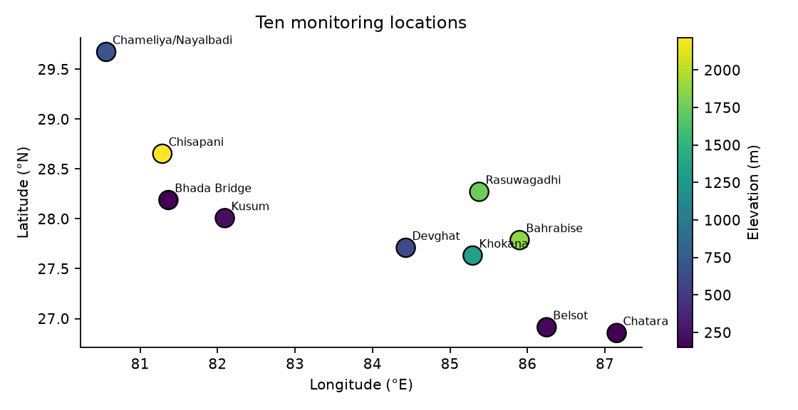

*Figure 1. The ten locations. The panel spans roughly 80.6–87.2 °E and 26.9–29.7 °N, covering the Mahakali/Karnali system in the west through the Koshi system in the east.*

### 3.3 Variable dictionary

**Table 2. Variables, with their roles in this study.**

| Variable | Unit | Type | Role in study |
|---|---|---|---|
| `date` | day | index | time index; daily, no gaps |
| `location`, `river`, `basin` | — | categorical | panel identifier; basin used for grouping |
| `dhm_station` | id | numeric id | metadata only (not a numeric predictor) |
| `latitude`, `longitude`, `elevation_m` | °, °, m | static | static covariates (with caveat, test A7) |
| `precipitation_mm` | mm/day | dynamic | main forcing; heavy-tailed, zero-inflated |
| `rain_mm` | mm/day | dynamic | liquid part of precipitation |
| `precipitation_hours` | h/day | dynamic | duration; intensity = P / hours |
| `soil_moisture_0_100cm_m3m3` | m³/m³ | dynamic | antecedent wetness |
| `temperature_mean_c` | °C | dynamic | melt/phase proxy |
| `dew_point_mean_c`, `relative_humidity_mean_pct` | °C, % | dynamic | moisture state |
| `wind_speed_max_kmh`, `wind_gusts_max_kmh`, `wind_direction_dominant_deg` | km/h, km/h, ° | dynamic | storm-regime descriptors; direction is circular |
| `river_discharge_m3s` | m³/s | target | modelled discharge (corrected cell, Section 3.4) |

The difference `precipitation_mm − rain_mm` is a proxy for solid precipitation (snow). It is non-zero on 223 days at Rasuwagadhi and on only 4 days at Chameliya/Nayalbadi, and exactly zero everywhere else, which is consistent with Rasuwagadhi's high elevation and cool climate (mean temperature 17.5 °C).

### 3.4 Audit findings

The audit consists of eight tests. They are cheap to run and form a reproducible checklist (A1–A3 are implemented as code in `floodlab/data.py`; the others are analyses with the scripts named in Section 10).

**A1 — Completeness and key integrity.** 10 locations × 1,339 days with no duplicate (location, date) pairs and no missing values. *Pass.*

**A2 — Zero-inflation of precipitation.** Between 30 % and 59 % of days have exactly zero precipitation, rain and precipitation hours, and the three zero patterns are internally consistent (no row has precipitation zero and positive precipitation hours, or the reverse). We follow the curator's advice and **do not impute or remove zeros**; we use the hurdle structure of Section 4.4 where needed. *Pass.*

**A3 — Rain versus precipitation.** `rain_mm` never exceeds `precipitation_mm`, and equals it except where snow is plausible (Section 3.3). *Pass.*

**A4 — Discharge magnitude and the grid cell it came from (critical; failed, then corrected).** In the V2 file, mean discharge at the three large-river locations Chisapani (Karnali), Devghat (Narayani) and Chatara (Saptakoshi) is 0.8, 2.3 and 1.5 m³/s, with maxima of 17, 21 and 23 m³/s. We recall published long-term mean flows for these rivers at or near the named stations of order 10³ m³/s; we have not checked this against DHM gauge series, so the statement is an expectation and not a validated fact. We tested the obvious explanation, that the requested coordinate falls in a GloFAS grid cell that is not on the main channel. The Flood API reports the model cell it used (for example, a request at 28.65 °N is answered for 28.675 °N), and the cell size is 0.05° (about 5 km). For each location we requested the discharge of the 5 × 5 block of cells centred on the dataset coordinate (offsets of ±0.05° and ±0.10° in latitude and longitude), 250 requests over 1 January 2023–31 August 2026, and compared each with the dataset series (Table 3).

**Table 3. GloFAS cell scan. The dataset's own cell reproduces the file exactly at all ten locations (maximum absolute difference below 0.02 m³/s); at seven locations a neighbouring cell carries 17–1,565 times more flow.** "Offset" is (latitude, longitude) in steps of 0.05° from the dataset coordinate; "cells >10×" counts the 24 neighbouring cells with a mean above ten times the dataset cell's.

| Location | Dataset cell mean Q | Dataset cell reproduces file | Best neighbouring cell offset | Best-cell mean Q | Ratio best / dataset | Cells >10× | Replaced in corrected panel |
|---|---|---|---|---|---|---|---|
| Chisapani | 0.8 | yes | (0,-1) | 1325.3 | 1564.6 | 11 | yes |
| Chatara | 1.5 | yes | (-1,-2) | 1829.0 | 1226.4 | 9 | yes |
| Devghat | 2.3 | yes | (-1,-2) | 1608.7 | 690.0 | 10 | yes |
| Rasuwagadhi | 1.4 | yes | (-2,-2) | 132.9 | 94.5 | 11 | yes |
| Bhada Bridge | 0.7 | yes | (-2,0) | 65.4 | 93.9 | 7 | yes |
| Khokana | 1.7 | yes | (-2,-2) | 48.9 | 29.5 | 6 | yes |
| Bahrabise | 5.1 | yes | (-1,-2) | 84.1 | 16.6 | 6 | yes |
| Chameliya/Nayalbadi | 31.4 | yes | (-1,-2) | 39.8 | 1.3 | 0 | no |
| Belsot | 33.0 | yes | (-2,-2) | 36.9 | 1.1 | 0 | no |
| Kusum | 125.8 | yes | (0,-2) | 126.5 | 1.0 | 0 | no |


The outcome is unambiguous for the large rivers: the dataset sampled a cell of tiny upstream area beside the channel, and one or two cells away the same request returns means of 1,325 m³/s (Chisapani), 1,609 m³/s (Devghat) and 1,829 m³/s (Chatara), the order of magnitude we expect for those rivers. Bhada Bridge (65 m³/s, from 0.7), Bahrabise (84, from 5.1), Khokana (49, from 1.7) and Rasuwagadhi (133, from 1.4) are affected in the same way. Belsot, Chameliya/Nayalbadi and Kusum are not: their best neighbour is within 27 % of the dataset cell.

*Correction.* We built a corrected series (`paper/corrected/panel_corrected_2023_2026.csv`) that, at each location where a neighbouring cell has more than ten times the mean flow of the dataset cell, uses the neighbouring cell with the highest mean flow (seven locations), and otherwise keeps the dataset cell (three locations). Weather and soil moisture are unchanged. **This is a heuristic, and it has limits we cannot remove without gauge data:** (i) for Khokana and Rasuwagadhi the best cell lies at the corner of the scanned block, so a larger cell may exist beyond it; (ii) "highest mean in the block" could select a different river near a confluence; (iii) the weather is still taken at the original coordinate, up to about 0.11° (12 km) from the discharge cell; and (iv) no upstream area or gauge series was available to confirm any replacement. A visual check supports caution at two locations (Figure 2): the corrected Khokana series is still erratic, with dry-season flows of 0.05–1 m³/s and spikes of 10²–10³ m³/s, and the unchanged Kusum series drops to about 0.1 m³/s at monsoon onset, so neither cell is guaranteed to be on the main channel; the three large-river series (Chatara, Devghat, Chisapani) and Bahrabise, Rasuwagadhi and Bhada Bridge look like smooth monsoon hydrographs. Where we quote results for the corrected panel they describe the *corrected modelled series*, not the gauged river.

**A5 — Quantisation and repeated values (consequence of A4).** In the V2 series, 64 % of Bhada Bridge days and 51 % of Chisapani days had discharge identical to the previous day, because flows were so small that they were rounded at the second decimal. In the corrected series the repeated-value fraction is 2–13 % at every location (Table 5).

**A6 — Intermittent zero flow (consequence of A4).** The V2 series had 223 days of exactly zero discharge at Khokana (16.7 % of the record). The corrected series has none (its 5th percentile is 0.1 m³/s), so the apparent intermittency was an artefact of the small cell and no zero-flow model is needed.

**A7 — Elevation field plausibility.** The `elevation_m` field gives Chisapani as 2,215 m, but its mean temperature is 23.1 °C, similar to the 150–230 m sites (23.9–24.6 °C) and far above the 17.5 °C of the 1,749 m Rasuwagadhi site. A 2,215 m Nepal site with a 23 °C annual mean is not plausible. We therefore **do not treat `elevation_m` as a physical covariate** and run models with and without it. *Fail, unresolved.*

**A8 — Dates beyond the present.** The panel ends on 31 August 2026 and contains the 2026 monsoon through that date. The documentation mentions a 2026 flood in the Rasuwa and Bhote Koshi–Trishuli corridor without giving its date, so it cannot be tested directly (Section 8.8).

**Table 4. Seasonality and tail diagnostics per location (June–September = monsoon), corrected discharge.**

| location | Monsoon (JJAS) share of P | Monsoon share of Q | CV of Q | Q99 / median | P99 (mm/d) | Zero-Q days |
|---|---|---|---|---|---|---|
| Chatara | 77% | 70% | 0.94 | 7.5 | 51.4 | 0.0% |
| Bhada Bridge | 89% | 85% | 1.89 | 71.5 | 40.5 | 0.0% |
| Belsot | 73% | 63% | 1.18 | 15.6 | 46.7 | 0.0% |
| Kusum | 85% | 85% | 1.86 | 56.9 | 29.4 | 0.0% |
| Devghat | 79% | 76% | 1.12 | 10.5 | 48.2 | 0.0% |
| Chameliya/Nayalbadi | 83% | 66% | 0.98 | 8.1 | 42.8 | 0.0% |
| Khokana | 81% | 85% | 1.99 | 64.4 | 54.1 | 0.0% |
| Rasuwagadhi | 62% | 82% | 1.21 | 12.5 | 37.6 | 0.0% |
| Bahrabise | 86% | 77% | 1.15 | 12.7 | 48.6 | 0.0% |
| Chisapani | 89% | 74% | 1.08 | 9.8 | 41.5 | 0.0% |


**Table 5. Data-quality diagnostics per location, corrected discharge.** "Zero P days" are genuine dry days, retained by design. "Repeated Q" is the fraction of days where discharge is identical to the previous day.

| location | Zero P days | P≠rain days | Repeated Q (ΔQ=0) | Q<0.01 | Mean temp °C |
|---|---|---|---|---|---|
| Chatara | 44% | 0 | 3% | 0.0% | 23.9 |
| Bhada Bridge | 59% | 0 | 7% | 0.0% | 24.1 |
| Belsot | 52% | 0 | 13% | 0.0% | 24.6 |
| Kusum | 56% | 0 | 3% | 0.0% | 24.1 |
| Devghat | 57% | 0 | 2% | 0.0% | 23.4 |
| Chameliya/Nayalbadi | 50% | 4 | 8% | 0.0% | 21.3 |
| Khokana | 34% | 0 | 9% | 0.0% | 18.6 |
| Rasuwagadhi | 30% | 223 | 3% | 0.0% | 17.5 |
| Bahrabise | 47% | 0 | 2% | 0.0% | 20.3 |
| Chisapani | 53% | 0 | 2% | 0.0% | 23.1 |


### 3.5 Circularity and the status of the target

Let $F$ denote Open-Meteo/GloFAS's hydrological model, forced with meteorological inputs $X^{\mathrm{GloFAS}}_{t}$. The target is $Q_t = F(X^{\mathrm{GloFAS}}_{1:t}) + \epsilon_t$, and the predictors are Open-Meteo weather $X^{\mathrm{OM}}_t$, which is *related* to, but not guaranteed identical to, $X^{\mathrm{GloFAS}}_t$. A learned model $\hat f$ that predicts $Q_{t+h}$ from $X^{\mathrm{OM}}_{1:t}$ is therefore approximating $F$ composed with a forcing-mismatch term. Three consequences follow:

1. High skill is expected whenever the forcings are close, and tells us little about the real river.
2. Skill should be *compared to a benchmark that exploits the same structure* (persistence plus recession), not to zero.
3. The right scientific question is not "can we forecast the river?" but "how is the modelled river's response organised, and where does the data-driven approximation break?"

We write the paper in this framing throughout. The A4 finding is a further warning: the identity of the modelled cell is itself a data-processing choice, and a benchmark built on the wrong cell would have produced confident but meaningless numbers.

### 3.6 Structural breaks and non-stationarity

Because "Best Match" is a blend, the underlying weather model may change over time. We will test each weather series for mean shifts using the CUSUM statistic and the Pettitt test, after removing the seasonal cycle by regressing on harmonics. For a series $z_t$, $t=1,\dots,n$, the Pettitt statistic is

$$U_{t} = \sum_{i=1}^{t}\sum_{j=t+1}^{n}\operatorname{sgn}(z_i - z_j), \qquad K = \max_{1\le t<n}|U_t|,$$

with approximate $p$-value $p \approx 2\exp\!\big(-6K^2 / (n^3 + n^2)\big)$. A significant break in precipitation or soil moisture near a model-version date would be a red flag for temporal validation. We ran the Pettitt test on six seasonally adjusted weather series at each of the ten locations (60 tests; Table 6; the CUSUM test was not run).

**Table 6. Pettitt change-point tests on seasonally adjusted weather series (10 locations per variable).** "Largest shift" is the largest change in the mean of the residual, in standard deviations, between the segments before and after the estimated change point.

| Variable | Tests | Smallest p | p<0.05 (raw) | p<0.05 (Bonferroni, 60 tests) | Largest |mean shift| (sd) |
|---|---|---|---|---|---|
| dew point | 10 | 0.0000 | 10 | 9 | 0.60 |
| max wind speed | 10 | 0.0000 | 8 | 6 | 0.51 |
| precipitation | 10 | 0.0000 | 8 | 5 | 0.28 |
| relative humidity | 10 | 0.0000 | 10 | 8 | 0.60 |
| soil moisture | 10 | 0.0000 | 10 | 10 | 1.44 |
| temperature | 10 | 0.0000 | 9 | 8 | 0.44 |


Almost every series is flagged: 46 of the 60 tests remain significant after a Bonferroni correction, including soil moisture at all ten locations (shifts up to 1.4 standard deviations), dew point and relative humidity at 9 and 8, and temperature at 8. **These p-values cannot be taken at face value.** The test assumes independent observations, whereas daily residuals of soil moisture, humidity and temperature are strongly autocorrelated, and with only 3.7 years a wet year followed by a dry one produces an apparent break whatever the cause. What is informative is that the estimated dates *cluster across locations*: the dew-point break falls within 6–8 May 2024 at six of ten locations, the relative-humidity break within 8–9 April 2025 at five, and the temperature break within 27–28 April 2025 at four (and on 29 March 2024 at two more), and the soil-moisture breaks fall between June 2024 and September 2025. Common dates at distant locations are what one would expect from a change in the weather-model blend, but also from a common weather regime, and we cannot distinguish the two without the provider's model-version history, which we did not have. We therefore treat the weather series as possibly non-stationary in distribution. The chronological test period (September 2025–August 2026) lies after most of the estimated breaks, so a model trained on earlier data may meet different input distributions at test time; the ablation, which shows that humidity, soil moisture and temperature contribute little (Section 8.7), limits the consequence for the forecasts reported here, but not for any analysis that uses those variables directly.


### 3.7 Exploratory results

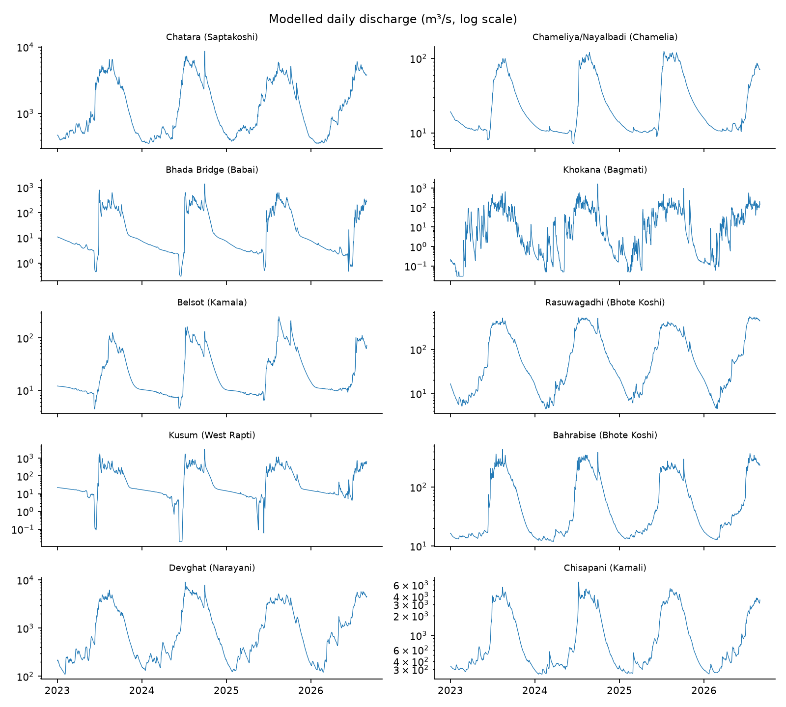

*Figure 2. Corrected modelled daily discharge at each location (log axis). Monsoon peaks dominate, and the plateaus and zero floor of the V2 series (Khokana, Bhada Bridge, Chisapani, Chatara) are gone.*

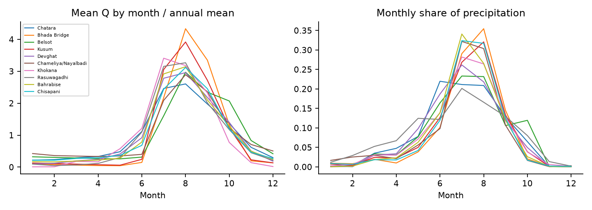

*Figure 3. Left: mean discharge by month normalised by the annual mean. Right: monthly share of total precipitation. All locations peak in June–September, but the discharge peak lags the rainfall peak at several sites.*

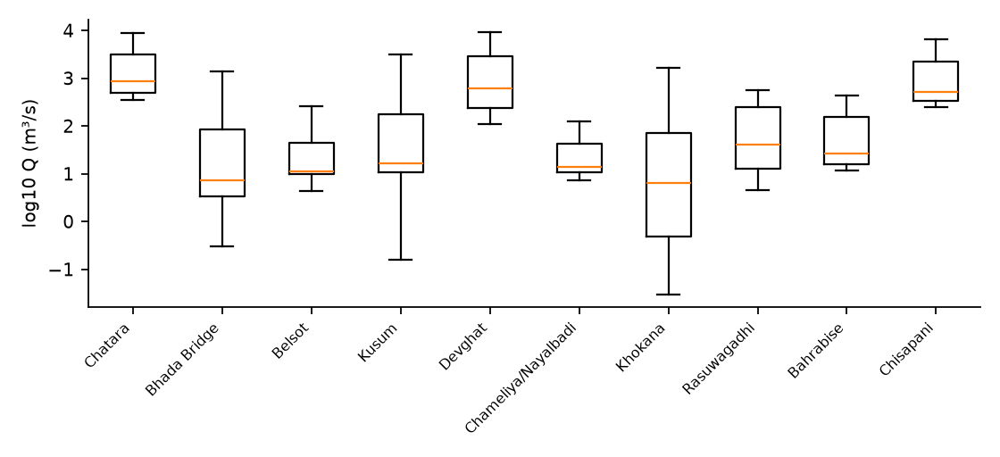

*Figure 4. Distribution of log10 corrected discharge at each location, ordered as in Table 1. The locations still differ by roughly three orders of magnitude (the three large rivers carry 10³ m³/s, the others 10¹–10²), which is why we normalise per location before pooling.*

Discharge is extremely persistent. Lag-1 autocorrelation of $\log(1+Q)$ ranges from 0.968 (Khokana) to 0.999 (Chameliya/Nayalbadi, Chisapani and Rasuwagadhi), and lag-7 from 0.821 (Khokana) to 0.983 (Rasuwagadhi). This is why persistence is a very hard baseline at every location and why Khokana, the flashiest, is the most informative test.

---


## 4. Mathematical Formulation

### 4.1 Notation

Index locations by $s\in\{1,\dots,S\}$ with $S=10$ and days by $t\in\{1,\dots,T\}$ with $T=1339$. Let $P_{s,t}$ denote precipitation (mm), $\theta_{s,t}$ soil moisture, $\tau_{s,t}$ mean temperature, $Q_{s,t}$ discharge, and $\mathbf{x}_{s,t}\in\mathbb{R}^{d}$ the vector of all dynamic covariates. Static attributes are $\mathbf{a}_s$. The forecasting task at horizon $h$ is to learn

$$\hat Q_{s,t+h} = f_h\big(\mathbf{x}_{s,\,t-L+1:t},\; Q_{s,\,t-L+1:t},\; \mathbf{a}_s\big),$$

where $L$ is the look-back length. Crucially, no covariate dated after $t$ enters the model unless it is a *known-future* variable, and we do not use any such variable in the main benchmark, because forecast weather is not in the file. This is the most common source of leakage in flood-prediction notebooks, so it is spelled out as a rule: **a feature is admissible at forecast origin $t$ only if it is computable from data dated $\le t$.**

### 4.2 Variance-stabilising transformation

Discharge spans three orders of magnitude, so models are trained on

$$y_{s,t} = \log\!\big(1 + Q_{s,t}\big),$$

which is defined at zero flow. Skill is reported both in $y$-space (balanced) and after back-transformation to $Q$-space (high-flow dominated), because the two answer different questions. Back-transformation of a conditional mean of $y$ is biased; for a Gaussian residual with variance $\sigma^2$, the unbiased estimate is $\hat Q = \exp(\hat y + \tfrac{1}{2}\sigma^2) - 1$, and we use a smearing estimator (Duan, 1983) when residuals are not Gaussian:

$$\hat Q_{s,t+h} = \Big(\tfrac{1}{n}\sum_{i=1}^{n} e^{\hat\varepsilon_i}\Big)\, e^{\hat y_{s,t+h}} - 1 .$$

### 4.3 Antecedent precipitation and soil moisture

The classical antecedent precipitation index (Kohler and Linsley, 1951) is an exponentially weighted sum:

$$\mathrm{API}_{s,t}(k) = \sum_{j=0}^{J} k^{\,j}\,P_{s,t-j} \quad\Longleftrightarrow\quad \mathrm{API}_{s,t}(k) = k\,\mathrm{API}_{s,t-1}(k) + P_{s,t},\qquad 0<k<1,$$

with recession constant $k$ estimated per location. The soil-moisture covariate $\theta$ is supplied directly, and we form its anomaly relative to the day-of-year climatology so that the seasonal cycle does not dominate:

$$\theta^{*}_{s,t} = \frac{\theta_{s,t}-\bar\theta_{s,\mathrm{doy}(t)}}{\sigma_{\theta,s,\mathrm{doy}(t)}} .$$

With under four years of data, the climatological mean for each day of year is estimated from at most three or four values, so we use a smooth harmonic fit ($K=3$ harmonics) rather than per-day averages:

$$\bar\theta_{s}(t) = a_0 + \sum_{k=1}^{K}\Big[a_k\cos\!\tfrac{2\pi k\,\mathrm{doy}(t)}{365.25} + b_k \sin\!\tfrac{2\pi k\,\mathrm{doy}(t)}{365.25}\Big].$$

*Leakage note:* the climatology must be fitted on the training period only.

### 4.4 Zero-inflated precipitation

Let $I_{s,t}=\mathbb{1}[P_{s,t}>0]$. Daily precipitation is commonly modelled with a hurdle structure,

$$p(P)\;=\;(1-\pi)\,\delta_0(P)\;+\;\pi\,g(P;\boldsymbol\psi)\,\mathbb{1}[P>0],$$

with wet-day probability $\pi$ and positive-amount density $g$, often a gamma or a mixture of gammas to capture the heavy tail. This is used in three places: (i) as a generative model to simulate scenario rainfall in the sensitivity analysis (Section 7.6); (ii) to define wet-spell and dry-spell features; and (iii) to explain why a Gaussian loss on $P$ is inappropriate. We do not alter the data: the zeros are retained.

Two extra rainfall descriptors come from the duration variable. Mean wet-hour intensity is

$$\mathrm{INT}_{s,t} = \frac{P_{s,t}}{\max(H_{s,t},\,1)},$$

with $H$ the precipitation hours, and the wet-spell length $W_{s,t}$ is the number of consecutive days up to $t$ with $P>0$.

### 4.5 Seasonal-recession baseline

During dry spells, discharge recedes approximately as a linear reservoir:

$$Q_{t+1} = c\,Q_t,\qquad c = e^{-1/\kappa},$$

where $\kappa$ is a storage time constant. Taking logs, the recession constant for each site is estimated by regressing $\log Q_{t+1}$ on $\log Q_t$ over days with $P_{t}=P_{t+1}=0$ and $Q_{t+1}\le Q_t$ (a master recession curve). A *recession-persistence* baseline forecasts

$$\hat Q_{t+h} = c^{h}Q_t \quad\text{if no rain is forecast, else } Q_t,$$

which is a harder benchmark than raw persistence on recession limbs and a sanity check on model complexity.

### 4.6 Extreme value formulation

For threshold $u$ chosen as a high quantile of a series $Z$ (precipitation or discharge), exceedances $Y=Z-u\mid Z>u$ are modelled by the generalised Pareto distribution

$$G(y;\sigma,\xi)=1-\Big(1+\xi\,\tfrac{y}{\sigma}\Big)^{-1/\xi},\qquad y>0,\; 1+\xi y/\sigma>0,$$

with scale $\sigma>0$ and shape $\xi$. The $m$-observation return level is

$$z_m = u + \frac{\sigma}{\xi}\Big[(m\,\zeta_u)^{\xi}-1\Big],\qquad \zeta_u = \Pr(Z>u),$$

where $\zeta_u$ is estimated by the empirical exceedance rate. Because the panel spans under four years, $m$ is restricted to small multiples of the record length, and we report **return-level-like quantities as descriptive statistics with bootstrap intervals** and not as design values. Threshold stability is checked by plotting $\hat\sigma^{*}=\hat\sigma-\hat\xi u$ and $\hat\xi$ against $u$, and exceedances are declustered with a run length of $r$ days so that one storm counts once.

### 4.7 Event definitions

We deliberately compare three definitions of a "high-flow event" at location $s$, using only training-period information to set thresholds:

1. **Quantile threshold.** $E^{(q)}_{s,t}=\mathbb{1}[Q_{s,t}>Q_{s}^{(q)}]$, $q\in\{0.90,0.95,0.99\}$, with the quantile taken from the training period.
2. **Relative-rise threshold.** $E^{(r)}_{s,t}=\mathbb{1}\big[Q_{s,t}/\tilde Q_{s,t-1:t-7}>r\big]$, where $\tilde Q$ is the 7-day median (this was relevant when absolute magnitudes were unreliable in the uncorrected series, audit A4).
3. **Rate-of-rise threshold.** $E^{(\Delta)}_{s,t}=\mathbb{1}[\,y_{s,t}-y_{s,t-1}>\delta_s\,]$ with $\delta_s$ a training-period quantile of daily log-increments.

We report results under all three, to expose sensitivity to the labelling choice. A single headline accuracy under one arbitrary threshold is not a scientific result.


### 4.8 A worked example: Khokana, 24 September – 2 October 2024

To make the formulation concrete, Table 7 shows the quantities defined above for the most responsive location during the late-September 2024 storm, from the corrected series. The antecedent index uses a recession constant $k=0.8$ chosen for illustration (the study estimates $k$ per site).

**Table 7. Khokana during the 2024 storm (corrected discharge).** $y=\log(1+Q)$, $\Delta y$ is the one-day log increment, "persistence error" is $Q_{t+1}-Q_t$ in m³/s, and API is Eq. 4.3 with $k=0.8$.

| Date | P (mm) | θ (m³/m³) | Q (m³/s) | y | Δy | Persistence error (next day) | API(0.8) |
|---|---|---|---|---|---|---|---|
| 24 Sep | 9.4 | 0.375 | 11.1 | 2.492 | — | +37.9 | 25.2 |
| 25 Sep | 5.3 | 0.377 | 49.0 | 3.912 | +1.420 | +37.3 | 25.4 |
| 26 Sep | 86.5 | 0.389 | 86.3 | 4.469 | +0.557 | +354.3 | 106.9 |
| 27 Sep | 164.9 | 0.419 | 440.6 | 6.090 | +1.621 | +1,191.5 | 250.4 |
| 28 Sep | 76.4 | 0.429 | 1,632.1 | 7.398 | +1.308 | −487.5 | 276.7 |
| 29 Sep | 4.0 | 0.424 | 1,144.5 | 7.044 | −0.355 | −842.1 | 225.4 |
| 30 Sep | 0.5 | 0.418 | 302.4 | 5.715 | −1.329 | −166.6 | 180.8 |
| 1 Oct | 1.9 | 0.413 | 135.8 | 4.918 | −0.797 | −57.3 | 146.5 |
| 2 Oct | 18.3 | 0.411 | 78.4 | 4.375 | −0.543 | — | 135.5 |

Four features of this table drive the modelling choices.

1. **The response is fast and asymmetric.** Discharge rises 19-fold in two days (86 to 1,632 m³/s between 26 and 28 September, 147-fold from 24 September) and falls to 302 m³/s two days after the peak. The recession ratio on 29→30 September is $302/1{,}145=0.26$, far steeper than the linear-reservoir constants of the large rivers. A one-day persistence forecast errs by +1,191 m³/s on the rising limb and −842 m³/s on the falling limb, and the sum of squared one-day persistence errors over 26–30 September (about $2.5\times10^{6}$ (m³/s)²) dwarfs the variance of an ordinary day (median flow 6.4 m³/s). This is why NSE at this location is dominated by a handful of days.
2. **The increment target is informative.** The log-increment $\Delta y$ is positive on 25–28 September when rain is falling and negative afterwards, and it is large ($|\Delta y|>1.3$) on four of the nine days. A model that predicts $\Delta y_{t+1}$ from $P_t$, $P_{t-1}$ and the API has a direct, nearly monotone signal on the rising limb, which is the mechanism behind the gains of the learned models at Khokana (Section 8.4).
3. **Soil moisture moves slowly and late.** Soil moisture rises from 0.375 to 0.429 (+0.054) over the event while discharge changes by a factor of about 150. The 0–100 cm layer integrates rainfall and is a *state* rather than a trigger, and the ablation in Section 8.8 asks whether it adds skill beyond the rainfall history.
4. **The API saturates and decays.** With $k=0.8$ the index is 250–277 on 27–28 September and decays by about 20 % per day.

### 4.9 Master recession constants

The recession model of Section 4.5 requires pairs of consecutive days with no rainfall and a falling hydrograph. Applying the filter $P_t=P_{t+1}=0,\ Q_{t+1}\le Q_t,\ Q_t>0.5$ m³/s on the training period gives 103 to 479 qualifying pairs at every location of the corrected panel (Table 8), so a per-site constant is identifiable everywhere. The median day-to-day ratios are 0.968–0.997 at nine locations, i.e. storage constants of 31 to 320 days, which describe slowly receding baseflow, and 0.772 at Khokana, i.e. about 4 days, consistent with its flashy response. (In the V2 series, the same filter gave only 3 to 37 pairs at five locations and a degenerate ratio of exactly 1.0 at Devghat, because the plateaued values made the diagnostic uninformative; the correction removes this problem.)

**Table 8. Recession constants estimated on the training period (corrected discharge).** $\kappa=-1/\ln c$ is the implied storage constant in days.

| Location | dry_pairs | raw_median_ratio | used_c | kappa_days | fallback |
|---|---|---|---|---|---|
| Chatara | 302 | 0.982 | 0.982 | 54.149 | site |
| Bhada Bridge | 479 | 0.989 | 0.989 | 94.249 | site |
| Belsot | 418 | 0.997 | 0.997 | 320.166 | site |
| Kusum | 435 | 0.993 | 0.993 | 136.499 | site |
| Devghat | 392 | 0.968 | 0.968 | 30.881 | site |
| Chameliya/Nayalbadi | 363 | 0.993 | 0.993 | 134.999 | site |
| Khokana | 103 | 0.772 | 0.772 | 3.863 | site |
| Rasuwagadhi | 190 | 0.970 | 0.970 | 32.323 | site |
| Bahrabise | 334 | 0.987 | 0.987 | 78.893 | site |
| Chisapani | 368 | 0.986 | 0.986 | 72.127 | site |


---

## 5. Methodology: Models and Algorithms

### 5.1 Overall pipeline

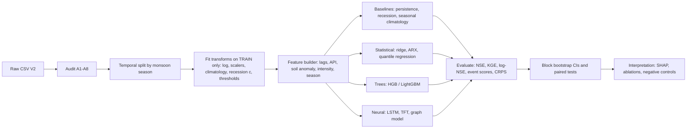

*Figure 5. Study pipeline. Every learned quantity in box D is estimated on the training period only; this is the single most important rule in the protocol.*

### 5.2 Baselines

Baselines carry the argument, because a model that does not beat persistence has learned nothing useful.

- **B0 Persistence.** $\hat Q_{t+h}=Q_t$. At every location the lag-1 autocorrelation exceeds 0.91, so this is demanding.
- **B1 Recession-persistence.** Section 4.5.
- **B2 Seasonal climatology.** $\hat Q_{t+h}=\bar Q_{s}(\mathrm{doy}(t+h))$, a smoothed day-of-year mean fitted on training data. This is the "no information about today" benchmark, relevant at long horizons.
- **B3 Persistence plus rainfall response.** A linear model $\Delta y_{t+h} = \beta_0 + \sum_{j=0}^{J}\beta_j\log(1+P_{t-j})+\gamma\,\theta^*_t + \varepsilon$, which is a lagged-rainfall transfer function (an ARX model) fitted per site by ridge regression.

### 5.3 Statistical models

**Distributed-lag (transfer function) model.** The rainfall–runoff relationship at a site is represented as a convolution,

$$y_{t+h}-y_t = \alpha + \sum_{j=0}^{J} w_j\,\phi(P_{t-j}) + \gamma\,\theta^*_t+\delta\,\Delta\tau_t + \varepsilon_t,$$

with $\phi(P)=\log(1+P)$ and an optional smoothness penalty on the weights, $\lambda\sum_j (w_{j+1}-2w_j+w_{j-1})^2$, to avoid noisy lag estimates from the short record. The estimated weights $\{w_j\}$ are the empirical *unit-hydrograph-like* response, and their centre of mass $\bar j=\sum_j j\,w_j/\sum_j w_j$ is a summary of catchment response time used in RQ2.

**Quantile regression.** To produce prediction intervals without Gaussian assumptions, we fit conditional quantiles $\hat q_\alpha(y_{t+h}\mid \cdot)$ for $\alpha\in\{0.05,0.5,0.95\}$ by minimising the pinball loss

$$\rho_\alpha(u)=u\,(\alpha-\mathbb{1}[u<0]),\qquad \mathcal{L}=\sum_{t}\rho_\alpha\big(y_{t+h}-\hat q_\alpha\big).$$

### 5.4 Gradient-boosted trees

Gradient boosting (Friedman, 2001) builds an additive model $F_M(\mathbf z)=\sum_{m=1}^{M}\eta\,\gamma_m\,T_m(\mathbf z)$ where each tree $T_m$ is fitted to the negative gradient of the loss at the current fit. We use histogram-based boosting (Ke et al., 2017) for speed. The target is the *increment* $\Delta y_{t+h}=y_{t+h}-y_t$, so the model begins from persistence and learns the correction; this reproduces the best-practice trick of modelling residuals against a strong baseline and turns out to matter (Section 8.4). Location enters as a categorical feature, enabling a *pooled* model with site-specific offsets, which is the data-efficient choice for ten sites.

Hyperparameters are tuned by blocked cross-validation (Section 6.2) over: learning rate $\in[0.02,0.1]$, leaves $\in\{7,15,31\}$, minimum samples per leaf $\in\{10,20,50\}$, and $L_2$ regularisation. We limit the search budget deliberately: with ~13k rows from effectively four monsoons, an extensive search overfits the validation split.

### 5.5 Neural sequence models

**LSTM.** A single-layer LSTM (Hochreiter and Schmidhuber, 1997) with hidden size $H$ maps a sequence of dynamic features $\mathbf{x}_{t-L+1:t}$ and static attributes (embedded) to $y_{t+h}$:

$$\begin{aligned}
\mathbf i_t&=\sigma(W_i\mathbf x_t+U_i\mathbf h_{t-1}+\mathbf b_i), &
\mathbf f_t&=\sigma(W_f\mathbf x_t+U_f\mathbf h_{t-1}+\mathbf b_f),\\
\mathbf o_t&=\sigma(W_o\mathbf x_t+U_o\mathbf h_{t-1}+\mathbf b_o), &
\tilde{\mathbf c}_t&=\tanh(W_c\mathbf x_t+U_c\mathbf h_{t-1}+\mathbf b_c),\\
\mathbf c_t&=\mathbf f_t\odot\mathbf c_{t-1}+\mathbf i_t\odot\tilde{\mathbf c}_t, &
\mathbf h_t&=\mathbf o_t\odot\tanh(\mathbf c_t).
\end{aligned}$$

Following Kratzert et al. (2019), the model is **trained jointly on all locations** with per-location input normalisation, so that it shares a single set of recurrent weights and can learn a common rainfall–response structure. The data regime is very small for a deep model (~13k sequences, strongly correlated), so we use heavy dropout, early stopping on a *monsoon-held-out* validation block, and an ensemble of $M=10$ seeds.

**Temporal Fusion Transformer.** A TFT (Lim et al., 2021) provides variable-selection gates and attention that can be inspected. It is a candidate rather than a promise, because its parameter count is large relative to the data. If it overfits, that is itself a publishable finding about the data regime.

**Graph-structured model.** With nodes $s\in\{1,\dots,10\}$ and an adjacency $A$ encoding upstream/downstream or same-basin relations, a graph convolution (Kipf and Welling, 2017) updates the node representation as $H^{(l+1)}=\sigma(\tilde D^{-1/2}\tilde A\tilde D^{-1/2}H^{(l)}W^{(l)})$. In this panel the locations are mostly *not nested*: only the pairs Rasuwagadhi→Devghat (Trishuli into Narayani) and Bahrabise→Chatara (Sun Koshi into Saptakoshi) have a plausible upstream–downstream relationship, and the other six nodes belong to separate basins. We therefore treat the graph model as an *ablation* testing whether explicit connectivity helps, with a learned adjacency as a data-driven alternative (the reverse engineering of a graph from cross-correlation is *not* evidence of physical connectivity).

### 5.6 Algorithms

Four algorithms are central. We present them as precisely as possible because leakage and event-definition errors are where this type of study most often fails.

**Algorithm 1 — Leakage-safe feature construction**

```
Input : panel D with columns (s, t, P, θ, τ, Q, ...); training end date t_train; horizon h
Output: feature matrix X, target y, for all origins t
1  split D into D_train (t ≤ t_train) and D_rest
2  for each location s:
3      fit  climatology harmonics for θ, Q on D_train[s]               # Eq. 4.3
4      fit  recession constant c_s on D_train[s] dry-spell pairs       # Eq. 4.5
5      fit  event thresholds Q_s^(q), δ_s on D_train[s]                # §4.7
6      fit  per-location scaler (mean, sd of y = log(1+Q)) on D_train[s]
7  for each location s and each origin t:
8      lag block   : y_{t-k}, k = 0..L-1                                # only past
9      rain block  : log(1+P_{t-j}), P_sum(3,7,14,30), API_t(k), W_t, INT_t
10     state block : θ*_t, Δθ_t(7), τ_t, RH_t, snow fraction_t
11     season block: sin(2π doy/365.25), cos(2π doy/365.25)
12     static block: location id, (optionally) elevation
13     target      : y_{t+h} − y_t
14 drop origins whose target is beyond the end of the panel
15 return X, y        # every transform in steps 3-6 used parameters from D_train only
```

**Algorithm 2 — Monsoon-blocked temporal cross-validation**

```
Input : panel D, seasons M = {2023, 2024, 2025, 2026}, gap g days
Output: out-of-fold predictions and per-fold scores
1  for each season m in M with a complete or partial monsoon (Jun 1–Sep 30):
2      V ← all days in [Jun 1 − g, Sep 30 + g] of season m               # held-out block
3      Tr ← all days outside V                                          # (a) non-contiguous OK for tabular
4      Tr ← Tr minus any origin whose look-back or horizon window overlaps V   # purge
5      fit pipeline of Algorithm 1 on Tr; predict V
6      store predictions with fold id m
7  aggregate scores per site, pooled and per fold; bootstrap over blocks
```

*Note.* Folds that train on the future and test on the past are legitimate for *tabular* models whose features use only the past, provided the purge in line 4 removes any overlap. For sequence models we additionally run a strictly forward-chaining scheme (train on seasons before $m$ and test on $m$) because recurrent state is also temporal. Both schemes are reported.

**Algorithm 3 — Event detection and declustering**

```
Input : series z_t, threshold u, minimum gap r (days)
Output: list of independent events {(t_start, t_peak, t_end, z_peak)}
1  exceed ← { t : z_t > u }
2  group consecutive exceedance days; merge groups separated by < r days
3  for each merged group G:
4      t_peak ← argmax_{t∈G} z_t
5      t_start ← last t < min(G) with z_t ≤ u      (or min(G))
6      t_end   ← first t > max(G) with z_t ≤ u     (or max(G))
7      record (t_start, t_peak, t_end, z_peak)
8  return events
```

**Algorithm 4 — Block-bootstrap confidence intervals for a skill difference**

```
Input : paired errors e^A_t, e^B_t for models A and B at one site; block length b; replicates R
Output: 95% CI for Δ = Metric(A) − Metric(B)
1  split the time axis into overlapping blocks of length b (stationary bootstrap, geometric lengths with mean b)
2  repeat R times:
3      draw blocks with replacement and concatenate to length T
4      compute Metric(A), Metric(B) on the resampled index set; store Δ_r
5  return the 2.5% and 97.5% quantiles of {Δ_r}
```

Block length $b$ is chosen from the integral time scale of the squared-error series (typically 7–14 days here). A paired block bootstrap (Politis and Romano, 1994) is used because daily errors are strongly autocorrelated, so independent resampling would give intervals that are too narrow.

### 5.7 Hyperparameters, computation and reproducibility budget

**Table 9. Intended model configurations.** Search ranges are deliberately narrow; effective sample size is small (Section 6.4). *Boosting and the LSTM were tuned in a nested, bounded search (Section 8.5); the ridge model has built-in selection; TFT-lite and the graph networks use default settings and 5 seeds; the reference TFT was not used.*

| Model | Inputs | Key settings | Search budget | Output |
|---|---|---|---|---|
| Ridge ARX (B3) | lags of $\log(1+P)$ up to $J=14$; $\theta^*$; $\Delta\tau$ | ridge $\lambda\in\{10^{-3},\dots,10^{2}\}$; second-difference smoothness penalty | 5-fold blocked CV | lag weights $\{w_j\}$ |
| Pooled HGB | 22 features (§8.4) plus variants | lr 0.02–0.1; leaves 7/15/31; min leaf 10/20/50; $L_2$ | ≤ 30 random configs | point forecast, SHAP |
| Quantile HGB | same | pinball loss, $\alpha\in\{0.05,0.5,0.95\}$ | shared with HGB | intervals |
| Joint LSTM | 30-day window, 12 dynamic inputs, static embedding | hidden 32/64; dropout 0.2–0.4; AdamW; early stopping | ≤ 12 configs × 10 seeds | ensemble mean and spread |
| TFT | same plus static covariates | 1–2 attention heads; hidden 16–32 | ≤ 6 configs × 5 seeds | attention, variable weights |
| Graph ablation | node features as LSTM plus adjacency (§5.5) | 1–2 layers | 3 configs | difference vs LSTM |

All of this is cheap: the data set has about 13,000 rows, the boosting arm trains in seconds on a CPU, and the neural arms fit in minutes on a CPU or a single small GPU. The binding constraint is therefore not computation but *degrees of freedom*: the more configurations are tried, the greater the risk that the best validation score reflects luck in a few monsoon peaks. We handle this in three ways: an explicit cap on the number of configurations; reporting the **distribution** of scores over configurations and seeds, not only the best; and a final untouched evaluation on the held-out season, run once.

**Seeds and determinism.** Every stochastic component (bootstrap, tree subsampling, neural initialisation, data shuffling) takes an explicit seed recorded alongside the result. For the neural models, results are reported as the median over seeds with the inter-seed range, since single-seed neural results are known to vary by amounts comparable to the differences between models.

---

## 6. Experimental Design

### 6.1 Prediction tasks

| Task | Target | Horizon | Rationale |
|---|---|---|---|
| T1 Regression | $\log(1+Q_{t+h})$ | 1, 3, 7 d | main forecasting benchmark |
| T2 Classification | $E^{(q)}_{t+h}$ for $q=0.90,0.95$ | 1, 3 d | event occurrence, three definitions in §4.7 |
| T3 Quantile | $q_{0.05,0.5,0.95}$ of $y_{t+h}$ | 1, 3 d | calibrated intervals |
| T4 Zero-flow | — | — | dropped: the corrected series has no zero flow (audit A6) |
| T5 Anomaly | high reconstruction error flag | — | unsupervised, detects unusual response |

### 6.2 Splits

The record is short, so the split design is critical. We use three schemes and report all three.

1. **Primary split (chronological).** Train 1 Jan 2023 – 31 Aug 2025, test 1 Sep 2025 – 31 Aug 2026. Training contains two full monsoons plus most of the 2025 monsoon, including the extreme September 2024 event; the test contains the tail of the 2025 monsoon and the monsoon months of 2026 to 31 August. This is the split used in the preliminary results.
2. **Leave-one-monsoon-out (Algorithm 2).** Each season is held out in turn with a purge gap. This measures sensitivity to which year is in the test set, which with four years is large.
3. **Leave-one-location-out (LOLO).** Train on nine locations, test on the tenth over the full period. *(The reported version trains on the chronological training period only and tests on the held-out site's test window, so that it is comparable with the within-site results; the held-out site's own recent flow remains an input, so this tests transfer of the rainfall-to-increment mapping, not prediction at an ungauged site.)* This approximates *prediction at ungauged sites* (Kratzert et al., 2019; Nearing et al., 2024) and is the most scientifically interesting test the panel permits, because it asks whether the rainfall–discharge mapping generalises across basins.

Validation data for early stopping or hyperparameter search is always carved out of the *training* period by season, never from the test period.

### 6.3 Metrics

For observations $o_i$ and predictions $p_i$ over a test set with mean $\bar o$:

$$\mathrm{NSE}=1-\frac{\sum_i (o_i-p_i)^2}{\sum_i (o_i-\bar o)^2},\qquad
\mathrm{KGE}=1-\sqrt{(r-1)^2+(\alpha-1)^2+(\beta-1)^2},$$

where $r$ is the Pearson correlation, $\alpha=\sigma_p/\sigma_o$ and $\beta=\mu_p/\mu_o$. NSE is computed on raw $Q$ (high-flow weighted) and on $y=\log(1+Q)$ (all-flow weighted). Skill relative to a benchmark $B$ is

$$\mathrm{SS}=1-\frac{\mathrm{MSE}_{\text{model}}}{\mathrm{MSE}_{B}},$$

reported against persistence and against seasonal climatology. Peak timing error is the difference in days between observed and predicted peak within each declustered event (Algorithm 3), and peak magnitude error is $(\hat z_{\text{peak}}-z_{\text{peak}})/z_{\text{peak}}$.

For event classification with hits $a$, misses $c$ and false alarms $b$:

$$\mathrm{POD}=\frac{a}{a+c},\quad \mathrm{FAR}=\frac{b}{a+b},\quad \mathrm{CSI}=\frac{a}{a+b+c},\quad \mathrm{F}_1=\frac{2a}{2a+b+c},$$

and, because events are rare, **precision–recall AUC** is preferred over ROC AUC. Probabilistic forecasts are scored with CRPS,

$$\mathrm{CRPS}(F,o)=\int_{-\infty}^{\infty}\big(F(x)-\mathbb{1}[x\ge o]\big)^2dx,$$

approximated from quantiles by averaging pinball losses over a grid of levels, and with the interval coverage and the sharpness of the 90 % prediction interval.

### 6.4 Statistical testing

Pairwise model comparisons use the Diebold–Mariano test (Diebold and Mariano, 1995) with a HAC variance estimator on the loss differential $d_t=L(e^A_t)-L(e^B_t)$, and the paired block bootstrap of Algorithm 4. With ten sites and several horizons, we control the false discovery rate with the Benjamini–Hochberg procedure. Because the ten series are cross-correlated (the cross-site correlation of $\log(1+Q)$ is between 0.60 and 0.98; Section 8.2), site-level results are *not independent*, and we say so when interpreting "wins at 8 of 10 sites".

### 6.5 Ablations and interpretation

Feature groups (lag, rain, soil, temperature/humidity, wind, season, static) are ablated one group at a time and one-group-only. Permutation importance and TreeSHAP (Lundberg and Lee, 2017) are computed on held-out data, with importance aggregated at the group level because individual features such as lags and rolling sums are highly collinear and individual importances are unstable. For the transfer-function model, interpretation is directly the lag-weight vector $\{w_j\}$.

### 6.6 Reproducibility

Random seeds, package versions and the exact split dates are logged; each table in the paper is generated by a script that reads the CSV and writes a Markdown or LaTeX table to `tables/`. The scripts used so far (`prelim.py`, `baseline.py`, `make_tables.py`) are in the repository, and no figure is hand-edited.

---

## 7. What Can Be Done With This Dataset

This section turns the research questions into concrete analyses. For each we state the question, the method, the output (figure or table) and an honest assessment of how far the data can support it. The assessment is part of the contribution: a reader should be able to tell which analyses are strong, which are exploratory, and which should not be attempted.

### 7.1 Rainfall–discharge lag structure (RQ2) — *strong*

**Status: done (Section 8.7).** **Method.** Estimate the distributed-lag weights $\{w_j\}_{j=0}^{J}$ (Section 5.3) per location on the prewhitened series, i.e. after removing seasonal harmonics and the autoregressive component of $\log(1+Q)$, so that the common monsoon cycle does not masquerade as a rainfall response. Summarise each site by the response centroid $\bar j$ and the cumulative response $\sum_j w_j$. Compare against elevation, basin and event size. Uncertainty comes from the stationary bootstrap (Algorithm 4).

**Why it is feasible.** The lag structure is identifiable from daily data at sites with response times of a few days, and the monsoon provides a large range of rain events. **Caveat.** Raw cross-correlations (Table 13) mix response with seasonality and must not be reported as lags. For example, correlations at several sites keep rising up to the maximum lag examined (7 days), which reflects the shared seasonal cycle and not a 7-day response time.

**Output.** Figure: lag-weight curves per site; Table: $\bar j$ with 95 % intervals; scatter of $\bar j$ against drainage characteristics if a corrected catchment-area attribute can be added (Section 10).

### 7.2 Antecedent soil moisture and wetness (RQ3) — *strong, with a causal caveat*

**Question.** For a given rainfall depth, is the discharge response larger when the soil is already wet?

**Method.** Estimate a runoff-ratio-like quantity per rainfall event, $\mathrm{RR}_e=\Delta Q_e/P_e$ with $\Delta Q_e$ the peak rise above pre-event flow and $P_e$ the event rainfall, identified through Algorithm 3. Then regress $\log \mathrm{RR}_e$ on pre-event soil moisture $\theta^{*}$, $\mathrm{API}$, season and site random effects:

$$\log \mathrm{RR}_{e,s}=\beta_0+\beta_1\,\theta^{*}_{e,s}+\beta_2\,\mathrm{API}_{e,s}+\beta_3\log P_{e,s}+u_s+\varepsilon_{e,s},\qquad u_s\sim\mathcal N(0,\sigma_u^2).$$

A positive $\beta_1$ supports the wet-catchment amplification hypothesis. The ablation of $\theta^*$ and API in the forecasting models (Section 6.5) provides a second, independent test.

**Caveat.** Modelled soil moisture and modelled discharge may derive from related land-surface physics, so a positive $\beta_1$ is partly a statement about model consistency. We will therefore compare with the case of a *random-permuted soil-moisture* control and with the response before and after the monsoon onset.

### 7.3 Forecasting benchmark (RQ4) — *strong, and the main quantitative result*

A pooled increment model, per-site models and a joint LSTM are compared against persistence, recession and climatology at 1-, 3- and 7-day horizons under the three splits of Section 6.2, with significance tests. A Temporal Fusion Transformer and a graph-network arm are described in Section 5.5 but were not run.

The completed benchmark is reported in Sections 8.4 and 8.5.

### 7.4 Spatial generalisation: prediction at an unseen location (RQ4) — *the most interesting test*

Leave-one-location-out training (Section 6.2) asks how much skill a model trained on nine sites retains at the tenth. As implemented, the held-out site's own recent discharge is still an input (it is the *training* that excludes the site), so this is a test of whether the learned rainfall-to-increment mapping transfers, not of prediction with no discharge history at all. The answer is a function of how similar the site's regime is to the others and is expected to vary widely. Khokana, whose flashy and intermittent regime differs from the rest, is a likely failure case, and the *pattern* of failures across sites is as informative as the average.

The completed experiment is reported in Section 8.6.

Regime similarity is quantified by the distance between sites in a feature space of normalised flow-duration-curve percentiles, monsoon share and lag centroid $\bar j$, and we test whether LOLO skill decays with this distance (rank correlation with bootstrap interval).

### 7.5 Extremes (RQ5) — *descriptive*

For precipitation and for discharge (in normalised form) we fit peaks-over-threshold models (Section 4.6) and report:

- threshold-stability plots and the declustered event counts (Algorithm 3);
- the GPD shape $\hat\xi$ per site with profile-likelihood intervals;
- a *leave-event-out* check: refit omitting 24–30 September 2024, then ask where the held-out event falls in the fitted tail. If the event is far beyond the fitted tail, that is evidence that the 2024 storm was unusual relative to the rest of the record, which is consistent with the DHM reports of record precipitation.
- joint extremes: the proportion of sites simultaneously above their 95th percentile on a given day (a spatial extent index), and an extremal-dependence coefficient $\chi(u)=\Pr(Z_2>F_2^{-1}(u)\mid Z_1>F_1^{-1}(u))$ for site pairs.

**Feasibility.** With 1,339 days per site and only about 4–5 monsoon seasons, tail inference is weak. We therefore refuse to report 50- or 100-year return levels and we keep extreme-value results qualitative and comparative.

### 7.6 Scenario and sensitivity analysis — *exploratory (done; Section 8.8, with a negative methodological result)*

Because the forecasting models are differentiable (neural) or cheap to evaluate (trees), they can be used for *counterfactual sensitivity* analysis: how much would modelled discharge change if the same storm fell on drier antecedent soil? Perturb $\theta^*$ by $\pm1\sigma$ and the 3-day rainfall by multiplicative factors $\lambda\in\{0.8,1.0,1.2\}$, and report the change in peak. This is a statement about the learned model and the modelled system, not about the real catchment, and is labelled as such. A hurdle-gamma rainfall generator (Section 4.4) can create synthetic rainfall for stress-testing.

### 7.7 Cross-basin synchrony and upstream–downstream relations — *exploratory (done; Section 8.7)*

Using a wavelet coherence or a simple lagged correlation of prewhitened series, test whether discharge at Rasuwagadhi leads discharge at Devghat (Trishuli into Narayani), and whether Bahrabise leads Chatara. Cross-correlation of the *precipitation* series (Table in §8.2) shows that adjacent eastern sites share rainfall (Chatara–Belsot 0.85; Bahrabise–Khokana 0.85) but that Rasuwagadhi is relatively decoupled from all others (0.46–0.61). Any "upstream leads downstream" result must be tested against the null of common rainfall forcing, for example with a Granger-type regression that conditions on the local precipitation series, since a common storm can induce an apparent lead–lag without any hydraulic connection.

### 7.8 Anomaly detection (T5) — *exploratory and useful as a diagnostic (done; Section 8.8)*

Train an LSTM autoencoder or an isolation forest on normal behaviour and score the reconstruction error of the rainfall–discharge relationship. A flood whose discharge response is *large relative to rainfall* (Kusum on 28 September 2024, or hypothetical glacier-driven rises) should produce a high residual, while a flood fully explained by rainfall should not. This gives a principled operational definition of a "non-rainfall-explained" event, and is evaluated against the documented-event list in Section 8.5, with the important proviso that the list has only a handful of entries.

### 7.9 Downstream (Nepal–India) context

The panel contains no Indian locations, so *transboundary effects cannot be measured*. What can be done is to characterise the **lead time available** between rainfall in Nepal and peak modelled discharge at the most downstream locations (Chatara on the Saptakoshi and Devghat on the Narayani, which become the Koshi and Gandak systems in India). In the September 2024 event, the peak at these locations followed the precipitation peak by 2 days at both (Table 12). We report this as a *characteristic timescale in the model*, not as an operational warning time, and flag that real routing, attenuation by structures, and observed flows could differ.

### 7.10 Summary of feasibility

The implementation status of each analysis is listed in Section 10.1.

**Table 10. Analyses by evidential strength.**

| Analysis | Strength | Main limitation |
|---|---|---|
| Lag structure (7.1) | Strong | seasonality confounding; needs prewhitening |
| Soil-moisture effect (7.2) | Strong | modelled-modelled dependence |
| Forecast benchmark (7.3) | Strong | circular target; short record |
| LOLO transfer (7.4) | Strong | ten sites; regimes differ |
| Extremes (7.5) | Descriptive | < 5 monsoons |
| Scenarios (7.6) | Exploratory | statement about the model |
| Synchrony/upstream (7.7) | Exploratory | common-forcing confound |
| Anomaly detection (7.8) | Exploratory | few labelled events |
| Transboundary (7.9) | Limited | no Indian locations |
| Glacier/flash flood detection | **Not supported** | processes absent from daily weather |

### 7.11 Extensions that would need additional data

The panel supports a considerable amount of science as it stands, but several of the most valuable extensions would need data it does not contain. We list them because a paper that says what is *missing* is more useful to the next researcher than one that stops at the file boundary.

1. **Gauge observations.** DHM discharge series for the ten named stations would allow the central validity question (audit A4; the cell scan of Section 3.4 resolves the gross scale error but not the match to gauges) to be answered directly: how does the modelled series compare in magnitude, timing and extremes with measured flow, and does the machine-learning model trained on modelled flow transfer to measured flow? Even a short overlapping period would let us compute bias, correlation and KGE of GloFAS against gauges at each site, and fit a simple bias-correction (for example quantile mapping) whose effect on forecast skill could be tested.
2. **Catchment attributes.** Upstream area, mean catchment elevation, glacier and snow fraction, land cover and slope are the static features that make cross-catchment learning work in larger studies (Kratzert et al., 2019). With ten sites, a handful of well-chosen attributes (upstream area, glacier fraction, mean slope) are all that can be supported, and they would replace the questionable `elevation_m` field.
3. **Alternative precipitation products.** Comparing the Open-Meteo precipitation series with satellite estimates such as IMERG, and with station records for the rare locations that have them, would show how sensitive conclusions are to the forcing. This is especially relevant for the steep Himalayan locations, where reanalysis precipitation can be biased.
4. **Snow and glacier information.** Snow-cover fraction, snow-water equivalent or degree-day melt estimates would help separate rain-driven from melt-driven rises at Rasuwagadhi and Bahrabise. A temperature-index feature, such as positive degree-days $\mathrm{PDD}_t=\sum_{j=0}^{J}\max(\tau_{t-j}-\tau_0,0)$ with $\tau_0=0\,^\circ$C, can be built from the panel as it stands, but a physical snow model would be better.
5. **Hazard inventories.** A dated, geo-located list of glacial-lake outbursts, landslide dams and flash floods would allow the negative-control analysis to be extended from three events to a proper evaluation, with labelled positives for anomaly detection (Section 7.8).
6. **Downstream observations.** Indian-side gauges on the Koshi, Gandak, Bagmati, Kamala and Rapti would turn the transboundary discussion into a measurable lead-time analysis. Without them, Section 7.9 stays at the level of a stated timescale in the modelled data.
7. **Forecast inputs.** Operational weather forecasts at the forecast origin (not available in the file) would make the task a true forecast problem with *known-future* inputs. The present benchmark is a *nowcast-plus-persistence* problem in which rainfall on the target day is unknown.

None of these is required for the core study, and none should be implied to have been used.

---


## 8. Results (corrected discharge)

All numbers in this section are produced by code in `paper/` on the corrected panel and are reproducible with the commands of Section 10.1b. Sections 8.1–8.3 are descriptive; 8.4–8.6 report the forecasting benchmark, the model arms and the transfer experiment; 8.7 reports the process analyses; 8.8 the documented events; 8.9 what changed relative to the uncorrected series; and 8.10 a discussion.

### 8.1 Annual maxima and the September 2024 storm

**Table 11. Annual maximum modelled discharge (m³/s), corrected series.** 2026 includes data only to 31 August.

| location | 2023 | 2024 | 2025 | 2026 (to 31 Aug) |
|---|---|---|---|---|
| Chatara | 6530.3 | 8648.7 | 5941.9 | 6024.6 |
| Bhada Bridge | 804.4 | 1392.2 | 619.9 | 353.8 |
| Belsot | 125.8 | 163.1 | 255.4 | 111.5 |
| Kusum | 1802.0 | 3175.9 | 1190.2 | 742.0 |
| Devghat | 6222.0 | 9098.1 | 5175.1 | 5766.7 |
| Chameliya/Nayalbadi | 99.5 | 120.3 | 124.6 | 86.5 |
| Khokana | 653.6 | 1632.0 | 969.5 | 571.8 |
| Rasuwagadhi | 515.4 | 522.6 | 422.6 | 552.4 |
| Bahrabise | 436.5 | 386.3 | 297.5 | 371.4 |
| Chisapani | 5558.0 | 6636.4 | 5259.2 | 3774.7 |


The 2024 annual maximum is the largest in the panel at six of the ten locations. The exceptions are Bahrabise (14 August 2023), Belsot (16 August 2025), Chameliya/Nayalbadi (12 July 2025) and Rasuwagadhi (18 July 2026). The all-time maximum falls on 28 September 2024 at Bhada Bridge, Khokana and Kusum and on 29 September at Chatara, but at Devghat and Chisapani it falls earlier, on 7 and 8 July 2024, so the September storm was not the largest event everywhere. At Chameliya/Nayalbadi only 7.2 mm fell over 26–28 September, because far-western Nepal lay outside the storm's footprint.

**Table 12. The 27–29 September 2024 storm (positive control).** "Pre-event Q" is the median of 15–24 September; the peak is the maximum over 20 September–8 October; the lag is from the largest precipitation day (24–30 September) to the peak discharge day.

| Location | P 26–28 Sep (mm) | Pre-event Q (median 15–24 Sep) | Peak Q 20 Sep–8 Oct | Peak / pre-event | Peak / Q99 | Lag P-peak→Q-peak (d) |
|---|---|---|---|---|---|---|
| Chatara | 274.7 | 2715.8 | 8648.68 | 3.2 | 1.36 | 2 |
| Bhada Bridge | 241.3 | 174.98 | 1392.16 | 8.0 | 2.63 | 1 |
| Belsot | 185.3 | 54.03 | 132.66 | 2.5 | 0.74 | 3 |
| Kusum | 157.2 | 215.02 | 3175.87 | 14.8 | 3.31 | 1 |
| Devghat | 292.4 | 3191.08 | 7887.6 | 2.5 | 1.23 | 2 |
| Chameliya/Nayalbadi | 7.2 | 70.46 | 69.31 | 1.0 | 0.61 | — |
| Khokana | 327.8 | 42.76 | 1632.05 | 38.2 | 3.99 | 1 |
| Rasuwagadhi | 196.3 | 244.52 | 505.99 | 2.1 | 0.98 | 2 |
| Bahrabise | 265.8 | 150.56 | 386.26 | 2.6 | 1.15 | 2 |
| Chisapani | 119.5 | 2998.8 | 3563.51 | 1.2 | 0.71 | 3 |


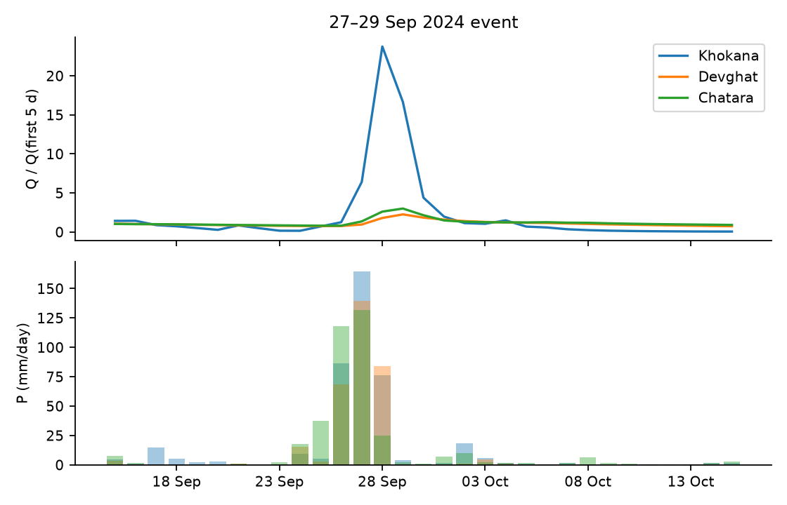

*Figure 6. Precipitation (bottom) and discharge normalised by its pre-event level (top) at Khokana (Bagmati), Devghat (Narayani) and Chatara (Saptakoshi).*

The data capture the rainfall-driven event: three-day precipitation of 120–328 mm at nine of ten locations, and discharge peaks of 1.2 to 38 times the pre-event flow. With the corrected series the large rivers are visible as well: the Saptakoshi at Chatara peaks at 8,649 m³/s (1.36 times its 99th percentile) two days after the rain peak, the Narayani at Devghat at 7,888 m³/s (1.23 times; its record in this panel, 9,098 m³/s, is on 7 July 2024), and the Bagmati at Khokana rises 38-fold to 1,632 m³/s, 4.0 times its 99th percentile. The Department of Hydrology and Meteorology reported flows above historical levels on the Bagmati, Narayani and Sunkoshi; the modelled panel is consistent for the Bagmati and, more weakly, for the Bhote Koshi at Bahrabise (1.15 times the 99th percentile), but its four-year record cannot test the statement for the Narayani. At Kusum the 28 September peak of 3,176 m³/s occurs on a day with only 8.4 mm of local rain, following 117.6 mm the day before, which shows that point precipitation at the coordinate is an incomplete description of upstream catchment forcing.

### 8.2 Dependence between locations

The cross-site correlation of $\log(1+Q)$ ranges from 0.60 (Belsot–Khokana) to 0.98 and averages 0.85, dominated by the shared seasonal cycle, so ten locations are far fewer than ten independent samples. The correlation of $\log(1+P)$ is lower and more spatially structured: Bhada Bridge–Kusum 0.88, Bhada Bridge–Chisapani 0.87 and Chatara–Belsot 0.85 are the strongest pairs, consistent with neighbouring western and eastern groups, and Rasuwagadhi is the most isolated (0.46–0.61 with every other location). This structure motivates the leave-one-location-out experiment and block bootstraps that respect dependence.

### 8.3 Rainfall–discharge association

**Table 13. Correlation between $\log(1+P_t)$ and $\log(1+Q_{t+k})$ (raw, not prewhitened), corrected series.**

| location | r(k=0) | r(k=1) | r(k=3) | r(k=7) | argmax k | max r |
|---|---|---|---|---|---|---|
| Chatara | 0.58 | 0.61 | 0.64 | 0.64 | 4 | 0.64 |
| Bhada Bridge | 0.51 | 0.55 | 0.58 | 0.62 | 7 | 0.62 |
| Belsot | 0.32 | 0.34 | 0.39 | 0.42 | 7 | 0.42 |
| Kusum | 0.53 | 0.57 | 0.6 | 0.62 | 7 | 0.62 |
| Devghat | 0.58 | 0.6 | 0.63 | 0.65 | 7 | 0.65 |
| Chameliya/Nayalbadi | 0.57 | 0.59 | 0.62 | 0.66 | 7 | 0.66 |
| Khokana | 0.81 | 0.87 | 0.84 | 0.76 | 1 | 0.87 |
| Rasuwagadhi | 0.4 | 0.41 | 0.43 | 0.43 | 7 | 0.43 |
| Bahrabise | 0.68 | 0.7 | 0.72 | 0.73 | 7 | 0.73 |
| Chisapani | 0.69 | 0.71 | 0.74 | 0.75 | 7 | 0.75 |


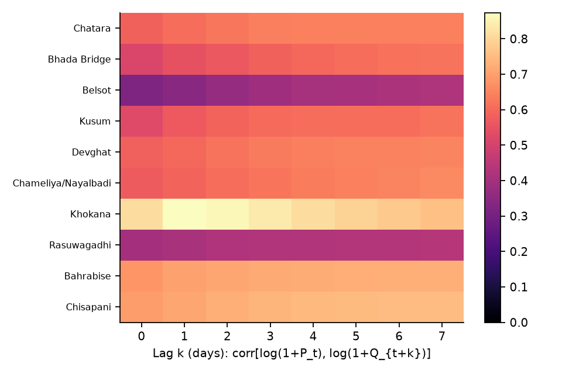

*Figure 7. Lagged correlation between log precipitation and log discharge, by location (rows ordered by elevation as in Table 1). Khokana responds within one day and then decays; most others keep increasing to the largest lag examined, which reflects seasonality and not a long response time (Section 8.7).*

Khokana is again the only location where the correlation peaks and then falls (maximum 0.87 at $k=1$). Elsewhere the correlation rises or plateaus out to $k=7$, which the prewhitened analysis of Section 8.7 shows to be a seasonal artefact.

### 8.4 Forecasting benchmark

The implementation (`paper/floodlab/`) follows Algorithms 1–4 and the protocol of Section 6. Before any model was run, `tests/test_leakage.py` passed three tests on the corrected panel: (a) all 28 features at origins up to a cutoff are unchanged when every observation after the cutoff is randomly rescaled; (b) the predictions of a model fitted before the cutoff are unchanged by the same perturbation; and (c) a deliberately leaky feature (a centred rolling mean) *is* detected, so the test can fail. All fitted quantities (soil-moisture and discharge climatology, recession constants, thresholds, scalers) use the training period only.

**What was run.** Baselines B0–B3; a pooled `HistGradientBoostingRegressor` on the increment $\Delta y_{t+h}$ (28 features plus site and elevation; default 400 iterations, learning rate 0.05, 15 leaves, $L_2=1$) and a nested-tuned version (Section 8.5); quantile versions of the boosted model at $h=1,3$; a joint multi-site LSTM (30-day window, 12 dynamic inputs, site embedding, three multi-horizon heads, early stopping on the most recent 15 % of training dates; 10 seeds averaged) and a tuned version; a simplified Transformer-style network ("TFT-lite") and three graph networks (5 seeds averaged). Splits: chronological (train to 31 August 2025, test 1 September 2025–31 August 2026); leave-one-monsoon-out (LOMO) over June–September of 2023–2026 with a 7-day purge before and a 30-day purge after each held-out block; forward chaining for the 2025 and 2026 monsoons (which the sequence models use in place of LOMO); and chronological leave-one-location-out (LOLO). Statistical comparisons use the Diebold–Mariano test with a Newey–West variance on squared log-space errors, Benjamini–Hochberg control within each split scheme, and the paired stationary bootstrap (Algorithm 4).

**Table 14. Median across the ten locations of NSE (raw $Q$) and log-NSE ($\log(1+Q)$) at horizons $h=1,3,7$ days.** B2 is the seasonal climatology, B3 the per-site ridge distributed-lag model, B1 recession-persistence; `_tuned` rows use the nested search of Section 8.5 and exist for the chronological split and the 2026 forward-chaining fold only. The sequence models were not run under LOMO (blank cells).

| Split | Model | h=1 NSE | h=1 logNSE | h=3 NSE | h=3 logNSE | h=7 NSE | h=7 logNSE | KGE h=3 |
|---|---|---|---|---|---|---|---|---|
| Chronological | B0_persistence | 0.984 | 0.996 | 0.949 | 0.981 | 0.893 | 0.944 | 0.972 |
| Chronological | B1_recession | 0.984 | 0.996 | 0.950 | 0.982 | 0.895 | 0.944 | 0.972 |
| Chronological | B2_climatology | 0.780 | 0.878 | 0.770 | 0.876 | 0.751 | 0.871 | 0.824 |
| Chronological | B3_ARX | 0.987 | 0.997 | 0.958 | 0.986 | 0.898 | 0.952 | 0.935 |
| Chronological | HGB | 0.990 | 0.997 | 0.904 | 0.980 | 0.878 | 0.947 | 0.892 |
| Chronological | LSTM | 0.987 | 0.997 | 0.963 | 0.987 | 0.905 | 0.964 | 0.931 |
| Chronological | HGB_tuned | 0.989 | 0.997 | 0.965 | 0.984 | 0.922 | 0.951 | 0.949 |
| Chronological | LSTM_tuned | 0.987 | 0.997 | 0.943 | 0.984 | 0.854 | 0.958 | 0.894 |
| Chronological | TFT_lite | 0.987 | 0.997 | 0.964 | 0.988 | 0.912 | 0.966 | 0.919 |
| Chronological | GRAPH_none | 0.987 | 0.996 | 0.963 | 0.985 | 0.921 | 0.961 | 0.942 |
| Chronological | GRAPH_phys | 0.988 | 0.996 | 0.968 | 0.986 | 0.920 | 0.965 | 0.949 |
| Chronological | GRAPH_learned | 0.988 | 0.997 | 0.967 | 0.987 | 0.908 | 0.965 | 0.929 |
| Leave-one-monsoon-out | B0_persistence | 0.944 | 0.977 | 0.802 | 0.897 | 0.585 | 0.672 | 0.898 |
| Leave-one-monsoon-out | B1_recession | 0.944 | 0.977 | 0.803 | 0.898 | 0.585 | 0.662 | 0.898 |
| Leave-one-monsoon-out | B2_climatology | 0.521 | 0.738 | 0.493 | 0.721 | 0.411 | 0.685 | 0.678 |
| Leave-one-monsoon-out | B3_ARX | 0.950 | 0.981 | 0.801 | 0.917 | 0.553 | 0.742 | 0.885 |
| Leave-one-monsoon-out | HGB | 0.950 | 0.982 | 0.802 | 0.926 | 0.592 | 0.789 | 0.875 |
| Leave-one-monsoon-out | LSTM |  |  |  |  |  |  |  |
| Leave-one-monsoon-out | HGB_tuned |  |  |  |  |  |  |  |
| Leave-one-monsoon-out | LSTM_tuned |  |  |  |  |  |  |  |
| Leave-one-monsoon-out | TFT_lite |  |  |  |  |  |  |  |
| Leave-one-monsoon-out | GRAPH_none |  |  |  |  |  |  |  |
| Leave-one-monsoon-out | GRAPH_phys |  |  |  |  |  |  |  |
| Leave-one-monsoon-out | GRAPH_learned |  |  |  |  |  |  |  |
| Forward chaining (2025 and 2026 folds) | B0_persistence | 0.969 | 0.986 | 0.888 | 0.935 | 0.621 | 0.722 | 0.935 |
| Forward chaining (2025 and 2026 folds) | B1_recession | 0.969 | 0.986 | 0.888 | 0.936 | 0.620 | 0.716 | 0.934 |
| Forward chaining (2025 and 2026 folds) | B2_climatology | 0.523 | 0.783 | 0.508 | 0.779 | 0.453 | 0.740 | 0.732 |
| Forward chaining (2025 and 2026 folds) | B3_ARX | 0.969 | 0.987 | 0.883 | 0.947 | 0.610 | 0.769 | 0.886 |
| Forward chaining (2025 and 2026 folds) | HGB | 0.951 | 0.985 | 0.832 | 0.940 | 0.517 | 0.799 | 0.866 |
| Forward chaining (2025 and 2026 folds) | LSTM | 0.965 | 0.988 | 0.860 | 0.942 | 0.512 | 0.793 | 0.852 |
| Forward chaining (2025 and 2026 folds) | HGB_tuned |  |  |  |  |  |  |  |
| Forward chaining (2025 and 2026 folds) | LSTM_tuned |  |  |  |  |  |  |  |
| Forward chaining (2025 and 2026 folds) | TFT_lite | 0.970 | 0.989 | 0.908 | 0.961 | 0.724 | 0.870 | 0.912 |
| Forward chaining (2025 and 2026 folds) | GRAPH_none | 0.970 | 0.987 | 0.895 | 0.930 | 0.697 | 0.820 | 0.921 |
| Forward chaining (2025 and 2026 folds) | GRAPH_phys | 0.967 | 0.986 | 0.851 | 0.929 | 0.575 | 0.830 | 0.884 |
| Forward chaining (2025 and 2026 folds) | GRAPH_learned | 0.974 | 0.988 | 0.909 | 0.955 | 0.708 | 0.843 | 0.939 |
| Forward chaining, 2026 fold only | B0_persistence | 0.973 | 0.985 | 0.893 | 0.937 | 0.751 | 0.802 | 0.932 |
| Forward chaining, 2026 fold only | B1_recession | 0.973 | 0.985 | 0.893 | 0.937 | 0.751 | 0.802 | 0.932 |
| Forward chaining, 2026 fold only | B2_climatology | 0.573 | 0.832 | 0.561 | 0.826 | 0.533 | 0.809 | 0.717 |
| Forward chaining, 2026 fold only | B3_ARX | 0.976 | 0.989 | 0.901 | 0.955 | 0.727 | 0.859 | 0.904 |
| Forward chaining, 2026 fold only | HGB | 0.971 | 0.987 | 0.869 | 0.936 | 0.795 | 0.825 | 0.871 |
| Forward chaining, 2026 fold only | LSTM | 0.974 | 0.984 | 0.895 | 0.949 | 0.739 | 0.851 | 0.857 |
| Forward chaining, 2026 fold only | HGB_tuned | 0.975 | 0.989 | 0.909 | 0.952 | 0.824 | 0.867 | 0.918 |
| Forward chaining, 2026 fold only | LSTM_tuned | 0.981 | 0.988 | 0.911 | 0.956 | 0.800 | 0.874 | 0.898 |
| Forward chaining, 2026 fold only | TFT_lite | 0.975 | 0.985 | 0.899 | 0.946 | 0.748 | 0.855 | 0.888 |
| Forward chaining, 2026 fold only | GRAPH_none | 0.979 | 0.986 | 0.899 | 0.934 | 0.801 | 0.826 | 0.917 |
| Forward chaining, 2026 fold only | GRAPH_phys | 0.977 | 0.985 | 0.907 | 0.944 | 0.782 | 0.859 | 0.926 |
| Forward chaining, 2026 fold only | GRAPH_learned | 0.981 | 0.989 | 0.903 | 0.951 | 0.824 | 0.882 | 0.927 |


**Table 15. Number of locations (of 10) at which a model beats persistence in log-space MSE, and how many of those differences are significant after BH correction.** "Sig." means $q<0.05$ on the Diebold–Mariano test.

| Split | Model | h=1 | h=3 | h=7 |
|---|---|---|---|---|
| chrono | B1_recession | 10/10 better; 8 sig.; 0 sig. worse | 9/10 better; 6 sig.; 0 sig. worse | 8/10 better; 2 sig.; 0 sig. worse |
| chrono | B3_ARX | 10/10 better; 3 sig.; 0 sig. worse | 10/10 better; 3 sig.; 0 sig. worse | 10/10 better; 0 sig.; 0 sig. worse |
| chrono | HGB | 10/10 better; 1 sig.; 0 sig. worse | 7/10 better; 1 sig.; 0 sig. worse | 8/10 better; 0 sig.; 0 sig. worse |
| chrono | LSTM | 9/10 better; 1 sig.; 0 sig. worse | 10/10 better; 2 sig.; 0 sig. worse | 10/10 better; 4 sig.; 0 sig. worse |
| chrono | HGB_tuned | 10/10 better; 1 sig.; 0 sig. worse | 10/10 better; 3 sig.; 0 sig. worse | 9/10 better; 1 sig.; 0 sig. worse |
| chrono | LSTM_tuned | 7/10 better; 1 sig.; 0 sig. worse | 9/10 better; 1 sig.; 0 sig. worse | 10/10 better; 2 sig.; 0 sig. worse |
| chrono | TFT_lite | 8/10 better; 1 sig.; 0 sig. worse | 10/10 better; 2 sig.; 0 sig. worse | 9/10 better; 4 sig.; 0 sig. worse |
| chrono | GRAPH_none | 9/10 better; 1 sig.; 0 sig. worse | 10/10 better; 2 sig.; 0 sig. worse | 10/10 better; 2 sig.; 0 sig. worse |
| chrono | GRAPH_phys | 9/10 better; 1 sig.; 0 sig. worse | 10/10 better; 2 sig.; 0 sig. worse | 10/10 better; 4 sig.; 0 sig. worse |
| chrono | GRAPH_learned | 10/10 better; 3 sig.; 0 sig. worse | 10/10 better; 4 sig.; 0 sig. worse | 10/10 better; 5 sig.; 0 sig. worse |
| lomo | B1_recession | 8/10 better; 2 sig.; 0 sig. worse | 8/10 better; 1 sig.; 0 sig. worse | 2/10 better; 0 sig.; 0 sig. worse |
| lomo | B3_ARX | 9/10 better; 8 sig.; 0 sig. worse | 10/10 better; 8 sig.; 0 sig. worse | 10/10 better; 3 sig.; 0 sig. worse |
| lomo | HGB | 9/10 better; 6 sig.; 0 sig. worse | 9/10 better; 2 sig.; 0 sig. worse | 10/10 better; 3 sig.; 0 sig. worse |
| fc | B1_recession | 8/10 better; 0 sig.; 0 sig. worse | 7/10 better; 0 sig.; 0 sig. worse | 3/10 better; 0 sig.; 0 sig. worse |
| fc | B3_ARX | 9/10 better; 2 sig.; 0 sig. worse | 9/10 better; 1 sig.; 0 sig. worse | 9/10 better; 0 sig.; 0 sig. worse |
| fc | HGB | 7/10 better; 1 sig.; 0 sig. worse | 8/10 better; 0 sig.; 0 sig. worse | 8/10 better; 0 sig.; 0 sig. worse |
| fc | LSTM | 8/10 better; 1 sig.; 0 sig. worse | 9/10 better; 1 sig.; 1 sig. worse | 8/10 better; 1 sig.; 1 sig. worse |
| fc | TFT_lite | 7/10 better; 1 sig.; 0 sig. worse | 9/10 better; 1 sig.; 0 sig. worse | 10/10 better; 0 sig.; 0 sig. worse |
| fc | GRAPH_none | 7/10 better; 1 sig.; 1 sig. worse | 8/10 better; 1 sig.; 1 sig. worse | 8/10 better; 0 sig.; 1 sig. worse |
| fc | GRAPH_phys | 7/10 better; 1 sig.; 1 sig. worse | 7/10 better; 1 sig.; 1 sig. worse | 8/10 better; 0 sig.; 1 sig. worse |
| fc | GRAPH_learned | 9/10 better; 1 sig.; 0 sig. worse | 10/10 better; 0 sig.; 0 sig. worse | 10/10 better; 0 sig.; 0 sig. worse |
| fc26 | B1_recession | 4/10 better; 0 sig.; 0 sig. worse | 4/10 better; 0 sig.; 0 sig. worse | 1/10 better; 0 sig.; 0 sig. worse |
| fc26 | B3_ARX | 10/10 better; 1 sig.; 0 sig. worse | 10/10 better; 0 sig.; 0 sig. worse | 10/10 better; 0 sig.; 0 sig. worse |
| fc26 | HGB | 10/10 better; 1 sig.; 0 sig. worse | 7/10 better; 0 sig.; 0 sig. worse | 8/10 better; 0 sig.; 0 sig. worse |
| fc26 | LSTM | 6/10 better; 1 sig.; 0 sig. worse | 7/10 better; 0 sig.; 0 sig. worse | 8/10 better; 0 sig.; 0 sig. worse |
| fc26 | HGB_tuned | 10/10 better; 1 sig.; 0 sig. worse | 10/10 better; 0 sig.; 0 sig. worse | 10/10 better; 0 sig.; 0 sig. worse |
| fc26 | LSTM_tuned | 9/10 better; 1 sig.; 0 sig. worse | 9/10 better; 0 sig.; 0 sig. worse | 9/10 better; 0 sig.; 0 sig. worse |
| fc26 | TFT_lite | 6/10 better; 1 sig.; 0 sig. worse | 6/10 better; 0 sig.; 0 sig. worse | 7/10 better; 0 sig.; 0 sig. worse |
| fc26 | GRAPH_none | 8/10 better; 0 sig.; 0 sig. worse | 8/10 better; 0 sig.; 0 sig. worse | 8/10 better; 0 sig.; 0 sig. worse |
| fc26 | GRAPH_phys | 8/10 better; 1 sig.; 0 sig. worse | 9/10 better; 0 sig.; 0 sig. worse | 10/10 better; 0 sig.; 0 sig. worse |
| fc26 | GRAPH_learned | 9/10 better; 0 sig.; 0 sig. worse | 9/10 better; 0 sig.; 0 sig. worse | 9/10 better; 0 sig.; 0 sig. worse |
| lolo | HGB | 5/10 better; 1 sig.; 1 sig. worse | 5/10 better; 1 sig.; 1 sig. worse | 6/10 better; 0 sig.; 1 sig. worse |
| lolo | LSTM | 6/10 better; 1 sig.; 3 sig. worse | 6/10 better; 1 sig.; 3 sig. worse | 6/10 better; 1 sig.; 2 sig. worse |


The results, with the corrected discharge, are as follows.

1. **Persistence is a very strong baseline** (chronological split: median NSE 0.984, 0.949 and 0.893 at 1, 3 and 7 days; log-NSE 0.996, 0.981 and 0.944), stronger than in the uncorrected series because the large rivers are smooth.
2. **The learned models are close to one another.** On the chronological split the median log-NSE of boosting (default and tuned), the LSTM, TFT-lite and the three graph networks lies between 0.996 and 0.997 at one day, 0.980 and 0.988 at three, and 0.947 and 0.966 at seven; the corresponding values for persistence are 0.996, 0.981 and 0.944. Median NSE ranges from 0.904 (default boosting) to 0.968 (physical-adjacency graph) at three days and from 0.854 (tuned LSTM) to 0.922 (tuned boosting) at seven, so raw-flow NSE separates them somewhat more than log-NSE does.
3. **Most models beat persistence at most locations but rarely significantly.** On the chronological split every model beats persistence at 7–10 of 10 locations (Table 15). The differences are significant at one location at one day for most learned models (three for the ridge model and the learned-adjacency graph), and at between 0 and 5 locations at seven days (the learned-adjacency graph is highest with 5, the ridge model and default boosting 0). The recession-persistence baseline B1 is significantly better than persistence at 8 locations at one day and 6 at three days, although its median scores equal those of persistence; this arises from small, consistent gains at many locations.
4. **Under leave-one-monsoon-out the ridge model is the most reliable.** It beats persistence at 9, 10 and 10 of 10 locations at 1, 3 and 7 days and significantly at 8, 8 and 3 of them; boosting does so at 9, 9 and 10 (significant at 6, 2 and 3). In raw-flow NSE, however, the LOMO medians show no gain at three days (persistence 0.802, ridge 0.801, boosting 0.802) and a loss for the ridge model at seven (0.553 against 0.585), while log-NSE shows gains (0.917 and 0.926 against 0.897 at three days; 0.742 and 0.789 against 0.672 at seven). The monsoon-only evaluation blocks are dominated by a few large peaks, so NSE and log-NSE answer different questions, and both must be reported.
5. **The result depends on the held-out year and on the fold scheme.** Under LOMO the largest gains over persistence at seven days occur for the 2024 monsoon (boosting log-NSE 0.812 against 0.606) and 2025 (0.745 against 0.591); in 2026 the gain is small (0.833 against 0.802). Under forward chaining (Table 14, "Forward chaining" rows) the default boosting and LSTM models are below persistence in raw NSE at seven days (0.517 and 0.512 against 0.621), while TFT-lite (0.724) and the learned-adjacency graph (0.708) are above it.
6. **Seed variability is large relative to model differences.** Across ten seeds the LSTM's chronological median log-NSE at seven days ranges from 0.934 to 0.965 (mean 0.952, standard deviation 0.011), so single seeds fall both below and above persistence (0.944); the ten-seed ensemble (0.964) is better than the typical seed. At three days the range is 0.971–0.987 (persistence 0.981).

**Table 16. Seed variability of the LSTM (median log-NSE across locations, chronological split).**

| h | seed mean | seed sd | seed min | seed max | ensemble (10 seeds) |
|---|---|---|---|---|---|
| 1.0000 | 0.9957 | 0.0011 | 0.9933 | 0.9967 | 0.9969 |
| 3.0000 | 0.9814 | 0.0053 | 0.9711 | 0.9869 | 0.9869 |
| 7.0000 | 0.9522 | 0.0113 | 0.9342 | 0.9653 | 0.9638 |


**Table 17. Median log-NSE across locations for each held-out monsoon (LOMO for the baselines, ridge and boosting; forward chaining for the sequence models).** Blank cells are folds for which the model was not run.

| Split | Held-out monsoon | h | B0_persistence logNSE | B3_ARX logNSE | HGB logNSE | LSTM logNSE |
|---|---|---|---|---|---|---|
| lomo | 2023 | 1 | 0.972 | 0.976 | 0.983 |  |
| lomo | 2023 | 3 | 0.866 | 0.876 | 0.884 |  |
| lomo | 2023 | 7 | 0.563 | 0.656 | 0.691 |  |
| lomo | 2024 | 1 | 0.975 | 0.980 | 0.984 |  |
| lomo | 2024 | 3 | 0.874 | 0.906 | 0.923 |  |
| lomo | 2024 | 7 | 0.606 | 0.741 | 0.812 |  |
| lomo | 2025 | 1 | 0.985 | 0.985 | 0.987 |  |
| lomo | 2025 | 3 | 0.909 | 0.907 | 0.927 |  |
| lomo | 2025 | 7 | 0.591 | 0.628 | 0.745 |  |
| lomo | 2026 | 1 | 0.985 | 0.989 | 0.986 |  |
| lomo | 2026 | 3 | 0.937 | 0.955 | 0.949 |  |
| lomo | 2026 | 7 | 0.802 | 0.860 | 0.833 |  |
| fc | 2025 | 1 | 0.985 | 0.984 | 0.980 | 0.987 |
| fc | 2025 | 3 | 0.909 | 0.903 | 0.904 | 0.923 |
| fc | 2025 | 7 | 0.591 | 0.564 | 0.735 | 0.745 |
| fc | 2026 | 1 | 0.985 | 0.989 | 0.987 | 0.984 |
| fc | 2026 | 3 | 0.937 | 0.955 | 0.936 | 0.949 |
| fc | 2026 | 7 | 0.802 | 0.859 | 0.825 | 0.851 |


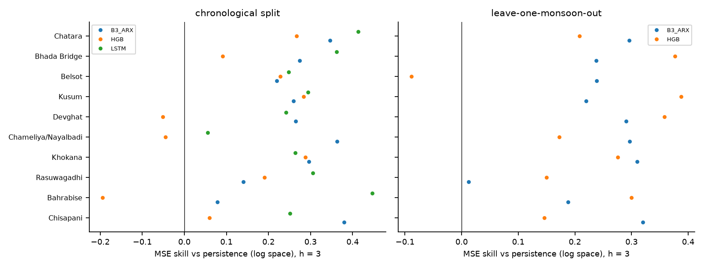

*Figure 8. Skill relative to persistence in log-space MSE at $h=3$. Positive values mean the model beats persistence. The horizontal scales differ between panels.*

**Per-location detail.** Khokana remains the location where learned models help most (chronological split, NSE at three days: persistence −0.071; ridge 0.373; boosting 0.352; LSTM 0.361) because its discharge is flashy even after correction. Where persistence is already near 0.98 (Chameliya/Nayalbadi, Rasuwagadhi, Chisapani) nothing improves on it meaningfully. Bhada Bridge and Kusum, the two locations with the highest coefficients of variation after Khokana, show the largest disagreement between models: at seven days the ridge model's NSE is only 0.028 at Bhada Bridge and 0.251 at Kusum, against 0.688 and 0.637 for persistence, while its log-NSE is higher than persistence's at both. A model can therefore lose at the peaks while winning on the baseflow, and reporting a single number would hide this.

**Table 18. Per-location NSE and log-NSE at $h=3$, chronological split.**

| Location | B0_persistence NSE | B0_persistence logNSE | B3_ARX NSE | B3_ARX logNSE | HGB NSE | HGB logNSE | LSTM NSE | LSTM logNSE |
|---|---|---|---|---|---|---|---|---|
| Chatara | 0.943 | 0.981 | 0.962 | 0.988 | 0.953 | 0.986 | 0.960 | 0.989 |
| Bhada Bridge | 0.841 | 0.935 | 0.756 | 0.953 | 0.814 | 0.941 | 0.862 | 0.958 |
| Belsot | 0.861 | 0.968 | 0.882 | 0.975 | 0.894 | 0.976 | 0.877 | 0.976 |
| Kusum | 0.793 | 0.924 | 0.781 | 0.944 | 0.828 | 0.946 | 0.790 | 0.946 |
| Devghat | 0.968 | 0.980 | 0.977 | 0.985 | 0.972 | 0.979 | 0.966 | 0.985 |
| Chameliya/Nayalbadi | 0.985 | 0.990 | 0.986 | 0.994 | 0.978 | 0.990 | 0.977 | 0.991 |
| Khokana | -0.071 | 0.823 | 0.373 | 0.875 | 0.352 | 0.874 | 0.361 | 0.870 |
| Rasuwagadhi | 0.981 | 0.988 | 0.981 | 0.990 | 0.913 | 0.991 | 0.982 | 0.992 |
| Bahrabise | 0.955 | 0.985 | 0.955 | 0.986 | 0.867 | 0.982 | 0.966 | 0.992 |
| Chisapani | 0.981 | 0.988 | 0.974 | 0.992 | 0.964 | 0.989 | 0.967 | 0.991 |
| **Median** | 0.949 | 0.981 | 0.958 | 0.986 | 0.904 | 0.980 | 0.963 | 0.987 |


**Table 19. Per-location NSE and log-NSE at $h=7$, chronological split.**

| Location | B0_persistence NSE | B0_persistence logNSE | B3_ARX NSE | B3_ARX logNSE | HGB NSE | HGB logNSE | LSTM NSE | LSTM logNSE |
|---|---|---|---|---|---|---|---|---|
| Chatara | 0.886 | 0.952 | 0.910 | 0.961 | 0.919 | 0.966 | 0.930 | 0.974 |
| Bhada Bridge | 0.688 | 0.869 | 0.028 | 0.915 | 0.522 | 0.908 | 0.761 | 0.934 |
| Belsot | 0.735 | 0.925 | 0.782 | 0.944 | 0.844 | 0.942 | 0.790 | 0.947 |
| Kusum | 0.637 | 0.837 | 0.251 | 0.872 | 0.738 | 0.881 | 0.576 | 0.888 |
| Devghat | 0.904 | 0.937 | 0.925 | 0.942 | 0.913 | 0.936 | 0.943 | 0.960 |
| Chameliya/Nayalbadi | 0.942 | 0.963 | 0.932 | 0.976 | 0.936 | 0.952 | 0.946 | 0.975 |
| Khokana | -0.285 | 0.635 | 0.330 | 0.759 | 0.136 | 0.749 | 0.368 | 0.786 |
| Rasuwagadhi | 0.940 | 0.962 | 0.937 | 0.966 | 0.920 | 0.976 | 0.972 | 0.978 |
| Bahrabise | 0.900 | 0.954 | 0.890 | 0.961 | 0.843 | 0.966 | 0.957 | 0.983 |
| Chisapani | 0.938 | 0.958 | 0.907 | 0.970 | 0.933 | 0.969 | 0.879 | 0.968 |
| **Median** | 0.893 | 0.944 | 0.898 | 0.952 | 0.878 | 0.947 | 0.905 | 0.964 |


**Event-based skill.** Using the training-period 95th percentile of each location as the threshold, the test window contains 27 declustered observed events across the ten locations (Algorithm 3, $r=3$ days). Persistence "detects" every event at one day (event POD 1.00) because a high flow persists into the next day, with a day-level false-alarm ratio of 0.20 and CSI of 0.66. The learned models have lower event POD at one day (0.70–0.89) and comparable false-alarm ratios (0.12–0.21), and the best day-level CSI at one day belongs to the graph network with physical adjacency (0.694) and the LSTM (0.692) against 0.661 for persistence. At three days the tuned boosted model has the best CSI (0.510 against 0.473 for persistence) and a false-alarm ratio of 0.295 against 0.364. Timing errors are 0.9–1.3 days at one day for the ridge, LSTM, TFT-lite and graph models but 2.6–2.7 days for boosting, whose forecast peaks therefore lag. With 27 events these differences are not statistically resolvable.

**Table 20. Event-based scores, chronological split (threshold = training-period 95th percentile).**

| Model | h | day POD | day FAR | day CSI | events | event POD | timing MAE (d) | median peak rel. err |
|---|---|---|---|---|---|---|---|---|
| B0_persistence | 1 | 0.796 | 0.204 | 0.661 | 27 | 1.000 | 0.967 | 0.000 |
| B0_persistence | 3 | 0.649 | 0.364 | 0.473 | 27 | 0.593 | 2.483 | 0.000 |
| B3_ARX | 1 | 0.815 | 0.210 | 0.670 | 27 | 0.889 | 1.280 | 0.014 |
| B3_ARX | 3 | 0.715 | 0.443 | 0.456 | 27 | 0.630 | 3.898 | 0.036 |
| HGB | 1 | 0.720 | 0.131 | 0.649 | 27 | 0.778 | 2.630 | -0.015 |
| HGB | 3 | 0.556 | 0.368 | 0.420 | 27 | 0.481 | 4.792 | 0.034 |
| LSTM | 1 | 0.803 | 0.166 | 0.692 | 27 | 0.815 | 0.930 | -0.028 |
| LSTM | 3 | 0.603 | 0.350 | 0.455 | 27 | 0.407 | 1.714 | 0.058 |
| HGB_tuned | 1 | 0.764 | 0.167 | 0.663 | 27 | 0.889 | 2.700 | 0.017 |
| HGB_tuned | 3 | 0.649 | 0.295 | 0.510 | 27 | 0.556 | 4.259 | -0.002 |
| LSTM_tuned | 1 | 0.803 | 0.208 | 0.663 | 27 | 0.815 | 0.930 | -0.007 |
| LSTM_tuned | 3 | 0.596 | 0.357 | 0.448 | 27 | 0.370 | 1.500 | -0.012 |
| TFT_lite | 1 | 0.796 | 0.188 | 0.672 | 27 | 0.852 | 0.896 | -0.020 |
| TFT_lite | 3 | 0.656 | 0.336 | 0.493 | 27 | 0.556 | 1.969 | -0.014 |
| GRAPH_phys | 1 | 0.764 | 0.118 | 0.694 | 27 | 0.704 | 0.944 | -0.030 |
| GRAPH_phys | 3 | 0.576 | 0.216 | 0.497 | 27 | 0.370 | 2.500 | -0.039 |


**Probabilistic skill.** The quantile boosted model gives 90 % intervals with a coverage of 0.865 at $h=1$ and 0.848 at $h=3$, slightly below nominal, and 0.847 and 0.815 on days above the training 95th percentile, so the intervals are close to equally reliable at high flows, unlike in the uncorrected series. The approximate CRPS is 0.036 (one day) and 0.076 (three days) in log units. Coverage by location ranges from 0.83 to 0.92 at one day and from 0.78 to 0.90 at three.

**Table 21. Quantile forecast evaluation (chronological split).**

| h | mean pinball (5 levels) | approx CRPS (=2x mean pinball) | 90% interval coverage | coverage on training-q95 high-flow days | mean width (log units) | min site coverage | max site coverage |
|---|---|---|---|---|---|---|---|
| 1.000 | 0.018 | 0.036 | 0.865 | 0.847 | 0.191 | 0.827 | 0.918 |
| 3.000 | 0.038 | 0.076 | 0.848 | 0.815 | 0.423 | 0.782 | 0.895 |


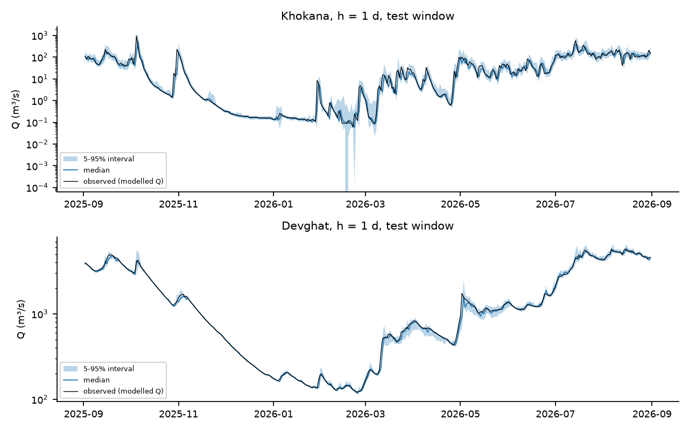

*Figure 9. Five-to-ninety-five percent prediction intervals and median forecast of the quantile boosted model for $h=1$ over the test window, with the corrected modelled discharge in black.*

### 8.5 Tuning, the Transformer-style network and the graph networks

**Nested hyperparameter search.** We ran a bounded search in which the final test period was never touched: the inner folds are the 2023, 2024 and 2025 monsoons *inside the training period* (before 1 September 2025), each held out in turn with the same purges, and the criterion is the median across locations of log-space NSE. For boosting, 30 random configurations plus the default were evaluated at each horizon; for the LSTM, the default plus 11 random configurations of hidden size, dropout, learning rate and weight decay, three seeds each, on a forward-chained inner fold (train before June 2025, validate on the 2025 monsoon). For boosting, the selected configurations are shallow and regularised (learning rate 0.02, 7 leaves, minimum leaf size 50, 200 iterations at one and three days; learning rate 0.1, 7 leaves, minimum leaf size 10, $L_2=10$ at seven). The inner score gain over the default is 0.005 at one day (0.982 against 0.977), 0.017 at three (0.909 against 0.891) and 0.003 at seven (0.755 against 0.752), and the 31 candidates span 0.974–0.982, 0.880–0.909 and 0.720–0.755. Tuned results exist only for the chronological split and the 2026 forward-chaining fold, because tuning on seasons that later serve as LOMO folds would leak.

**Tuning helped boosting and did not help the LSTM.** On the chronological test window the tuned boosted model has a median NSE of 0.989, 0.965 and 0.922 at 1, 3 and 7 days against 0.990, 0.904 and 0.878 for the default configuration, and a median log-NSE of 0.997, 0.984 and 0.951 against 0.997, 0.980 and 0.947; it improves on the default at 9 of 10 locations at three days and 8 of 10 at seven (median log-NSE gain +0.002 and +0.005). Without tuning, boosting looked worse than persistence at three days in raw NSE (0.904 against 0.949); with tuning it is better (0.965). The LSTM configuration chosen on the inner fold (hidden size 64, dropout 0.4, learning rate 0.003, weight decay 0.01) did worse on the test window than the default (median NSE 0.943 and 0.854 against 0.963 and 0.905 at three and seven days; log-NSE 0.984 and 0.958 against 0.987 and 0.964). The inner scores of the LSTM candidates range from 0.846 to 0.896 on a single validation monsoon, which reflects configuration-and-seed noise and did not transfer. *Tuning can therefore change the ranking of model families, and the effect differs by family.*

**Transformer-style and graph arms.** The reference Temporal Fusion Transformer was not used. We implemented a simplified variant ("TFT-lite": gated variable selection, an LSTM encoder, one self-attention layer over the 30-day window, a gated output head and a site embedding, without quantile outputs or known-future inputs) and a multi-site graph network (shared LSTM encoder per site, one graph-convolution layer; variants with no edges, a fixed physical adjacency with two edges, Rasuwagadhi → Devghat and Bahrabise → Chatara, and a learned adjacency), each with 5 seeds averaged and default settings. On the chronological split TFT-lite is equivalent to the LSTM (median log-NSE difference 0.000, −0.001 and −0.002 at 1, 3 and 7 days, better at 5, 4 and 3 of 10 locations). Under forward chaining its median scores are higher than the LSTM's (log-NSE 0.961 and 0.870 against 0.942 and 0.793 at three and seven days), but at the level of individual locations it is better at only 5 of 10 at those horizons, so we do not read this as a robust advantage. **Explicit river connectivity does not help robustly.** Relative to the same network with no edges, the physical adjacency changes the median log-NSE by 0.000, +0.001 and 0.000 at 1, 3 and 7 days on the chronological split (better at 5, 6 and 5 of 10 locations) and by −0.001, −0.005 and +0.006 in forward chaining; the learned adjacency is +0.018 at seven days in forward chaining (9 of 10 locations) and about zero on the chronological split. With only four of ten locations connected by the physical graph, we do not expect a large effect, and the data do not show one.

**Table 22. Paired comparisons of model arms: median difference in site-level log-NSE and the number of locations where the first model is better.**

| Split | h | Comparison | median Δ log-NSE | sites better |
|---|---|---|---|---|
| chrono | 1 | physical adjacency vs none | 0.000 | 5/10 |
| chrono | 1 | learned adjacency vs none | 0.000 | 6/10 |
| chrono | 1 | graph(no edges) vs LSTM | -0.000 | 4/10 |
| chrono | 1 | tuned vs default HGB | 0.000 | 5/10 |
| chrono | 1 | tuned vs default LSTM | -0.000 | 4/10 |
| chrono | 1 | TFT-lite vs LSTM | 0.000 | 5/10 |
| chrono | 3 | physical adjacency vs none | 0.001 | 6/10 |
| chrono | 3 | learned adjacency vs none | 0.002 | 7/10 |
| chrono | 3 | graph(no edges) vs LSTM | -0.002 | 4/10 |
| chrono | 3 | tuned vs default HGB | 0.002 | 9/10 |
| chrono | 3 | tuned vs default LSTM | -0.002 | 2/10 |
| chrono | 3 | TFT-lite vs LSTM | -0.001 | 4/10 |
| chrono | 7 | physical adjacency vs none | 0.000 | 5/10 |
| chrono | 7 | learned adjacency vs none | 0.002 | 6/10 |
| chrono | 7 | graph(no edges) vs LSTM | -0.001 | 4/10 |
| chrono | 7 | tuned vs default HGB | 0.005 | 8/10 |
| chrono | 7 | tuned vs default LSTM | -0.001 | 4/10 |
| chrono | 7 | TFT-lite vs LSTM | -0.002 | 3/10 |
| fc | 1 | physical adjacency vs none | -0.001 | 3/10 |
| fc | 1 | learned adjacency vs none | -0.000 | 4/10 |
| fc | 1 | graph(no edges) vs LSTM | 0.000 | 6/10 |
| fc | 1 | TFT-lite vs LSTM | 0.001 | 6/10 |
| fc | 3 | physical adjacency vs none | -0.005 | 4/10 |
| fc | 3 | learned adjacency vs none | 0.000 | 5/10 |
| fc | 3 | graph(no edges) vs LSTM | -0.001 | 3/10 |
| fc | 3 | TFT-lite vs LSTM | 0.001 | 5/10 |
| fc | 7 | physical adjacency vs none | 0.006 | 8/10 |
| fc | 7 | learned adjacency vs none | 0.018 | 9/10 |
| fc | 7 | graph(no edges) vs LSTM | 0.004 | 5/10 |
| fc | 7 | TFT-lite vs LSTM | -0.003 | 5/10 |
| fc26 | 1 | physical adjacency vs none | -0.001 | 3/10 |
| fc26 | 1 | learned adjacency vs none | 0.001 | 6/10 |
| fc26 | 1 | graph(no edges) vs LSTM | 0.001 | 6/10 |
| fc26 | 1 | tuned vs default HGB | 0.000 | 5/10 |
| fc26 | 1 | tuned vs default LSTM | 0.003 | 8/10 |
| fc26 | 1 | TFT-lite vs LSTM | 0.001 | 6/10 |
| fc26 | 3 | physical adjacency vs none | 0.001 | 7/10 |
| fc26 | 3 | learned adjacency vs none | 0.005 | 7/10 |
| fc26 | 3 | graph(no edges) vs LSTM | 0.003 | 5/10 |
| fc26 | 3 | tuned vs default HGB | 0.015 | 10/10 |
| fc26 | 3 | tuned vs default LSTM | 0.009 | 8/10 |
| fc26 | 3 | TFT-lite vs LSTM | -0.002 | 4/10 |
| fc26 | 7 | physical adjacency vs none | 0.013 | 6/10 |
| fc26 | 7 | learned adjacency vs none | 0.015 | 8/10 |
| fc26 | 7 | graph(no edges) vs LSTM | 0.008 | 6/10 |
| fc26 | 7 | tuned vs default HGB | 0.043 | 10/10 |
| fc26 | 7 | tuned vs default LSTM | 0.003 | 5/10 |
| fc26 | 7 | TFT-lite vs LSTM | -0.008 | 4/10 |


The event-based scores (Table 20) and Table 15 show the same plateau: all learned models are within a narrow band, each is better than persistence at most locations, and few of the differences are statistically distinguishable from persistence.

### 8.6 Transfer to an unseen location (leave-one-location-out)

The LOLO experiment trains on nine locations (chronological training period) and predicts the tenth, with no site identifier and no elevation as inputs. *It is not a prediction for an ungauged river:* the model still receives the held-out location's own recent discharge as an input. It tests whether the learned rainfall-to-increment mapping transfers across locations, which is a weaker claim than the ungauged-basin test of Kratzert et al. (2019).

**Table 23. LOLO results at $h=1$ (log-NSE), with the within-site pooled boosted model as the reference and the regime distance of Table 25.**

| Location | Persistence log-NSE | HGB within-site log-NSE | HGB LOLO log-NSE | LSTM LOLO log-NSE | Δ HGB (LOLO − within) | Regime distance |
|---|---|---|---|---|---|---|
| Chatara | 0.996 | 0.998 | 0.997 | 0.996 | -0.000 | 2.463 |
| Bhada Bridge | 0.978 | 0.978 | 0.971 | 0.980 | -0.006 | 3.511 |
| Belsot | 0.991 | 0.994 | 0.992 | 0.971 | -0.002 | 2.621 |
| Kusum | 0.978 | 0.982 | 0.983 | 0.982 | 0.000 | 3.155 |
| Devghat | 0.996 | 0.997 | 0.996 | 0.995 | -0.001 | 2.341 |
| Chameliya/Nayalbadi | 0.998 | 0.998 | 0.994 | 0.994 | -0.005 | 2.800 |
| Khokana | 0.934 | 0.968 | 0.945 | 0.937 | -0.022 | 6.185 |
| Rasuwagadhi | 0.998 | 0.998 | 0.996 | 0.991 | -0.002 | 4.020 |
| Bahrabise | 0.996 | 0.998 | 0.997 | 0.997 | -0.001 | 2.412 |
| Chisapani | 0.998 | 0.998 | 0.997 | 0.998 | -0.001 | 2.496 |
| **Median** | 0.996 | 0.997 | 0.995 | 0.993 | -0.002 | 2.710 |


**Table 24. LOLO results at $h=3$ (log-NSE).**

| Location | Persistence log-NSE | HGB within-site log-NSE | HGB LOLO log-NSE | LSTM LOLO log-NSE | Δ HGB (LOLO − within) | Regime distance |
|---|---|---|---|---|---|---|
| **Median** | 0.981 | 0.980 | 0.969 | 0.964 | -0.002 | 2.710 |
| Bhada Bridge | 0.935 | 0.941 | 0.945 | 0.957 | 0.004 | 3.511 |
| Belsot | 0.968 | 0.976 | 0.949 | 0.831 | -0.026 | 2.621 |
| Kusum | 0.924 | 0.946 | 0.946 | 0.943 | 0.000 | 3.155 |
| Devghat | 0.980 | 0.979 | 0.972 | 0.973 | -0.007 | 2.341 |
| Chameliya/Nayalbadi | 0.990 | 0.990 | 0.967 | 0.971 | -0.022 | 2.800 |
| Khokana | 0.823 | 0.874 | 0.859 | 0.834 | -0.015 | 6.185 |
| Rasuwagadhi | 0.988 | 0.991 | 0.988 | 0.945 | -0.003 | 4.020 |
| Bahrabise | 0.985 | 0.982 | 0.981 | 0.990 | -0.001 | 2.412 |
| Chisapani | 0.988 | 0.989 | 0.988 | 0.992 | -0.000 | 2.496 |


Transfer costs little at the median: log-NSE falls from 0.997 (within-site boosting) to 0.995 at $h=1$ and from 0.980 to 0.969 at $h=3$, and the LOLO LSTM is at 0.993 and 0.964, against persistence at 0.996 and 0.981. The losses are concentrated: at $h=1$ Khokana loses 0.022 and Bhada Bridge 0.006; at $h=3$ Belsot loses 0.026 for boosting and the LOLO LSTM collapses to 0.831 there (persistence 0.968), and Chameliya/Nayalbadi loses 0.022. A regime distance computed from seven descriptors on the training period (four flow-duration-curve quantiles of $\log_{10}(Q/\tilde Q)$, the monsoon share of precipitation, the lag-1 autocorrelation of $\log(1+Q)$ and the standard deviation of daily log-increments; Table 25) singles out Khokana (6.19), then Rasuwagadhi (4.02) and Bhada Bridge (3.51); the others lie between 2.3 and 3.2. The rank correlation between regime distance and the LOLO loss is negative in three of four cases and not significant with ten locations (Spearman $\rho=-0.60$, 95 % bootstrap interval $[-0.99, 0.08]$ for boosting at $h=1$; $-0.27$ for the LSTM; $+0.02$ and $-0.33$ at $h=3$), so the data cannot establish that more distinctive locations transfer worse.

**Table 25. Regime descriptors used for the distance (training period).** fdc$p$: $\log_{10}$ of the flow-duration-curve quantile at $p$ divided by the median.

| Location | fdc5 | fdc25 | fdc75 | fdc95 | monsoonP | ac1 | sd_dy | dist |
|---|---|---|---|---|---|---|---|---|
| Chatara | -0.26 | -0.15 | 0.63 | 0.89 | 0.84 | 1.00 | 0.06 | 2.46 |
| Bhada Bridge | -0.56 | -0.33 | 1.12 | 1.65 | 0.91 | 0.99 | 0.26 | 3.51 |
| Belsot | -0.17 | -0.07 | 0.52 | 1.01 | 0.85 | 1.00 | 0.07 | 2.62 |
| Kusum | -0.94 | -0.23 | 1.01 | 1.53 | 0.87 | 0.99 | 0.25 | 3.15 |
| Devghat | -0.51 | -0.29 | 0.77 | 1.05 | 0.85 | 1.00 | 0.07 | 2.34 |
| Chameliya/Nayalbadi | -0.13 | -0.10 | 0.50 | 0.88 | 0.84 | 1.00 | 0.04 | 2.80 |
| Khokana | -1.90 | -0.98 | 1.17 | 1.61 | 0.85 | 0.97 | 0.49 | 6.19 |
| Rasuwagadhi | -0.77 | -0.51 | 0.84 | 1.09 | 0.61 | 1.00 | 0.07 | 4.02 |
| Bahrabise | -0.23 | -0.17 | 0.84 | 1.11 | 0.89 | 1.00 | 0.09 | 2.41 |
| Chisapani | -0.26 | -0.16 | 0.70 | 0.97 | 0.91 | 1.00 | 0.06 | 2.50 |


**Table 26. Rank correlation between regime distance and the change in log-NSE under LOLO.**

| h | model | rho | p | ci_lo | ci_hi |
|---|---|---|---|---|---|
| 1 | hgb | -0.600 | 0.067 | -0.987 | 0.082 |
| 1 | lstm | -0.273 | 0.446 | -0.839 | 0.623 |
| 3 | hgb | 0.018 | 0.960 | -0.572 | 0.731 |
| 3 | lstm | -0.333 | 0.347 | -0.852 | 0.434 |


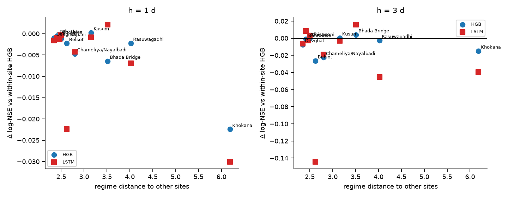

*Figure 10. Change in log-NSE when a location is left out of training (LOLO minus within-site boosting, for both models), against its regime distance to the other nine locations. The correlation is not significant.*

**Full-period variant.** Training on nine locations over all dates and testing on the tenth over all dates, without site identity or elevation, gives a median log-NSE of 0.995, 0.985 and 0.968 at 1, 3 and 7 days against 0.995, 0.980 and 0.944 for persistence, ahead of persistence at 8, 8 and 10 of 10 locations (median NSE 0.975, 0.946 and 0.924 against 0.978, 0.930 and 0.877). This variant is optimistic: the training locations include the same dates as the held-out location, so concurrent storms are in the training data, and it should be read as spatial transfer under shared weather rather than out-of-sample prediction.

**Table 27. LOLO over the full period (median across held-out locations).**

| h | logNSE_persist | logNSE_lolo | NSE_persist | NSE_lolo | sites better than persistence (log-NSE) |
|---|---|---|---|---|---|
| 1 | 0.995 | 0.995 | 0.978 | 0.975 | 8/10 |
| 3 | 0.980 | 0.985 | 0.930 | 0.946 | 8/10 |
| 7 | 0.944 | 0.968 | 0.877 | 0.924 | 10/10 |


### 8.7 Process analyses

**Rainfall–discharge lag structure (RQ2).** After prewhitening (regressing the daily log-increment on the current and ten lagged log-rainfalls, an error-correction term and seasonal harmonics, with a second-difference smoothness penalty chosen by blocked cross-validation), the modelled response is fast everywhere (Table 28, Figure 11). The peak weight falls at lag 1 day at seven locations, at lag 2 days at Belsot and Chameliya/Nayalbadi and at lag 0 at Bhada Bridge. The centroid of the positive weights is shortest at Rasuwagadhi (1.15 days; bootstrap interval 0.97–1.88) and Khokana (1.20; 0.97–1.91), then Chisapani (1.75; 1.62–2.56), Devghat (1.81; 1.49–2.44) and Chatara (2.01; 1.71–2.78), and longest at Chameliya/Nayalbadi (3.33; 2.32–4.05) and Bhada Bridge (3.72; 2.23–4.67). With the corrected series the three large rivers have centroids of 1.8–2.0 days with narrow intervals, whereas the uncorrected tributary cells gave 2.6–2.8 days. The intervals of the slower locations overlap (Belsot 2.50, Bahrabise 2.78, Kusum 2.85, Chameliya/Nayalbadi 3.33), so the data do **not** resolve an ordering among them. The raw correlations of Table 13, which kept rising out to seven days, therefore overstate the response time because of the common seasonal cycle. The cumulative response $\sum_j w_j$ is largest at Khokana (0.44; 0.36–0.58), then Kusum (0.18) and Bhada Bridge (0.17), and smallest at Rasuwagadhi (0.01; −0.00–0.02), where modelled discharge hardly depends on rainfall at the daily scale, consistent with a smoother regime driven by melt or storage in the model. We had expected high-elevation locations to respond more slowly, and the weights show the opposite for Rasuwagadhi; we flag this as unexplained and as a reason to treat the modelled response as a property of the model cell.

**Table 28. Distributed-lag summary (prewhitened).** $\lambda$ is the smoothness penalty selected by blocked cross-validation; intervals are 2.5–97.5 % from 200 stationary-bootstrap replicates.

| Location | λ | Peak lag (d) | Centroid j̄ (d) | j̄ 2.5% | j̄ 97.5% | Σw | Σw 2.5% | Σw 97.5% |
|---|---|---|---|---|---|---|---|---|
| Chatara | 0.10 | 1 | 2.01 | 1.71 | 2.78 | 0.04 | 0.03 | 0.05 |
| Bhada Bridge | 1000.00 | 0 | 3.72 | 2.23 | 4.67 | 0.17 | 0.10 | 0.24 |
| Belsot | 100.00 | 2 | 2.50 | 1.65 | 3.73 | 0.05 | 0.03 | 0.07 |
| Kusum | 10.00 | 1 | 2.85 | 2.19 | 4.02 | 0.18 | 0.10 | 0.27 |
| Devghat | 100.00 | 1 | 1.81 | 1.49 | 2.44 | 0.06 | 0.05 | 0.08 |
| Chameliya/Nayalbadi | 100.00 | 2 | 3.33 | 2.32 | 4.05 | 0.03 | 0.02 | 0.04 |
| Khokana | 10.00 | 1 | 1.20 | 0.97 | 1.91 | 0.44 | 0.36 | 0.58 |
| Rasuwagadhi | 100.00 | 1 | 1.15 | 0.97 | 1.88 | 0.01 | -0.00 | 0.02 |
| Bahrabise | 1.00 | 1 | 2.78 | 2.13 | 3.90 | 0.05 | 0.03 | 0.07 |
| Chisapani | 100.00 | 1 | 1.75 | 1.62 | 2.56 | 0.04 | 0.03 | 0.05 |


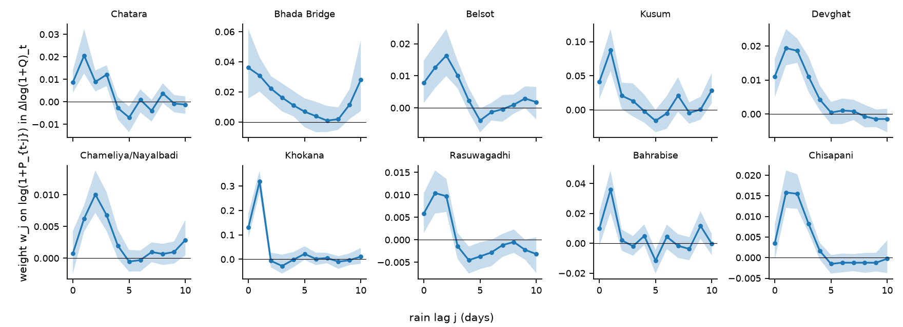

*Figure 11. Estimated weights $w_j$ on $\log(1+P_{t-j})$ in the daily log-increment of discharge, with 95 % bootstrap bands. The scales differ by location.*

**Antecedent wetness (RQ3).** We identified 310 rain events (declustered 3-day rainfall above each location's 90th percentile, Algorithm 3) and regressed the log amplification of discharge on the pre-event soil-moisture anomaly, a standardised antecedent-rain index, log event rainfall, pre-event flow relative to the median and a monsoon indicator, with a random intercept for location. **We find no evidence that wetter antecedent soil amplifies the modelled response:** the coefficient on the soil-moisture anomaly is −0.025 (standard error 0.103, $p=0.81$), a within-location permutation test gives $p=0.80$, and the per-location Spearman correlations between the anomaly and the model residual lie between −0.27 and +0.29 with all $p>0.1$. Event rainfall has a strong positive coefficient (2.10, $z=10.2$), the monsoon indicator is positive (1.37, $p<0.001$) and the standardised antecedent-rain index is negative (−0.40, $p=0.018$): for a given event rainfall, a wetter antecedent period is associated with a smaller relative rise, which is the opposite of the wet-catchment amplification hypothesis and may reflect that wet periods have higher baseflow. The forecasting ablation agrees with the null on soil moisture (Table 30): dropping the soil-moisture features from the pooled boosted model under LOMO changes the median log-NSE by 0.000 at $h=1$ and −0.003 at $h=3$, whereas dropping the current-rain features costs 0.001 and 0.012, the season terms 0.000 and 0.029, the temperature, humidity and snow group 0.000 and 0.014, and using flow lags alone costs 0.003 and 0.020. Dropping the antecedent-rain features *improves* the three-day score slightly (+0.004). Grouped permutation importance on the chronological test window gives the same ordering (Table 31): flow lags dominate at every horizon (106 %, 99 % and 113 % increase in MSE when permuted), current rain matters at one day (92 %) but not beyond (21 % at three days, 2 % at seven), the temperature, humidity and snow group matters at one and three days (21 % and 11 %), site and elevation at one day (23 %), season at longer horizons (14–15 %), and soil moisture (1.2 %, −2.0 %, −1.6 %) is indistinguishable from zero. TreeSHAP was not computed. These results do not show that soil moisture is unimportant in real catchments; they show that, in this *modelled* system and at daily resolution, the soil-moisture variable adds nothing detectable beyond the rainfall and flow histories.

**Table 29. Mixed-effects model of event amplification.**

| Term | Estimate | SE | z | p |
|---|---|---|---|---|
| Intercept | -8.7974 | 1.0226 | -8.6029 | 0.0000 |
| th_pre | -0.0250 | 0.1033 | -0.2423 | 0.8085 |
| api_pre_s | -0.4024 | 0.1696 | -2.3723 | 0.0177 |
| lPe | 2.1005 | 0.2051 | 10.2388 | 0.0000 |
| lqpre | -0.1393 | 0.1006 | -1.3842 | 0.1663 |
| monsoon | 1.3662 | 0.3031 | 4.5077 | 0.0000 |
| **permutation p for θ\* (500 within-site shuffles)** |  |  |  | 0.7960 |


**Table 30. Feature-group ablation, LOMO, pooled boosted model (median across locations).**

| Variant | h=1 log-NSE | h=1 Δlog-NSE | h=1 NSE | h=3 log-NSE | h=3 Δlog-NSE | h=3 NSE |
|---|---|---|---|---|---|---|
| all features (reference) | 0.982 | 0.000 | 0.950 | 0.926 | 0.000 | 0.802 |
| drop soil (θ*, Δθ7) | 0.982 | -0.000 | 0.950 | 0.923 | -0.003 | 0.797 |
| drop antecedent rain (API, 14/30-d sums) | 0.983 | 0.000 | 0.949 | 0.930 | 0.004 | 0.807 |
| drop current rain (lags 0-3, 3/7-d sums, intensity, wet spell) | 0.982 | -0.001 | 0.942 | 0.914 | -0.012 | 0.782 |
| drop temperature/humidity/snow (τ, Δτ, PDD, RH, snow frac.) | 0.982 | -0.000 | 0.950 | 0.912 | -0.014 | 0.794 |
| drop season (sin/cos doy) | 0.982 | -0.000 | 0.948 | 0.896 | -0.029 | 0.801 |
| drop site & elevation | 0.981 | -0.001 | 0.940 | 0.916 | -0.010 | 0.775 |
| flow lags only (no weather, no site) | 0.979 | -0.003 | 0.949 | 0.906 | -0.020 | 0.804 |


**Table 31. Grouped permutation importance (percentage increase in test MSE of the increment when the group is permuted within the test window).**

| Group | h=1 (% MSE increase) | h=3 (% MSE increase) | h=7 (% MSE increase) |
|---|---|---|---|
| flow lags | 105.7 | 99.3 | 113.4 |
| current rain | 91.8 | 21.0 | 2.1 |
| season | 5.5 | 13.8 | 15.3 |
| temperature, humidity, snow | 21.3 | 10.5 | -0.8 |
| site & elevation | 23.2 | 5.3 | 2.1 |
| antecedent rain | 2.4 | 2.4 | 7.1 |
| soil moisture | 1.2 | -2.0 | -1.6 |


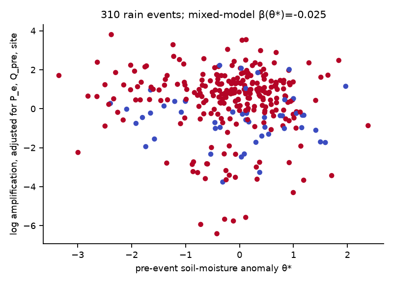

*Figure 12. Adjusted log amplification against the pre-event soil-moisture anomaly (310 events; colour marks the monsoon season). There is no visible trend.*

**Extremes (RQ5).** Peaks-over-threshold fits (threshold at the 95th percentile, declustered with $r=3$ days, with the 24–30 September 2024 window removed before fitting) give daily-precipitation shape estimates between $-0.15$ (Bahrabise) and $+0.47$ (Bhada Bridge), and **every 95 % bootstrap interval contains zero**, with 30–43 peaks per location (Table 32; precipitation is unaffected by the discharge correction). The September 2024 daily maximum is above the fitted threshold at nine of ten locations (Chameliya/Nayalbadi is the exception, 10.4 mm). The implied return period of that maximum under the tail fitted *without* it varies from 1.1 years (Belsot) and 2.2 years (Chisapani) to 6 years (Bhada Bridge), 9–10 years (Chatara, Khokana), 47 years (Kusum), 69 years (Bahrabise), 309 years (Rasuwagadhi) and 432 years (Devghat). These numbers are dominated by the sign of the poorly determined shape parameter (Khokana's heavy tail, $\hat\xi=0.42$, makes a 165 mm day unremarkable; Devghat's negative shape, $-0.11$, makes a 140 mm day extreme), so we read them only as a consistency check that identifies Devghat, Rasuwagadhi and Bahrabise as the locations where the storm was most unusual relative to the rest of the record. For normalised corrected discharge (Table 33) only 8–28 declustered peaks are available per location, Belsot and Rasuwagadhi have too few to fit, every shape interval contains zero (for example −2.33 to 0.73 at Chatara), and the implied return periods of the September 2024 peak range from 2.5 years (Bahrabise) and 6.9 years (Devghat, Khokana) to about 100 years (Bhada Bridge, Kusum). At Chatara the peak exceeds the finite upper end of the fitted bounded tail, and at Chameliya/Nayalbadi and Chisapani it is below the threshold, so no return period applies. We do not report design return levels.

**Table 32. GPD fits for daily precipitation (event window excluded), 95 % bootstrap intervals for $\xi$.**

| Location | peaks (event-excluded) | ξ̂ | ξ 2.5% | ξ 97.5% | event max (P mm or Q/median) | threshold u | implied return period (yr) |
|---|---|---|---|---|---|---|---|
| Chatara | 37 | 0.03 | -1.11 | 0.34 | 131.80 | 20.80 | 8.9 |
| Bhada Bridge | 30 | 0.47 | -0.39 | 0.86 | 176.90 | 21.60 | 6.1 |
| Belsot | 32 | 0.41 | -0.43 | 0.77 | 79.00 | 17.60 | 1.1 |
| Kusum | 38 | 0.17 | -0.32 | 0.45 | 117.60 | 17.30 | 47.1 |
| Devghat | 43 | -0.11 | -0.55 | 0.13 | 139.60 | 18.70 | 431.9 |
| Chameliya/Nayalbadi | 43 | 0.01 | -0.37 | 0.30 | 10.40 | 25.20 | below threshold |
| Khokana | 36 | 0.42 | -0.03 | 0.79 | 164.90 | 30.70 | 9.5 |
| Rasuwagadhi | 39 | -0.08 | -0.55 | 0.14 | 104.80 | 19.60 | 309.0 |
| Bahrabise | 35 | -0.15 | -0.73 | 0.09 | 111.60 | 28.40 | 68.6 |
| Chisapani | 42 | 0.28 | -0.38 | 0.56 | 92.90 | 23.40 | 2.1 |


**Table 33. GPD fits for discharge normalised by the location median (corrected series).**

| Location | peaks (event-excluded) | ξ̂ | ξ 2.5% | ξ 97.5% | event max (P mm or Q/median) | threshold u | implied return period (yr) |
|---|---|---|---|---|---|---|---|
| Chatara | 10 | -0.60 | -2.33 | 0.73 | 10.20 | 6.20 | beyond fitted upper bound |
| Bhada Bridge | 13 | 0.09 | -1.93 | 1.81 | 188.40 | 41.60 | 101.9 |
| Kusum | 18 | 0.11 | -1.48 | 0.42 | 188.40 | 33.00 | 101.2 |
| Devghat | 9 | 0.36 | -2.28 | 1.05 | 12.90 | 8.60 | 6.9 |
| Chameliya/Nayalbadi | 8 | -1.47 | -2.80 | 0.35 | 4.40 | 7.10 | below threshold |
| Khokana | 28 | 0.64 | -1.08 | 1.33 | 257.00 | 30.30 | 6.9 |
| Bahrabise | 13 | -0.25 | -2.04 | 0.15 | 14.60 | 10.90 | 2.5 |
| Chisapani | 8 | -0.40 | -2.43 | 0.33 | 7.00 | 8.30 | below threshold |


**Joint extremes.** The mean empirical extremal-dependence coefficient between locations (probability that one is above its 95th percentile given the other is) is 0.34 for precipitation (maximum 0.55) and 0.38 for discharge (maximum 0.71). On 84 days at least three locations exceed their own 95th-percentile precipitation and on 42 days at least five, and on 6 July 2024 and again on 3 August 2025 all ten do; for discharge, 114 days have three or more locations above their 95th percentile and 43 days five or more, and all ten locations are simultaneously above on 9 August 2024. By this measure the 6 July 2024 rainfall was spatially wider than the 27 September 2024 storm day (all ten locations against nine), although the latter was far more intense where it fell.

**Table 34. Joint-extreme summary (corrected series).**

| Variable | mean off-diag χ | max χ | days with ≥3 sites >q95 | days ≥5 sites | max sites on one day | date |
|---|---|---|---|---|---|---|
| P | 0.340 | 0.554 | 84 | 42 | 10 | 2024-07-06 |
| Q | 0.382 | 0.708 | 114 | 43 | 10 | 2024-08-09 |


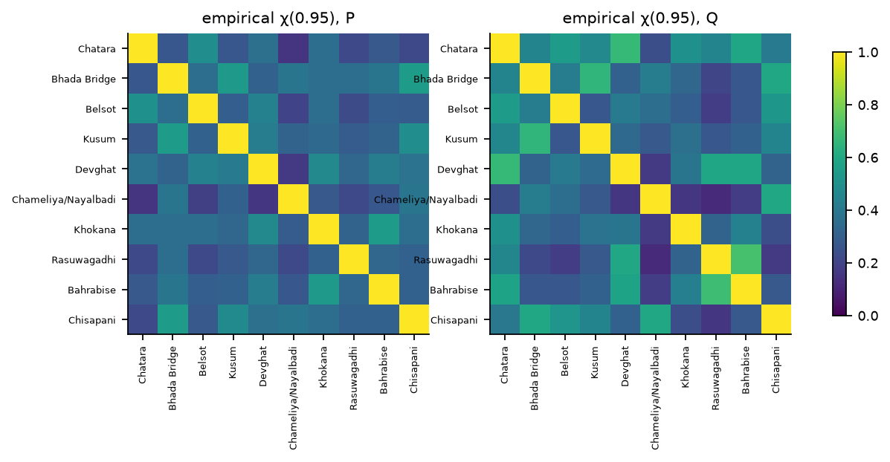

*Figure 13. Empirical $\chi(0.95)$ for precipitation (left) and discharge (right).*

**Upstream–downstream relations (Section 7.7).** After removing the local rainfall response and the autoregressive term from each series, the residual cross-correlations between an upstream and a downstream location are clearly above those of control pairs (Table 35): 0.52 at lag 0 for Rasuwagadhi → Devghat (bootstrap interval 0.42–0.62; 0.30 at lag 1) and 0.52 for Bahrabise → Chatara (0.35–0.65; 0.14 at lag 1), against 0.12 (Rasuwagadhi → Kusum) and 0.11 (Bahrabise → Chisapani; 0.17 at lag 1) for pairs from different basins. The best lag is zero for the two upstream–downstream pairs. **With the corrected discharge there is therefore evidence of same-day coupling between upstream and downstream locations beyond what local rainfall explains**; in the uncorrected series the same pairs gave 0.24 and 0.17 (intervals reaching 0.02), indistinguishable from controls. The coupling is at lag zero, which at daily resolution indicates a travel time shorter than a day (or unobserved shared rainfall), so this finding is a statement about co-movement and not about a measurable propagation delay.

**Table 35. Residual cross-correlation (upstream at time $t$ with downstream at $t+k$) after partialling out local rainfall.**

| Pair | Relation | r(k=0) | r(k=1) | r(k=2) | r(k=3) | r(k=4) | r(k=5) | best_k | ci_lo | ci_hi |
|---|---|---|---|---|---|---|---|---|---|---|
| Rasuwagadhi → Devghat | upstream→downstream (Trishuli→Narayani) | 0.524 | 0.299 | 0.063 | -0.042 | -0.035 | 0.007 | 0 | 0.423 | 0.622 |
| Bahrabise → Chatara | upstream→downstream (Sun Koshi→Saptakoshi) | 0.524 | 0.143 | -0.132 | -0.157 | 0.017 | 0.090 | 0 | 0.354 | 0.650 |
| Rasuwagadhi → Kusum | control: different basins | 0.117 | 0.054 | -0.013 | -0.025 | 0.008 | 0.028 | 0 | 0.020 | 0.225 |
| Bahrabise → Chisapani | control: different basins | 0.114 | 0.167 | 0.014 | -0.039 | -0.049 | -0.002 | 1 | 0.083 | 0.242 |


**Recession constants.** Table 8 gives the training-period master-recession constants of the corrected series; the recession-persistence baseline B1 is close to persistence (identical medians at one day), and its significant advantage at eight locations at one day under the chronological split (Table 15) arises from small gains at many locations.

### 8.8 Documented events as positive and negative controls

The rain-driven September 2024 storm is the positive control (Section 8.1). The August 2024 Thame glacial-lake outburst and the July 2025 Bhote Koshi flash flood are negative controls, events the data should not capture. In the corrected series the Thame event has no visible signature at the nearest locations: at Chatara discharge over 12–20 August 2024 is 5,020–6,350 m³/s and its maximum in that window (6,352 m³/s) is below its 99th percentile (6,371 m³/s); at Bahrabise it is 284–347 m³/s, a maximum on 14 August (3 % above its 99th percentile) following 47 mm of rain on 13 August, with no abrupt change on 16 August. At Rasuwagadhi, on 8 July 2025 discharge is 356 m³/s, 1.01 times the prior-week median, with 1.3 mm of precipitation. For the 2026 Rasuwa and Bhote Koshi–Trishuli event, whose date is not given in the file, the highest modelled discharge at Rasuwagadhi in the whole record (552 m³/s) occurs on 18 July 2026, but it follows 58, 36 and 41 mm of rain on 12–14 July and a smooth rise from 449 to 552 m³/s over six days, i.e. a rain-driven signature that cannot be attributed to an outburst. We therefore cannot test that event.

**Residual check.** We computed standardised one-day-ahead forecast residuals out of fold (LOMO, monsoon months only, per-location standardisation) and ranked the residual in a ±1-day window around each event (Table 36). The rain-driven storm produces some of the largest residuals in the record (standardised residual 3.8–4.2 for Kusum, 2.4–3.3 for Khokana and 6.1–6.9 for Devghat, at or above the 98.0th percentile of the monsoon out-of-fold residuals), while the three non-rainfall events give residuals within the ordinary range: 0.08 and −0.34 at Chatara (percentiles 59 and 30), −0.43 and 0.29 at Bahrabise (23 and 80), and 1.00 and 0.81 at Rasuwagadhi (88 and 85).

**Isolation-forest detector.** An isolation forest fitted per location on six standardised features of the rainfall–discharge relationship (log-increment, current and lagged rain, 3-day rain, soil-moisture anomaly, discharge anomaly), with no event labels, places the three storm days at the 99.93rd percentile of each location's record and the three non-rainfall events at ordinary levels (Chatara 64.9, Bahrabise 73.8, Rasuwagadhi 67.7; Table 37).

These checks have two limitations. First, a residual or an anomaly score flags *surprises*, not causes: it is large whenever the river rises more than yesterday's state predicts, which includes ordinary rain not yet observed, so it cannot separate rain-driven from non-rain-driven events. Second, the three negative controls are **absent from the modelled data**, not merely missed by the model, which supports the conclusion that whatever caused those floods is not in the panel. An LSTM autoencoder was not run.

**Table 36. Out-of-fold standardised residuals around documented events ($h=1$, LOMO).**

| Event | Location | Date | Role | Model | max standardised residual (±1 d) | percentile within site monsoon OOF residuals |
|---|---|---|---|---|---|---|
| Sep-2024 storm | Kusum | 2024-09-28 | rain-driven flood (positive) | B3_ARX | 3.81 | 98.69 |
| Sep-2024 storm | Kusum | 2024-09-28 | rain-driven flood (positive) | HGB | 4.20 | 98.91 |
| Sep-2024 storm | Khokana | 2024-09-28 | rain-driven flood (positive) | B3_ARX | 2.44 | 98.03 |
| Sep-2024 storm | Khokana | 2024-09-28 | rain-driven flood (positive) | HGB | 3.30 | 99.56 |
| Sep-2024 storm | Devghat | 2024-09-29 | rain-driven flood (positive) | B3_ARX | 6.93 | 99.78 |
| Sep-2024 storm | Devghat | 2024-09-29 | rain-driven flood (positive) | HGB | 6.09 | 99.78 |
| Thame GLOF | Chatara | 2024-08-16 | GLOF, nearest location (negative control) | B3_ARX | 0.08 | 59.30 |
| Thame GLOF | Chatara | 2024-08-16 | GLOF, nearest location (negative control) | HGB | -0.34 | 29.54 |
| Thame GLOF | Bahrabise | 2024-08-16 | GLOF, nearest Koshi site (negative control) | B3_ARX | -0.43 | 23.41 |
| Thame GLOF | Bahrabise | 2024-08-16 | GLOF, nearest Koshi site (negative control) | HGB | 0.29 | 79.87 |
| Bhote Koshi flash flood | Rasuwagadhi | 2025-07-08 | flash flood (negative control) | B3_ARX | 1.00 | 87.75 |
| Bhote Koshi flash flood | Rasuwagadhi | 2025-07-08 | flash flood (negative control) | HGB | 0.81 | 85.12 |


**Table 37. Isolation-forest percentile of the documented events (maximum over ±1 day).**

| Location | Date | Event | max_score | percentile within site record |
|---|---|---|---|---|
| Kusum | 2024-09-28 | Sep-2024 storm (rain-driven) | 0.76 | 99.93 |
| Khokana | 2024-09-28 | Sep-2024 storm (rain-driven) | 0.75 | 99.93 |
| Devghat | 2024-09-29 | Sep-2024 storm (rain-driven) | 0.78 | 99.93 |
| Chatara | 2024-08-16 | Thame GLOF, nearest location | 0.45 | 64.92 |
| Bahrabise | 2024-08-16 | Thame GLOF, nearest Koshi site | 0.47 | 73.82 |
| Rasuwagadhi | 2025-07-08 | Bhote Koshi flash flood | 0.46 | 67.69 |


**Scenario analysis (Section 7.6).** We used a boosted model trained *without* the 2024 monsoon and perturbed its inputs at the origins 26 and 27 September 2024: soil-moisture anomaly ±1 standard deviation and rainfall features scaled by 0.8 and 1.2. The model is almost insensitive to these changes (Table 38): the soil-moisture perturbations change the predicted next-day discharge by exactly 0.0 % at the 27 September origin at all four locations, and the rainfall scalings by between −11.4 % and +4.5 %, with a non-monotone response at Khokana (more rain, lower prediction). The model also cannot reproduce the storm: from the 27 September origin it predicts 470 m³/s at Khokana against an observed 1,632 and 764 m³/s at Kusum against 3,176 (about 71–76 % too low), and 4,320 and 5,108 m³/s at Devghat and Chatara against 6,280 and 7,515 (about 30 % too low). Tree ensembles cannot extrapolate beyond the target range seen in training, and the storm exceeds it. **The scenario analysis therefore says nothing about catchment sensitivity; it documents a limitation of the model class for extreme events.**

**Table 38. Counterfactual perturbations, boosted model trained without the 2024 monsoon (origins 26 and 27 September 2024, $h=1$).**

| Location | Origin | Scenario | Q_pred | change_vs_baseline_pct | Q_observed_next_day |
|---|---|---|---|---|---|
| Khokana | 2024-09-26 | baseline | 151.38 | 0.00 | 440.57 |
| Khokana | 2024-09-26 | soil −1σ | 157.06 | 3.76 | 440.57 |
| Khokana | 2024-09-26 | soil +1σ | 151.38 | 0.00 | 440.57 |
| Khokana | 2024-09-26 | rain ×0.8 | 152.08 | 0.46 | 440.57 |
| Khokana | 2024-09-26 | rain ×1.2 | 150.78 | -0.39 | 440.57 |
| Khokana | 2024-09-26 | rain ×1.2 & soil +1σ | 150.78 | -0.39 | 440.57 |
| Khokana | 2024-09-27 | baseline | 470.06 | 0.00 | 1632.05 |
| Khokana | 2024-09-27 | soil −1σ | 470.06 | 0.00 | 1632.05 |
| Khokana | 2024-09-27 | soil +1σ | 470.06 | 0.00 | 1632.05 |
| Khokana | 2024-09-27 | rain ×0.8 | 482.60 | 2.67 | 1632.05 |
| Khokana | 2024-09-27 | rain ×1.2 | 416.57 | -11.38 | 1632.05 |
| Khokana | 2024-09-27 | rain ×1.2 & soil +1σ | 416.57 | -11.38 | 1632.05 |
| Kusum | 2024-09-26 | baseline | 216.93 | 0.00 | 608.54 |
| Kusum | 2024-09-26 | soil −1σ | 216.93 | 0.00 | 608.54 |
| Kusum | 2024-09-26 | soil +1σ | 216.93 | 0.00 | 608.54 |
| Kusum | 2024-09-26 | rain ×0.8 | 214.79 | -0.98 | 608.54 |
| Kusum | 2024-09-26 | rain ×1.2 | 219.72 | 1.28 | 608.54 |
| Kusum | 2024-09-26 | rain ×1.2 & soil +1σ | 219.72 | 1.28 | 608.54 |
| Kusum | 2024-09-27 | baseline | 764.41 | 0.00 | 3175.87 |
| Kusum | 2024-09-27 | soil −1σ | 764.41 | 0.00 | 3175.87 |
| Kusum | 2024-09-27 | soil +1σ | 764.41 | 0.00 | 3175.87 |
| Kusum | 2024-09-27 | rain ×0.8 | 799.07 | 4.53 | 3175.87 |
| Kusum | 2024-09-27 | rain ×1.2 | 753.78 | -1.39 | 3175.87 |
| Kusum | 2024-09-27 | rain ×1.2 & soil +1σ | 753.78 | -1.39 | 3175.87 |
| Devghat | 2024-09-26 | baseline | 3016.11 | 0.00 | 3356.38 |
| Devghat | 2024-09-26 | soil −1σ | 3016.11 | 0.00 | 3356.38 |
| Devghat | 2024-09-26 | soil +1σ | 3016.11 | 0.00 | 3356.38 |
| Devghat | 2024-09-26 | rain ×0.8 | 3012.13 | -0.13 | 3356.38 |
| Devghat | 2024-09-26 | rain ×1.2 | 3114.46 | 3.26 | 3356.38 |
| Devghat | 2024-09-26 | rain ×1.2 & soil +1σ | 3114.46 | 3.26 | 3356.38 |
| Devghat | 2024-09-27 | baseline | 4320.12 | 0.00 | 6279.59 |
| Devghat | 2024-09-27 | soil −1σ | 4320.12 | 0.00 | 6279.59 |
| Devghat | 2024-09-27 | soil +1σ | 4320.12 | 0.00 | 6279.59 |
| Devghat | 2024-09-27 | rain ×0.8 | 4340.02 | 0.46 | 6279.59 |
| Devghat | 2024-09-27 | rain ×1.2 | 4320.12 | 0.00 | 6279.59 |
| Devghat | 2024-09-27 | rain ×1.2 & soil +1σ | 4320.12 | 0.00 | 6279.59 |
| Chatara | 2024-09-26 | baseline | 2810.68 | 0.00 | 3916.42 |
| Chatara | 2024-09-26 | soil −1σ | 2810.68 | 0.00 | 3916.42 |
| Chatara | 2024-09-26 | soil +1σ | 2810.68 | 0.00 | 3916.42 |
| Chatara | 2024-09-26 | rain ×0.8 | 2827.32 | 0.59 | 3916.42 |
| Chatara | 2024-09-26 | rain ×1.2 | 2810.68 | 0.00 | 3916.42 |
| Chatara | 2024-09-26 | rain ×1.2 & soil +1σ | 2810.68 | 0.00 | 3916.42 |
| Chatara | 2024-09-27 | baseline | 5107.86 | 0.00 | 7515.23 |
| Chatara | 2024-09-27 | soil −1σ | 5107.86 | 0.00 | 7515.23 |
| Chatara | 2024-09-27 | soil +1σ | 5107.86 | 0.00 | 7515.23 |
| Chatara | 2024-09-27 | rain ×0.8 | 5161.89 | 1.06 | 7515.23 |
| Chatara | 2024-09-27 | rain ×1.2 | 5048.48 | -1.16 | 7515.23 |
| Chatara | 2024-09-27 | rain ×1.2 & soil +1σ | 5048.48 | -1.16 | 7515.23 |


**Back-transformation.** The Duan smearing factor computed on the training period is 1.005, 1.013 and 1.015 at 1, 3 and 7 days; applying it changes the median NSE of the default boosted model by 0.000, −0.002 and 0.000, so we keep the plain `expm1` back-transformation.

### 8.9 What changed after correcting the discharge

Table 39 compares key results on the uncorrected V2 series (the companion document `PAPER_PLAN.md`) with those on the corrected series. Some conclusions are robust to the correction and some are not.

**Table 39. Key results before and after correcting the discharge cells.**

| Result | Uncorrected V2 | Corrected | Robust? |
|---|---|---|---|
| Large-river mean discharge (Chisapani, Devghat, Chatara) | 0.8, 2.3, 1.5 m³/s | 1,325, 1,609, 1,829 m³/s | changed |
| Repeated-value days at Bhada Bridge / Chisapani | 64 % / 51 % | 7 % / 2 % | artefact removed |
| Zero-flow days at Khokana | 223 | 0 | artefact removed |
| Persistence, chronological split, median NSE at 1 / 3 / 7 d | 0.953 / 0.867 / 0.752 | 0.984 / 0.949 / 0.893 | changed (stronger baseline) |
| Persistence NSE at Khokana, $h=3$ | −0.224 | −0.071 | changed |
| Learned models vs persistence | within about 0.02 log-NSE of each other; significant at 1–4 locations | within about 0.02; significant at 0–5 | **robust** |
| Ridge model beats persistence under LOMO (sites; significant) | 10/10 at all horizons; 7, 6, 5 | 9, 10, 10 of 10; 8, 8, 3 | **robust**, stronger |
| Boosting untuned vs tuned, chronological NSE at 3 d | 0.850 → 0.887 | 0.904 → 0.965 | **robust** (tuning matters) |
| LSTM tuning | no gain | worse | **robust** (no gain) |
| Graph connectivity helps | no (learned adjacency +0.03 at 7 d in forward chaining) | no (+0.018) | **robust** |
| Soil-moisture effect on event amplification | −0.011 ($p=0.91$) | −0.025 ($p=0.81$) | **robust null** |
| Soil moisture in ablation / permutation importance | ≈ 0 | ≈ 0 | **robust null** |
| Upstream–downstream residual correlation at lag 0 (Rasuwagadhi → Devghat) | 0.24 (0.02–0.40) vs control 0.10 | 0.52 (0.42–0.62) vs control 0.12 | **changed**: appears only after correction |
| Lag centroid, Devghat / Chatara / Chisapani | 2.62 / 2.84 / 2.55 d | 1.81 / 2.01 / 1.75 d | changed |
| Quantile-interval coverage on high-flow days, $h=1$ / 3 | 0.74 / 0.54 | 0.85 / 0.82 | changed |
| Thame GLOF and Bhote Koshi flash flood visible | no | no | **robust** |
| Sept 2024 storm stands out in residuals / isolation forest | yes | yes (99.9th percentile) | **robust** |
| Tree models cannot extrapolate to the storm | yes (about 75 % too low) | yes (30–76 % too low) | **robust** |

The robust findings are the ones most likely to hold for the real rivers; the changed ones are those that depended on the tributary-scale cells.

### 8.10 Discussion

**What the numbers say.** Five results are robust. First, the target is highly persistent, so skill must be stated relative to persistence: with the corrected series, persistence reaches a median NSE of 0.984 at one day. Second, learned models improve on persistence modestly (median log-NSE gains of 0.000–0.007 at one and three days and up to 0.022 at seven on the chronological split), mostly at the flashy locations and in the monsoon-only evaluation, and rarely significantly. Third, **model ranking depends on the split, the horizon, the seed and the tuning**: tuned boosting reaches 0.965 NSE at three days against 0.904 untuned, but tuning the LSTM made it worse, and TFT-lite and the graph networks are better than the LSTM under forward chaining in median but at only half the locations. Once tuned, boosting, the LSTM, TFT-lite and the graph networks all lie within about 0.02 log-NSE of one another. Complexity of the model class buys nothing detectable here. Fourth, **the signal is in the rainfall and flow histories**: the ablation and the permutation importance show that rainfall features and the flow lags carry the skill, while soil moisture and antecedent rainfall indices add nothing detectable; temperature, humidity and snow features matter slightly at longer horizons. Fifth, **explicit connectivity does not help robustly** and **extreme events are out of reach for tree models trained without them**.

**What changed with the correction, and why it matters.** The cell error was not a cosmetic problem. It produced a quantised and intermittent target for several locations, understated the magnitude of the large rivers by three orders of magnitude, hid an upstream–downstream coupling that is clearly present once the channel is sampled, and distorted the interval calibration at high flows. A benchmark built on the uncorrected file would have given numbers that are internally consistent and scientifically misleading. The correction is a heuristic (Section 3.4), but it moves the panel from clearly wrong to plausible, and the comparison of Table 39 shows which conclusions survive.

**Why a headline percentage is hard to interpret.** The dataset page refers to a public notebook that reported a headline percentage on version 1. Without the label definition, split and baseline, such a number cannot be compared with anything. A classifier for "discharge above the site's 90th percentile" can reach a high accuracy by predicting the previous day's label, because high-flow days cluster in the monsoon, and accuracy is dominated by the majority class. The comparison that matters is with the persistence classifier, with precision–recall and event-level measures (Table 20), and under all three label definitions of Section 4.7. In our test window persistence already detects every event at one day (event POD 1.00) with a false-alarm ratio of 0.20.

**What would change the conclusions.** The most important uncertainty is still the match between the corrected cells and the real rivers: no gauge data were available, two of the replacement cells lie at the corner of the scanned block, and the weather is taken at the original coordinate. A second is the effective sample size: the chronological test window contains one full monsoon, and even LOMO has four seasons, of which two include one-off extremes. A longer record would address this; an extension script is provided (`build_extended.py`) but could not be run because the weather API's daily quota was exhausted. Third, the null soil-moisture result may reflect the daily resolution and the coarse model rather than hydrology.

**Positioning of the contribution.** We do not claim an operational flood-warning model. We claim (a) an audit that identifies, with a reproducible scan, a grid-cell error affecting seven of ten locations of a public dataset, and a corrected panel; (b) a leakage-tested benchmark protocol with baselines that are hard to beat, and a demonstration that model complexity buys little over them on this panel; (c) quantitative process findings with honest uncertainty, including null results for soil moisture; and (d) a calibrated statement of blind spots. The first and last of these are the contributions most likely to help other users of the dataset.

---


## 9. Threats to Validity, Ethics and Limitations

**Construct validity.** The target is a modelled discharge, not a gauge record (Section 3.5), and its identity depends on a processing choice we found to be wrong in the original file (Section 3.4). The corrected series is a better, but still unvalidated, representation of the named rivers (the Khokana and Kusum series in particular still look erratic at low flow, Section 3.4): no upstream area or gauge series was available; two replacement cells (Khokana and Rasuwagadhi) lie at the corner of the scanned block; the "highest mean flow in the block" rule could in principle select a different river near a confluence; and weather and soil moisture are still taken at the original coordinate, up to about 0.11° from the discharge cell. Until the corrected cells are checked against DHM gauge series, we interpret results as properties of the corrected *modelled* data. A future version of the dataset should record the GloFAS cell used and its upstream area.

**Internal validity.** The principal risks are temporal leakage (mitigated by Algorithm 1 and three automated leakage tests, one of which is a negative control), selection of thresholds on test data (fixed from training) and seed- or split-dependent conclusions (mitigated by multiple splits, 5–10 seeds and bootstrap intervals). The ten series are not independent: the effective sample size for monsoon-level conclusions is a handful of seasons. The replacement-cell rule was chosen after looking at the scan, using the data themselves (flow magnitude), and not on any forecast skill.

**External validity.** Four years (about 4.7 monsoon seasons by the end of August 2026, with the 2026 monsoon incomplete) is a short record that includes at least one record-setting storm. Conclusions about the typical or the extreme must be framed accordingly. Results for ten locations cannot be extrapolated to all Nepali rivers, particularly the snow- and glacier-dominated headwaters.

**Statistical conclusion validity.** Metric choice affects rankings (Section 8.4, items 4 and 5); we report both raw and log-space metrics plus event metrics. Multiple comparisons across locations, horizons and models are corrected by false-discovery-rate control within each split scheme. Hyperparameters were tuned only for boosting and the LSTM, with a bounded nested search (Section 8.5); the Transformer-style and graph networks use default settings, so conclusions about the relative merit of model families remain conditional on the search effort spent on each. The tuning of the LSTM did not transfer to the test period, which indicates that the inner validation signal is noisy.

**Data limitations.** Weather values are model/reanalysis-based, and change-point tests flag clustered breaks across locations that may reflect changes in the provider's model blend (Section 3.6); precipitation in steep terrain can be strongly biased, and soil moisture is a model variable. The elevation field has a plausibility problem at Chisapani (A7). Zeros in precipitation are genuine and retained.

**Ethical and societal considerations.** Flood information is safety-relevant. The paper states explicitly that the models are research tools and not warning systems; that they cannot detect glacial-lake outburst, landslide-dam or avalanche-triggered floods; and that the dataset is not a substitute for DHM's official monitoring and forecasting. We avoid any presentation that could be mistaken for an operational forecast and avoid publishing a ranked "most dangerous river" list derived from modelled magnitudes. Open-Meteo, GloFAS and DHM are credited according to the licence terms. Death and displacement figures from the 2024 floods are cited only from official reports.

**Negative results are reportable.** That model complexity buys little over persistence, that tuning of the LSTM did not help, that soil moisture shows no effect and that connectivity does not help robustly are findings of this study and are reported as such.

---

## 10. Implementation Status, Reproduction and Remaining Work

### 10.1 Implementation status

**Table 40. What was implemented and run, and what remains.**

| Plan item | Status | Where |
|---|---|---|
| Audit tests A1–A3 as code; A4 as a reproducible scan | done | `floodlab/data.py`, `fetch_extended.py scan`, `scan_from_cache.py` |
| Corrected discharge panel | done (cached scan responses; heuristic cell rule; **not validated against gauges**) | `build_corrected.py` |
| Algorithm 1 (leakage-safe features) + leakage tests | done; 3 tests pass on the corrected panel | `floodlab/features.py`, `tests/test_leakage.py` |
| Algorithm 2 (purged blocked CV) | done (LOMO with 7-day pre- and 30-day post-purge) and forward chaining | `run_benchmark.py` |
| Algorithms 3 and 4 (events, stationary bootstrap) | done | `floodlab/events.py`, `metrics.py` |
| Baselines B0–B3 | done | `floodlab/models.py` |
| Pooled boosting, quantile boosting | done; default and nested-tuned versions | Sections 8.4, 8.5 |
| Joint LSTM, 10 seeds | done; default and nested-tuned versions | `floodlab/lstm.py` |
| Transformer-style network, graph models | done as **simplified variants** (TFT-lite, three graph variants), default settings, 5 seeds; the reference TFT was not used | `floodlab/nets.py` |
| Chronological, LOMO and forward-chaining splits | done | Section 8.4 |
| LOLO | done in the chronological variant and in an optimistic full-period variant | Section 8.6 |
| Metrics, DM tests with BH, block-bootstrap intervals, event and quantile scores | done | `evaluate.py` |
| Lag weights, soil-moisture mixed model, ablation, POT/GPD, joint extremes, upstream–downstream, recession | done | `analyses.py`, `ablation.py` |
| Grouped permutation importance, scenario analysis, isolation forest, smearing check | done | `run_extras2.py` |
| Pettitt change-point test on weather series | done; uninterpretable p-values (autocorrelation), but break dates cluster across locations | Section 3.6, `breaks.py` |
| TreeSHAP, LSTM autoencoder, wavelet coherence, profile-likelihood GPD intervals, CUSUM test | **not run** | — |
| Validation of the corrected cells against DHM gauges; catchment attributes | **not done**: no gauge data available | Section 7.11 |
| Record extension (2010–2022) with corrected discharge | **scripts written, not run**: the weather API's daily quota was exhausted; the discharge API works | `build_extended.py`, `extended/run_all.sh` |

### 10.1b Reproducing the results

```
pip install pandas numpy scipy scikit-learn statsmodels matplotlib torch
cd paper
python fetch_extended.py scan          # needs flood-api.open-meteo.com; writes the cached cell scan (about 250 requests)
python scan_from_cache.py              # summarises the scan from the cache
python build_corrected.py              # builds corrected/panel_corrected_2023_2026.csv from the cache
bash corrected/run_all.sh              # leakage tests, benchmark, tuning, LSTM, extra arms, analyses, evaluation (about 1 hour)
cd corrected && FLOOD_CSV=$PWD/panel_corrected_2023_2026.csv python ../prelim.py && python ../make_tables.py
cd corrected && FLOOD_CSV=$PWD/panel_corrected_2023_2026.csv python ../breaks.py   # Pettitt tests (Section 3.6)
cd .. && python build_paper.py         # assembles corrected/PAPER.md
python check_numbers.py                # cross-checks 100+ numbers quoted in the text against the result files
```

Run the heavy scripts one at a time; they use all CPU cores and slow each other down badly if run together. The original uncorrected analysis is reproduced by the same scripts without `FLOOD_CSV`.

### 10.2 Remaining work

1. Validate or correct the replacement cells against DHM gauge discharge (or published long-term means), at least at Chisapani, Devghat, Chatara and Khokana.
2. Extend the record when the weather API quota allows (`build_extended.py`, then `extended/run_all.sh`); about 13 more training monsoons would make leave-one-monsoon-out and the extreme-value analyses meaningful.
3. Run the unrun items of Table 40. After any re-run, execute `check_numbers.py`, which cross-checks about 100 of the numbers quoted in the text against the result files (all matched at the time of writing); numbers not covered by it were checked by hand.
4. Verify the references, and reformat for the target venue (a dataset-and-benchmark track is the natural fit).

### 10.3 Suggested venues

Hydrology and water-resources journals that accept data-driven studies, and data-focused venues if the audit, correction and benchmark are packaged as a dataset-and-benchmark paper. A datasets paper would put more weight on Sections 3 and 8.9; a methods paper on Sections 4, 5 and 7.

---


## References

*Entries were written from memory and then checked against Crossref on 2 October 2026. Authors, years, titles, volumes and pages of the journal articles match (Bookhagen and Burbank; Dahal and Hasegawa; Duan; Friedman; Gneiting; Gupta et al.; Hochreiter and Schmidhuber; Chen and Guestrin; Lim et al.; Nash and Sutcliffe; Nearing et al.; Politis and Romano; Schaefli and Gupta; Shugar et al.); for Alfieri et al., Diebold and Mariano, Gneiting and Raftery, Harrigan et al., Knoben et al. and Kratzert et al. (2018, 2019) Crossref returned only the discussion paper, working paper or preprint of the same work, so the published volume and pages given here rest on our recollection of the final versions. Conference papers (Ke et al.; Kipf and Welling; Li et al.; Lundberg and Lee), the book (Coles), the 1951 report (Kohler and Linsley), the Open-Meteo software citation and the DHM reports could not be confirmed this way. The DHM item in particular is a pointer to what the dataset documentation cites, not a verified citation; the dataset page should be cited for those events.*

- Alfieri, L., Burek, P., Dutra, E., Krzeminski, B., Muraro, D., Thielen, J., Pappenberger, F. (2013). GloFAS – global ensemble streamflow forecasting and flood early warning. *Hydrology and Earth System Sciences*, 17, 1161–1175.
- Bookhagen, B., Burbank, D. W. (2010). Toward a complete Himalayan hydrological budget: spatiotemporal distribution of snowmelt and rainfall and their impact on river discharge. *Journal of Geophysical Research: Earth Surface*, 115, F03019.
- Chen, T., Guestrin, C. (2016). XGBoost: a scalable tree boosting system. *Proc. KDD*, 785–794.
- Coles, S. (2001). *An Introduction to Statistical Modeling of Extreme Values*. Springer.
- Dahal, R. K., Hasegawa, S. (2008). Representative rainfall thresholds for landslides in the Nepal Himalaya. *Geomorphology*, 100, 429–443.
- Diebold, F. X., Mariano, R. S. (1995). Comparing predictive accuracy. *Journal of Business & Economic Statistics*, 13, 253–263.
- Duan, N. (1983). Smearing estimate: a nonparametric retransformation method. *Journal of the American Statistical Association*, 78, 605–610.
- Friedman, J. H. (2001). Greedy function approximation: a gradient boosting machine. *Annals of Statistics*, 29, 1189–1232.
- Gneiting, T. (2011). Making and evaluating point forecasts. *Journal of the American Statistical Association*, 106, 746–762.
- Gneiting, T., Raftery, A. E. (2007). Strictly proper scoring rules, prediction, and estimation. *Journal of the American Statistical Association*, 102, 359–378.
- Gupta, H. V., Kling, H., Yilmaz, K. K., Martinez, G. F. (2009). Decomposition of the mean squared error and NSE performance criteria: implications for improving hydrological modelling. *Journal of Hydrology*, 377, 80–91.
- Harrigan, S., Zsoter, E., Cloke, H., Salamon, P., Prudhomme, C. (2023). Daily ensemble river discharge reforecasts and real-time forecasts from the operational Global Flood Awareness System. *Hydrology and Earth System Sciences*, 27, 1–19.
- Hochreiter, S., Schmidhuber, J. (1997). Long short-term memory. *Neural Computation*, 9, 1735–1780.
- Ke, G., et al. (2017). LightGBM: a highly efficient gradient boosting decision tree. *Advances in Neural Information Processing Systems*, 30.
- Kipf, T. N., Welling, M. (2017). Semi-supervised classification with graph convolutional networks. *ICLR*.
- Knoben, W. J. M., Freer, J. E., Woods, R. A. (2019). Technical note: inherent benchmark or not? Comparing Nash–Sutcliffe and Kling–Gupta efficiency scores. *Hydrology and Earth System Sciences*, 23, 4323–4331.
- Kohler, M. A., Linsley, R. K. (1951). Predicting the runoff from storm rainfall. *US Weather Bureau Research Paper 34*.
- Kratzert, F., Klotz, D., Brenner, C., Schulz, K., Herrnegger, M. (2018). Rainfall–runoff modelling using long short-term memory (LSTM) networks. *Hydrology and Earth System Sciences*, 22, 6005–6022.
- Kratzert, F., et al. (2019). Toward improved predictions in ungauged basins: exploiting the power of machine learning. *Water Resources Research*, 55, 11344–11354.
- Li, Y., Yu, R., Shahabi, C., Liu, Y. (2018). Diffusion convolutional recurrent neural network: data-driven traffic forecasting. *ICLR*.
- Lim, B., Arık, S. Ö., Loeff, N., Pfister, T. (2021). Temporal fusion transformers for interpretable multi-horizon time series forecasting. *International Journal of Forecasting*, 37, 1748–1764.
- Lundberg, S. M., Lee, S.-I. (2017). A unified approach to interpreting model predictions. *Advances in Neural Information Processing Systems*, 30.
- Nash, J. E., Sutcliffe, J. V. (1970). River flow forecasting through conceptual models, part I. *Journal of Hydrology*, 10, 282–290.
- Nearing, G., et al. (2024). Global prediction of extreme floods in ungauged watersheds. *Nature*, 627, 559–563.
- Politis, D. N., Romano, J. P. (1994). The stationary bootstrap. *Journal of the American Statistical Association*, 89, 1303–1313.
- Schaefli, B., Gupta, H. V. (2007). Do Nash values have value? *Hydrological Processes*, 21, 2075–2080.
- Shugar, D. H., et al. (2020). Rapid worldwide growth of glacial lakes since 1990. *Nature Climate Change*, 10, 939–945.
- Zippenfenig, P. (2023). Open-Meteo.com Weather API. Zenodo. (CC BY 4.0.)
- Nepal Department of Hydrology and Meteorology (2024). Reports on the September 2024 extreme rainfall and flood events and the August 2024 Thame glacial lake outburst, as cited in the dataset documentation.
