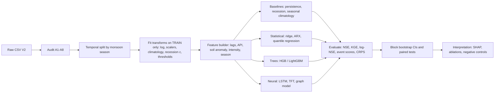

## 5. Methodology: Models and Algorithms

### 5.1 Overall pipeline



*Figure 5. Study pipeline. Every learned quantity in box D is estimated on the training period only; this is the single most important rule in the protocol.*

### 5.2 Baselines

Baselines carry the argument, because a model that does not beat persistence has learned nothing useful.

- **B0 Persistence.** $\hat Q_{t+h}=Q_t$. At every location the lag-1 autocorrelation exceeds 0.91, so this is demanding.
- **B1 Recession-persistence.** Section 4.5.
- **B2 Seasonal climatology.** $\hat Q_{t+h}=\bar Q_{s}(\mathrm{doy}(t+h))$, a smoothed day-of-year mean fitted on training data. This is the "no information about today" benchmark, relevant at long horizons.
- **B3 Persistence plus rainfall response.** A linear model $\Delta y_{t+h} = \beta_0 + \sum_{j=0}^{J}\beta_j\log(1+P_{t-j})+\gamma\,\theta^*_t + \varepsilon$, which is a lagged-rainfall transfer function (an ARX model) fitted per site by ridge regression.

### 5.3 Statistical models

**Distributed-lag (transfer function) model.** The rainfall–runoff relationship at a site is represented as a convolution,

$$y_{t+h}-y_t = \alpha + \sum_{j=0}^{J} w_j\,\phi(P_{t-j}) + \gamma\,\theta^*_t+\delta\,\Delta\tau_t + \varepsilon_t,$$

with $\phi(P)=\log(1+P)$ and an optional smoothness penalty on the weights, $\lambda\sum_j (w_{j+1}-2w_j+w_{j-1})^2$, to avoid noisy lag estimates from the short record. The estimated weights $\{w_j\}$ are the empirical *unit-hydrograph-like* response, and their centre of mass $\bar j=\sum_j j\,w_j/\sum_j w_j$ is a summary of catchment response time used in RQ2.

**Quantile regression.** To produce prediction intervals without Gaussian assumptions, we fit conditional quantiles $\hat q_\alpha(y_{t+h}\mid \cdot)$ for $\alpha\in\{0.05,0.5,0.95\}$ by minimising the pinball loss

$$\rho_\alpha(u)=u\,(\alpha-\mathbb{1}[u<0]),\qquad \mathcal{L}=\sum_{t}\rho_\alpha\big(y_{t+h}-\hat q_\alpha\big).$$

### 5.4 Gradient-boosted trees

Gradient boosting (Friedman, 2001) builds an additive model $F_M(\mathbf z)=\sum_{m=1}^{M}\eta\,\gamma_m\,T_m(\mathbf z)$ where each tree $T_m$ is fitted to the negative gradient of the loss at the current fit. We use histogram-based boosting (Ke et al., 2017) for speed. The target is the *increment* $\Delta y_{t+h}=y_{t+h}-y_t$, so the model begins from persistence and learns the correction; this reproduces the best-practice trick of modelling residuals against a strong baseline and turns out to matter (Section 8.4). Location enters as a categorical feature, enabling a *pooled* model with site-specific offsets, which is the data-efficient choice for ten sites.

Hyperparameters are tuned by blocked cross-validation (Section 6.2) over: learning rate $\in[0.02,0.1]$, leaves $\in\{7,15,31\}$, minimum samples per leaf $\in\{10,20,50\}$, and $L_2$ regularisation. We limit the search budget deliberately: with ~13k rows from effectively four monsoons, an extensive search overfits the validation split.

### 5.5 Neural sequence models

**LSTM.** A single-layer LSTM (Hochreiter and Schmidhuber, 1997) with hidden size $H$ maps a sequence of dynamic features $\mathbf{x}_{t-L+1:t}$ and static attributes (embedded) to $y_{t+h}$:

$$\begin{aligned}
\mathbf i_t&=\sigma(W_i\mathbf x_t+U_i\mathbf h_{t-1}+\mathbf b_i), &
\mathbf f_t&=\sigma(W_f\mathbf x_t+U_f\mathbf h_{t-1}+\mathbf b_f),\\
\mathbf o_t&=\sigma(W_o\mathbf x_t+U_o\mathbf h_{t-1}+\mathbf b_o), &
\tilde{\mathbf c}_t&=\tanh(W_c\mathbf x_t+U_c\mathbf h_{t-1}+\mathbf b_c),\\
\mathbf c_t&=\mathbf f_t\odot\mathbf c_{t-1}+\mathbf i_t\odot\tilde{\mathbf c}_t, &
\mathbf h_t&=\mathbf o_t\odot\tanh(\mathbf c_t).
\end{aligned}$$

Following Kratzert et al. (2019), the model is **trained jointly on all locations** with per-location input normalisation, so that it shares a single set of recurrent weights and can learn a common rainfall–response structure. The data regime is very small for a deep model (~13k sequences, strongly correlated), so we use heavy dropout, early stopping on a *monsoon-held-out* validation block, and an ensemble of $M=10$ seeds.

**Temporal Fusion Transformer.** A TFT (Lim et al., 2021) provides variable-selection gates and attention that can be inspected. It is a candidate rather than a promise, because its parameter count is large relative to the data. If it overfits, that is itself a publishable finding about the data regime.

**Graph-structured model.** With nodes $s\in\{1,\dots,10\}$ and an adjacency $A$ encoding upstream/downstream or same-basin relations, a graph convolution (Kipf and Welling, 2017) updates the node representation as $H^{(l+1)}=\sigma(\tilde D^{-1/2}\tilde A\tilde D^{-1/2}H^{(l)}W^{(l)})$. In this panel the locations are mostly *not nested*: only the pairs Rasuwagadhi→Devghat (Trishuli into Narayani) and Bahrabise→Chatara (Sun Koshi into Saptakoshi) have a plausible upstream–downstream relationship, and the other six nodes belong to separate basins. We therefore treat the graph model as an *ablation* testing whether explicit connectivity helps, with a learned adjacency as a data-driven alternative (the reverse engineering of a graph from cross-correlation is *not* evidence of physical connectivity).

### 5.6 Algorithms

Four algorithms are central. We present them as precisely as possible because leakage and event-definition errors are where this type of study most often fails.

**Algorithm 1 — Leakage-safe feature construction**

```
Input : panel D with columns (s, t, P, θ, τ, Q, ...); training end date t_train; horizon h
Output: feature matrix X, target y, for all origins t
1  split D into D_train (t ≤ t_train) and D_rest
2  for each location s:
3      fit  climatology harmonics for θ, Q on D_train[s]               # Eq. 4.3
4      fit  recession constant c_s on D_train[s] dry-spell pairs       # Eq. 4.5
5      fit  event thresholds Q_s^(q), δ_s on D_train[s]                # §4.7
6      fit  per-location scaler (mean, sd of y = log(1+Q)) on D_train[s]
7  for each location s and each origin t:
8      lag block   : y_{t-k}, k = 0..L-1                                # only past
9      rain block  : log(1+P_{t-j}), P_sum(3,7,14,30), API_t(k), W_t, INT_t
10     state block : θ*_t, Δθ_t(7), τ_t, RH_t, snow fraction_t
11     season block: sin(2π doy/365.25), cos(2π doy/365.25)
12     static block: location id, (optionally) elevation
13     target      : y_{t+h} − y_t
14 drop origins whose target is beyond the end of the panel
15 return X, y        # every transform in steps 3-6 used parameters from D_train only
```

**Algorithm 2 — Monsoon-blocked temporal cross-validation**

```
Input : panel D, seasons M = {2023, 2024, 2025, 2026}, gap g days
Output: out-of-fold predictions and per-fold scores
1  for each season m in M with a complete or partial monsoon (Jun 1–Sep 30):
2      V ← all days in [Jun 1 − g, Sep 30 + g] of season m               # held-out block
3      Tr ← all days outside V                                          # (a) non-contiguous OK for tabular
4      Tr ← Tr minus any origin whose look-back or horizon window overlaps V   # purge
5      fit pipeline of Algorithm 1 on Tr; predict V
6      store predictions with fold id m
7  aggregate scores per site, pooled and per fold; bootstrap over blocks
```

*Note.* Folds that train on the future and test on the past are legitimate for *tabular* models whose features use only the past, provided the purge in line 4 removes any overlap. For sequence models we additionally run a strictly forward-chaining scheme (train on seasons before $m$ and test on $m$) because recurrent state is also temporal. Both schemes are reported.

**Algorithm 3 — Event detection and declustering**

```
Input : series z_t, threshold u, minimum gap r (days)
Output: list of independent events {(t_start, t_peak, t_end, z_peak)}
1  exceed ← { t : z_t > u }
2  group consecutive exceedance days; merge groups separated by < r days
3  for each merged group G:
4      t_peak ← argmax_{t∈G} z_t
5      t_start ← last t < min(G) with z_t ≤ u      (or min(G))
6      t_end   ← first t > max(G) with z_t ≤ u     (or max(G))
7      record (t_start, t_peak, t_end, z_peak)
8  return events
```

**Algorithm 4 — Block-bootstrap confidence intervals for a skill difference**

```
Input : paired errors e^A_t, e^B_t for models A and B at one site; block length b; replicates R
Output: 95% CI for Δ = Metric(A) − Metric(B)
1  split the time axis into overlapping blocks of length b (stationary bootstrap, geometric lengths with mean b)
2  repeat R times:
3      draw blocks with replacement and concatenate to length T
4      compute Metric(A), Metric(B) on the resampled index set; store Δ_r
5  return the 2.5% and 97.5% quantiles of {Δ_r}
```

Block length $b$ is chosen from the integral time scale of the squared-error series (typically 7–14 days here). A paired block bootstrap (Politis and Romano, 1994) is used because daily errors are strongly autocorrelated, so independent resampling would give intervals that are too narrow.

### 5.7 Hyperparameters, computation and reproducibility budget

**Table 5a. Intended model configurations.** Search ranges are deliberately narrow; effective sample size is small (Section 6.4). *In the reported results no search was run: fixed configurations were used (Section 8.6), and the TFT and graph arms were not run.*

| Model | Inputs | Key settings | Search budget | Output |
|---|---|---|---|---|
| Ridge ARX (B3) | lags of $\log(1+P)$ up to $J=14$; $\theta^*$; $\Delta\tau$ | ridge $\lambda\in\{10^{-3},\dots,10^{2}\}$; second-difference smoothness penalty | 5-fold blocked CV | lag weights $\{w_j\}$ |
| Pooled HGB | 22 features (§8.4) plus variants | lr 0.02–0.1; leaves 7/15/31; min leaf 10/20/50; $L_2$ | ≤ 30 random configs | point forecast, SHAP |
| Quantile HGB | same | pinball loss, $\alpha\in\{0.05,0.5,0.95\}$ | shared with HGB | intervals |
| Joint LSTM | 30-day window, 12 dynamic inputs, static embedding | hidden 32/64; dropout 0.2–0.4; AdamW; early stopping | ≤ 12 configs × 10 seeds | ensemble mean and spread |
| TFT | same plus static covariates | 1–2 attention heads; hidden 16–32 | ≤ 6 configs × 5 seeds | attention, variable weights |
| Graph ablation | node features as LSTM plus adjacency (§5.5) | 1–2 layers | 3 configs | difference vs LSTM |

All of this is cheap: the data set has about 13,000 rows, the boosting arm trains in seconds on a CPU, and the neural arms fit in minutes on a CPU or a single small GPU. The binding constraint is therefore not computation but *degrees of freedom*: the more configurations are tried, the greater the risk that the best validation score reflects luck in a few monsoon peaks. We handle this in three ways: an explicit cap on the number of configurations; reporting the **distribution** of scores over configurations and seeds, not only the best; and a final untouched evaluation on the held-out season, run once.

**Seeds and determinism.** Every stochastic component (bootstrap, tree subsampling, neural initialisation, data shuffling) takes an explicit seed recorded alongside the result. For the neural models, results are reported as the median over seeds with the inter-seed range, since single-seed neural results are known to vary by amounts comparable to the differences between models.

---

## 6. Experimental Design

### 6.1 Prediction tasks

| Task | Target | Horizon | Rationale |
|---|---|---|---|
| T1 Regression | $\log(1+Q_{t+h})$ | 1, 3, 7 d | main forecasting benchmark |
| T2 Classification | $E^{(q)}_{t+h}$ for $q=0.90,0.95$ | 1, 3 d | event occurrence, three definitions in §4.7 |
| T3 Quantile | $q_{0.05,0.5,0.95}$ of $y_{t+h}$ | 1, 3 d | calibrated intervals |
| T4 Zero-flow | $\mathbb{1}[Q_{t+h}=0]$ | 1 d | Khokana only; handles audit A6 |
| T5 Anomaly | high reconstruction error flag | — | unsupervised, detects unusual response |

### 6.2 Splits

The record is short, so the split design is critical. We use three schemes and report all three.

1. **Primary split (chronological).** Train 1 Jan 2023 – 31 Aug 2025, test 1 Sep 2025 – 31 Aug 2026. Training contains two full monsoons plus most of the 2025 monsoon, including the extreme September 2024 event; the test contains the tail of the 2025 monsoon and the monsoon months of 2026 to 31 August. This is the split used in the preliminary results.
2. **Leave-one-monsoon-out (Algorithm 2).** Each season is held out in turn with a purge gap. This measures sensitivity to which year is in the test set, which with four years is large.
3. **Leave-one-location-out (LOLO).** Train on nine locations, test on the tenth over the full period. *(The reported version trains on the chronological training period only and tests on the held-out site's test window, so that it is comparable with the within-site results; the held-out site's own recent flow remains an input, so this tests transfer of the rainfall-to-increment mapping, not prediction at an ungauged site.)* This approximates *prediction at ungauged sites* (Kratzert et al., 2019; Nearing et al., 2024) and is the most scientifically interesting test the panel permits, because it asks whether the rainfall–discharge mapping generalises across basins.

Validation data for early stopping or hyperparameter search is always carved out of the *training* period by season, never from the test period.

### 6.3 Metrics

For observations $o_i$ and predictions $p_i$ over a test set with mean $\bar o$:

$$\mathrm{NSE}=1-\frac{\sum_i (o_i-p_i)^2}{\sum_i (o_i-\bar o)^2},\qquad
\mathrm{KGE}=1-\sqrt{(r-1)^2+(\alpha-1)^2+(\beta-1)^2},$$

where $r$ is the Pearson correlation, $\alpha=\sigma_p/\sigma_o$ and $\beta=\mu_p/\mu_o$. NSE is computed on raw $Q$ (high-flow weighted) and on $y=\log(1+Q)$ (all-flow weighted). Skill relative to a benchmark $B$ is

$$\mathrm{SS}=1-\frac{\mathrm{MSE}_{\text{model}}}{\mathrm{MSE}_{B}},$$

reported against persistence and against seasonal climatology. Peak timing error is the difference in days between observed and predicted peak within each declustered event (Algorithm 3), and peak magnitude error is $(\hat z_{\text{peak}}-z_{\text{peak}})/z_{\text{peak}}$.

For event classification with hits $a$, misses $c$ and false alarms $b$:

$$\mathrm{POD}=\frac{a}{a+c},\quad \mathrm{FAR}=\frac{b}{a+b},\quad \mathrm{CSI}=\frac{a}{a+b+c},\quad \mathrm{F}_1=\frac{2a}{2a+b+c},$$

and, because events are rare, **precision–recall AUC** is preferred over ROC AUC. Probabilistic forecasts are scored with CRPS,

$$\mathrm{CRPS}(F,o)=\int_{-\infty}^{\infty}\big(F(x)-\mathbb{1}[x\ge o]\big)^2dx,$$

approximated from quantiles by averaging pinball losses over a grid of levels, and with the interval coverage and the sharpness of the 90 % prediction interval.

### 6.4 Statistical testing

Pairwise model comparisons use the Diebold–Mariano test (Diebold and Mariano, 1995) with a HAC variance estimator on the loss differential $d_t=L(e^A_t)-L(e^B_t)$, and the paired block bootstrap of Algorithm 4. With ten sites and several horizons, we control the false discovery rate with the Benjamini–Hochberg procedure. Because the ten series are cross-correlated (the cross-site correlation of $\log(1+Q)$ is between 0.49 and 0.94; Section 8.2), site-level results are *not independent*, and we say so when interpreting "wins at 8 of 10 sites".

### 6.5 Ablations and interpretation

Feature groups (lag, rain, soil, temperature/humidity, wind, season, static) are ablated one group at a time and one-group-only. Permutation importance and TreeSHAP (Lundberg and Lee, 2017) are computed on held-out data, with importance aggregated at the group level because individual features such as lags and rolling sums are highly collinear and individual importances are unstable. For the transfer-function model, interpretation is directly the lag-weight vector $\{w_j\}$.

### 6.6 Reproducibility

Random seeds, package versions and the exact split dates are logged; each table in the paper is generated by a script that reads the CSV and writes a Markdown or LaTeX table to `tables/`. The scripts used so far (`prelim.py`, `baseline.py`, `make_tables.py`) are in the repository, and no figure is hand-edited.

---
